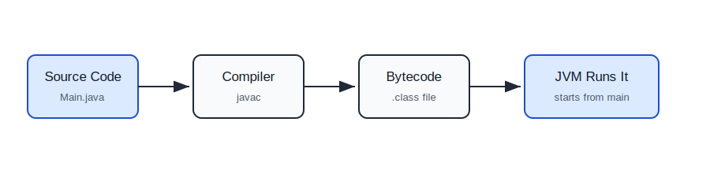
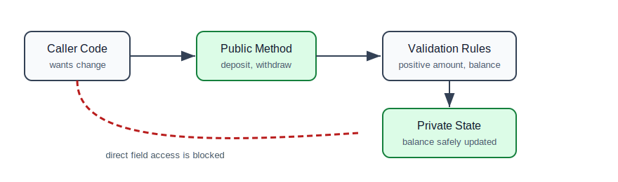
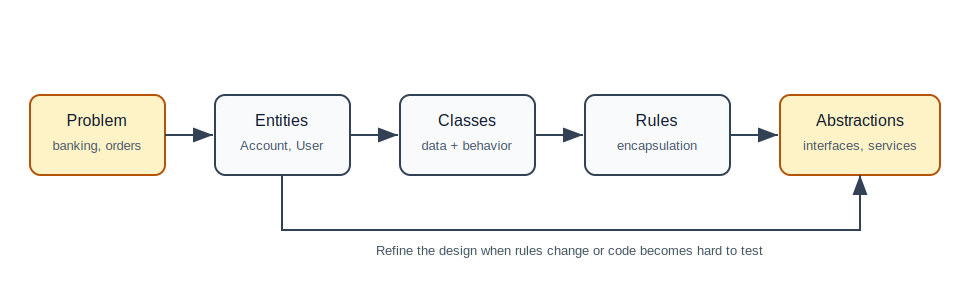

# Basics and Object-Oriented Programming

## Why This Topic Matters

Every Java backend application is built from classes, objects, methods, and data. Spring Boot applications may look magical at first, but underneath they are still Java objects calling other Java objects.

If you understand this file well, later topics like controllers, services, repositories, dependency injection, and design patterns will feel much easier.

## What Happens When You Run Java Code?

A Java program starts from a method named `main`.

```java
public class Main {
    public static void main(String[] args) {
        System.out.println("Hello backend developer");
    }
}
```

Beginner translation:

- `public` means this class or method can be accessed from outside.
- `class Main` defines a class named `Main`.
- `static` means Java can call this method without creating an object first.
- `void` means the method returns nothing.
- `String[] args` stores command-line arguments.
- `System.out.println` prints text to the console.

## Java Program Flow



## Variables

A variable is a named container for a value.

```java
int quantity = 2;
double price = 499.99;
boolean paid = false;
String productName = "Keyboard";
```

Java is statically typed. That means the type of each variable is known before the program runs.

### Primitive Types

Primitive types store simple values directly.

| Type | Example | Used For |
| --- | --- | --- |
| `byte` | `byte age = 25;` | very small numbers |
| `short` | `short year = 2026;` | small numbers |
| `int` | `int count = 100;` | normal whole numbers |
| `long` | `long id = 999999L;` | large whole numbers, IDs |
| `float` | `float rating = 4.5f;` | decimal numbers, less common |
| `double` | `double price = 99.50;` | decimal numbers |
| `char` | `char grade = 'A';` | single character |
| `boolean` | `boolean active = true;` | true/false |

### Reference Types

Reference variables point to objects.

```java
String name = "Asha";
User user = new User();
List<String> names = new ArrayList<>();
```

Mental model:

- primitive variable: the value is stored directly,
- reference variable: the variable stores a reference to an object elsewhere in memory.

## Operators

Operators perform calculations and comparisons.

```java
int total = 10 + 5;
int remaining = 10 - 3;
int multiplied = 4 * 5;
int divided = 10 / 2;
int remainder = 10 % 3;

boolean isAdult = age >= 18;
boolean canLogin = active && !blocked;
```

Common backend examples:

- calculate invoice totals,
- compare request limits,
- check whether a user has permission,
- validate if a quantity is positive.

## Conditionals

Conditionals let code make decisions.

```java
public String getDiscountType(int orderAmount) {
    if (orderAmount >= 5000) {
        return "HIGH_VALUE";
    } else if (orderAmount >= 1000) {
        return "STANDARD";
    } else {
        return "NONE";
    }
}
```

Use conditionals for validation and branching business rules.

## Switch

`switch` is useful when one value has multiple possible cases.

```java
public double deliveryCharge(String deliveryType) {
    return switch (deliveryType) {
        case "STANDARD" -> 40.0;
        case "EXPRESS" -> 100.0;
        case "SAME_DAY" -> 180.0;
        default -> throw new IllegalArgumentException("Unknown delivery type");
    };
}
```

## Loops

Loops repeat work.

### `for` Loop

Use this when you know how many times to repeat.

```java
for (int i = 1; i <= 5; i++) {
    System.out.println("Attempt " + i);
}
```

### Enhanced `for` Loop

Use this when reading every item from a collection.

```java
List<String> emails = List.of("a@example.com", "b@example.com");

for (String email : emails) {
    System.out.println("Sending email to " + email);
}
```

### `while` Loop

Use this when repetition depends on a condition.

```java
int retryCount = 0;

while (retryCount < 3) {
    retryCount++;
    System.out.println("Retrying request");
}
```

## Methods

A method is a reusable block of behavior.

```java
public double calculateTotal(double price, int quantity) {
    if (quantity <= 0) {
        throw new IllegalArgumentException("Quantity must be positive");
    }
    return price * quantity;
}
```

Method parts:

| Part | Example | Meaning |
| --- | --- | --- |
| Access modifier | `public` | who can call it |
| Return type | `double` | what it returns |
| Name | `calculateTotal` | what it does |
| Parameters | `double price, int quantity` | inputs |
| Body | `{ ... }` | logic |

Good method names are verbs or verb phrases:

- `createUser`
- `calculateTax`
- `sendEmail`
- `findOrderById`

## Classes

A class groups data and behavior.

```java
public class Product {
    private Long id;
    private String name;
    private double price;

    public Product(Long id, String name, double price) {
        this.id = id;
        this.name = name;
        this.price = price;
    }

    public boolean isExpensive() {
        return price > 10000;
    }
}
```

In backend development, classes often represent:

- domain objects: `Order`, `Customer`, `Payment`,
- services: `OrderService`, `EmailService`,
- repositories: `OrderRepository`,
- request/response DTOs: `CreateOrderRequest`, `OrderResponse`.

## Objects

An object is a real instance of a class.

```java
Product product = new Product(1L, "Laptop", 55000);

if (product.isExpensive()) {
    System.out.println("Approval required");
}
```

Class vs object:

| Concept | Meaning |
| --- | --- |
| Class | Blueprint |
| Object | Actual thing created from the blueprint |

## Constructors

A constructor runs when an object is created.

```java
public class Customer {
    private final String email;

    public Customer(String email) {
        if (email == null || email.isBlank()) {
            throw new IllegalArgumentException("Email is required");
        }
        this.email = email;
    }
}
```

Constructors are a good place to make sure an object starts in a valid state.

## Encapsulation

Encapsulation means protecting an object's internal data and exposing controlled behavior.

Bad:

```java
public class BankAccount {
    public double balance;
}
```

Anyone can do this:

```java
account.balance = -999999;
```

Better:

```java
public class BankAccount {
    private double balance;

    public void deposit(double amount) {
        if (amount <= 0) {
            throw new IllegalArgumentException("Deposit must be positive");
        }
        balance += amount;
    }

    public void withdraw(double amount) {
        if (amount <= 0) {
            throw new IllegalArgumentException("Withdrawal must be positive");
        }
        if (amount > balance) {
            throw new IllegalStateException("Insufficient balance");
        }
        balance -= amount;
    }

    public double getBalance() {
        return balance;
    }
}
```

The object protects its own rules.

## Encapsulation Flow



## Inheritance

Inheritance lets one class extend another.

```java
public class Employee {
    private final String name;

    public Employee(String name) {
        this.name = name;
    }

    public String getName() {
        return name;
    }
}

public class Manager extends Employee {
    private final int teamSize;

    public Manager(String name, int teamSize) {
        super(name);
        this.teamSize = teamSize;
    }

    public int getTeamSize() {
        return teamSize;
    }
}
```

Inheritance represents an "is-a" relationship.

`Manager` is an `Employee`.

Do not use inheritance only to reuse code. Deep inheritance trees become difficult to understand.

## Polymorphism

Polymorphism means the same abstraction can have different implementations.

```java
public interface PaymentProcessor {
    void pay(double amount);
}

public class CardPaymentProcessor implements PaymentProcessor {
    @Override
    public void pay(double amount) {
        System.out.println("Paid by card: " + amount);
    }
}

public class UpiPaymentProcessor implements PaymentProcessor {
    @Override
    public void pay(double amount) {
        System.out.println("Paid by UPI: " + amount);
    }
}
```

```java
public class CheckoutService {
    private final PaymentProcessor paymentProcessor;

    public CheckoutService(PaymentProcessor paymentProcessor) {
        this.paymentProcessor = paymentProcessor;
    }

    public void checkout(double amount) {
        paymentProcessor.pay(amount);
    }
}
```

`CheckoutService` does not care whether payment happens by card, UPI, wallet, or net banking. It depends on the interface.

This is one of the most important ideas behind Spring dependency injection.

## Abstraction

Abstraction hides details and exposes only what the caller needs.

```java
public interface NotificationService {
    void send(String destination, String message);
}
```

Possible implementations:

```java
public class EmailNotificationService implements NotificationService {
    public void send(String destination, String message) {
        System.out.println("Sending email to " + destination);
    }
}

public class SmsNotificationService implements NotificationService {
    public void send(String destination, String message) {
        System.out.println("Sending SMS to " + destination);
    }
}
```

The caller only knows `NotificationService`. The implementation can change later.

## OOP Design Flow



## Access Modifiers

Access modifiers control visibility.

| Modifier | Meaning |
| --- | --- |
| `public` | accessible from anywhere |
| `protected` | accessible in same package and subclasses |
| no modifier | package-private, accessible in same package |
| `private` | accessible only inside the same class |

Backend rule: keep fields private unless there is a strong reason not to.

## Static

`static` belongs to the class, not to an object.

```java
public class TaxUtils {
    public static double gst(double amount) {
        return amount * 0.18;
    }
}
```

```java
double tax = TaxUtils.gst(1000);
```

Static methods are fine for pure helper logic, but avoid using static everywhere. It can make testing and dependency management harder.

## Exceptions

Exceptions represent errors or unexpected situations.

```java
public User findUser(Long id) {
    if (id == null) {
        throw new IllegalArgumentException("ID is required");
    }
    return userRepository.findById(id)
            .orElseThrow(() -> new UserNotFoundException("User not found"));
}
```

Common exception types:

| Exception | When It Happens |
| --- | --- |
| `IllegalArgumentException` | caller passed invalid input |
| `IllegalStateException` | object is in wrong state |
| `NullPointerException` | code tried to use `null` as an object |
| custom exception | domain-specific failure |

## Beginner Project: Bank Account

Create:

- `BankAccount`
- `SavingsAccount`
- `CurrentAccount`
- `Transaction`
- `AccountService`

Requirements:

1. User can deposit money.
2. User can withdraw money.
3. Withdrawal should fail if balance is insufficient.
4. Every deposit and withdrawal should create a transaction.
5. Account balance should never be updated directly from outside.

## Common Beginner Mistakes

| Mistake | Why It Is A Problem | Better Approach |
| --- | --- | --- |
| Making every field `public` | any code can corrupt object state | use `private` fields and methods |
| Writing all code in `main` | impossible to maintain | split into classes |
| Huge methods | hard to read and test | extract smaller methods |
| Using inheritance for everything | creates rigid designs | prefer interfaces and composition |
| Ignoring invalid input | bugs appear later | validate early |
| Catching every exception silently | hides real failures | handle or rethrow clearly |

## Self-Check Questions

1. What is the difference between a class and an object?
2. Why should fields usually be private?
3. When would you use an interface?
4. What is polymorphism in plain language?
5. Why is constructor validation useful?
6. Why is `CheckoutService` better when it depends on `PaymentProcessor` instead of `CardPaymentProcessor`?

