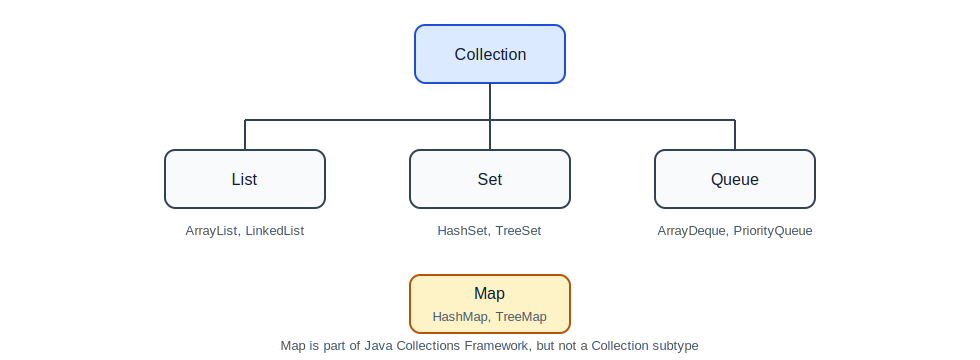
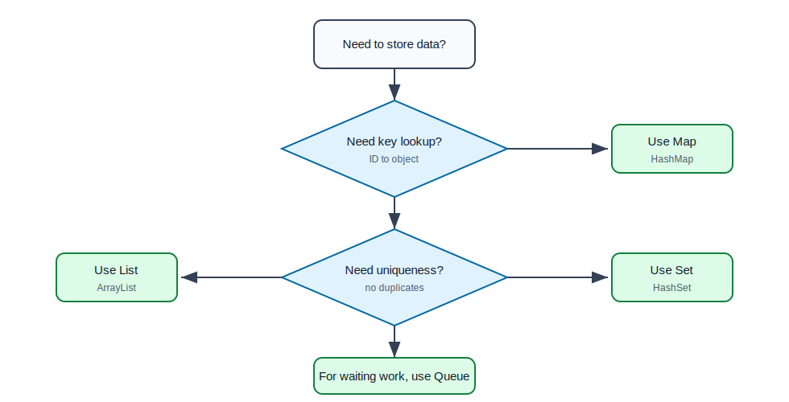

# Collections and Generics

## Why This Topic Matters

Backend applications constantly work with groups of data:

- list of users,
- set of permissions,
- map of product IDs to product details,
- queue of background jobs,
- paginated API results,
- records returned from a database.

Java collections help you store, search, group, sort, and process this data safely.

## Array vs Collection

An array has a fixed size.

```java
String[] names = new String[3];
names[0] = "Asha";
names[1] = "Ravi";
names[2] = "Meera";
```

A collection can grow and provides useful operations.

```java
List<String> names = new ArrayList<>();
names.add("Asha");
names.add("Ravi");
names.add("Meera");
```

Use arrays when the size is fixed and simple. Use collections for most backend work.

## Collection Family



## List

A `List` stores items in order and allows duplicates.

```java
List<String> cities = new ArrayList<>();
cities.add("Delhi");
cities.add("Mumbai");
cities.add("Delhi");

System.out.println(cities.get(0)); // Delhi
System.out.println(cities.size()); // 3
```

Use `List` when order matters.

Backend examples:

- orders sorted by creation date,
- comments under a post,
- search results,
- validation errors.

### ArrayList

`ArrayList` is backed by a resizable array.

Strengths:

- fast access by index,
- good for most normal list use cases,
- simple and memory efficient.

Weakness:

- inserting/removing in the middle can be slower because elements may shift.

### LinkedList

`LinkedList` stores items as linked nodes.

Strength:

- can be efficient for frequent insertions/removals at ends.

Weakness:

- slower random access,
- more memory overhead.

Beginner rule: use `ArrayList` unless you have a clear reason not to.

## Set

A `Set` stores unique values.

```java
Set<String> roles = new HashSet<>();
roles.add("USER");
roles.add("ADMIN");
roles.add("USER");

System.out.println(roles.size()); // 2
```

Use `Set` when duplicates should not exist.

Backend examples:

- user roles,
- unique tags,
- unique email addresses during import,
- permission names.

### HashSet

Fast membership checks, no guaranteed order.

```java
if (roles.contains("ADMIN")) {
    System.out.println("Can access admin panel");
}
```

### LinkedHashSet

Keeps insertion order.

### TreeSet

Keeps values sorted.

```java
Set<Integer> numbers = new TreeSet<>();
numbers.add(30);
numbers.add(10);
numbers.add(20);
System.out.println(numbers); // [10, 20, 30]
```

## Map

A `Map` stores key-value pairs.

```java
Map<Long, String> usersById = new HashMap<>();
usersById.put(1L, "Asha");
usersById.put(2L, "Ravi");

String name = usersById.get(1L);
```

Use `Map` when you need fast lookup by a key.

Backend examples:

- user by ID,
- product by SKU,
- request headers by name,
- configuration values,
- count by category.

## Map Example: Counting Orders By Status

```java
List<String> statuses = List.of("PAID", "PENDING", "PAID", "FAILED");
Map<String, Integer> countByStatus = new HashMap<>();

for (String status : statuses) {
    int currentCount = countByStatus.getOrDefault(status, 0);
    countByStatus.put(status, currentCount + 1);
}

System.out.println(countByStatus);
```

Output:

```text
{FAILED=1, PAID=2, PENDING=1}
```

## Queue

A `Queue` represents work waiting to be processed.

```java
Queue<String> jobs = new ArrayDeque<>();
jobs.offer("send-email");
jobs.offer("generate-invoice");

String nextJob = jobs.poll();
```

Backend examples:

- email sending,
- report generation,
- order processing,
- retry jobs.

## Choosing The Right Collection



| Requirement | Recommended Type |
| --- | --- |
| Ordered values, duplicates allowed | `ArrayList` |
| Unique values | `HashSet` |
| Unique values in insertion order | `LinkedHashSet` |
| Sorted unique values | `TreeSet` |
| Key-value lookup | `HashMap` |
| Sorted keys | `TreeMap` |
| FIFO processing | `ArrayDeque` |
| Thread-safe key-value access | `ConcurrentHashMap` |

## Iterating Collections

### Enhanced `for`

```java
for (String role : roles) {
    System.out.println(role);
}
```

### `forEach`

```java
roles.forEach(role -> System.out.println(role));
```

### Stream

```java
List<String> adminRoles = roles.stream()
        .filter(role -> role.startsWith("ADMIN"))
        .toList();
```

Streams are useful for transformations, filtering, grouping, and aggregation. Do not overuse them when a normal loop is clearer.

## Generics

Generics give type safety.

Without generics, a list can accidentally contain mixed values.

```java
List rawList = new ArrayList();
rawList.add("Asha");
rawList.add(100);
```

With generics:

```java
List<String> names = new ArrayList<>();
names.add("Asha");
// names.add(100); compile error
```

This is good. The compiler catches the mistake before your application runs.

## Generic Class

Generic classes are useful when the same structure can hold different data types.

```java
public class ApiResponse<T> {
    private final T data;
    private final String message;

    public ApiResponse(T data, String message) {
        this.data = data;
        this.message = message;
    }

    public T getData() {
        return data;
    }

    public String getMessage() {
        return message;
    }
}
```

Usage:

```java
ApiResponse<User> userResponse = new ApiResponse<>(user, "User found");
ApiResponse<List<Order>> orderResponse = new ApiResponse<>(orders, "Orders found");
```

The same wrapper works for one user, many orders, or any other data type.

## Generic Method

```java
public static <T> T first(List<T> items) {
    if (items == null || items.isEmpty()) {
        throw new IllegalArgumentException("List cannot be empty");
    }
    return items.get(0);
}
```

Usage:

```java
String firstName = first(List.of("Asha", "Ravi"));
Integer firstNumber = first(List.of(10, 20, 30));
```

## Wildcards

Wildcards make generic code more flexible.

### `? extends`

Use `? extends T` when you read values as type `T`.

```java
public double sum(List<? extends Number> numbers) {
    double total = 0;
    for (Number number : numbers) {
        total += number.doubleValue();
    }
    return total;
}
```

This accepts `List<Integer>`, `List<Double>`, and other number lists.

### `? super`

Use `? super T` when you add values of type `T`.

```java
public void addDefaultUsers(List<? super User> users) {
    users.add(new User(1L, "default@example.com"));
}
```

Simple memory rule: producer extends, consumer super.

## equals and hashCode

`HashSet` and `HashMap` depend on `equals` and `hashCode`.

If you create custom objects and want Java to know when two objects are "the same", define equality.

```java
public class User {
    private final Long id;
    private final String email;

    public User(Long id, String email) {
        this.id = id;
        this.email = email;
    }

    @Override
    public boolean equals(Object o) {
        if (this == o) return true;
        if (!(o instanceof User user)) return false;
        return Objects.equals(email, user.email);
    }

    @Override
    public int hashCode() {
        return Objects.hash(email);
    }
}
```

Rule: if two objects are equal, they must return the same hash code.

## Why Equality Matters

```java
Set<User> users = new HashSet<>();
users.add(new User(1L, "a@example.com"));
users.add(new User(2L, "a@example.com"));

System.out.println(users.size());
```

If equality is based on email, size is `1`. If equality is not defined, Java treats them as different objects and size may be `2`.

## Collections and Nulls

Some collections allow `null`, but avoid using null values when possible.

Better:

```java
List<String> names = Collections.emptyList();
```

Instead of:

```java
List<String> names = null;
```

Returning empty collections reduces `NullPointerException` risk.

## Immutability

Immutable collections cannot be changed after creation.

```java
List<String> roles = List.of("USER", "ADMIN");
```

This is useful when data should not be modified accidentally.

## Common Mistakes

| Mistake | Why It Hurts | Better Approach |
| --- | --- | --- |
| Using `List` for everything | slow lookup or duplicate bugs | choose based on need |
| Forgetting `equals/hashCode` | sets/maps behave unexpectedly | define equality for domain objects |
| Returning `null` collections | causes null checks everywhere | return empty collections |
| Modifying a list while iterating | can cause errors | use iterator or collect changes |
| Overusing streams | less readable code | use loops when simpler |
| Using raw types | loses type safety | always use generics |

## Beginner Project: Student Directory

Create a console program with:

- `Student`
- `Course`
- `StudentDirectory`

Requirements:

1. Store students in a `List`.
2. Prevent duplicate emails using a `Set`.
3. Find a student quickly by ID using a `Map`.
4. Store course enrollments.
5. Print all students sorted by name.

## Self-Check Questions

1. When should you use a `List`?
2. When should you use a `Set`?
3. Why is a `Map` useful for lookup?
4. What problem do generics solve?
5. Why do `HashSet` and `HashMap` care about `equals` and `hashCode`?
6. Why is returning an empty list usually better than returning `null`?

