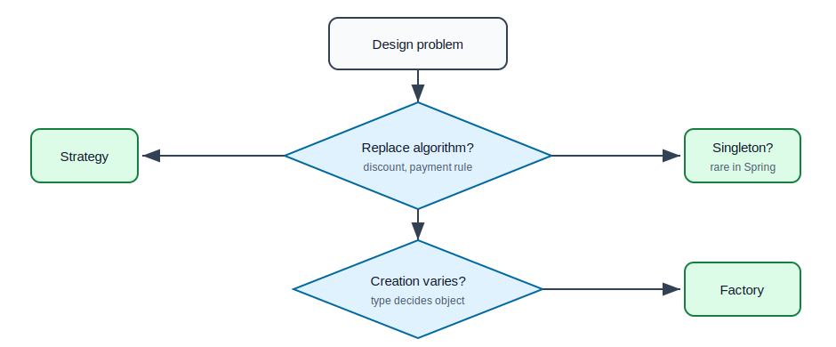
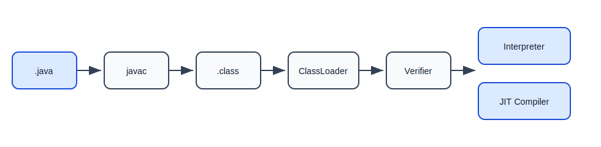
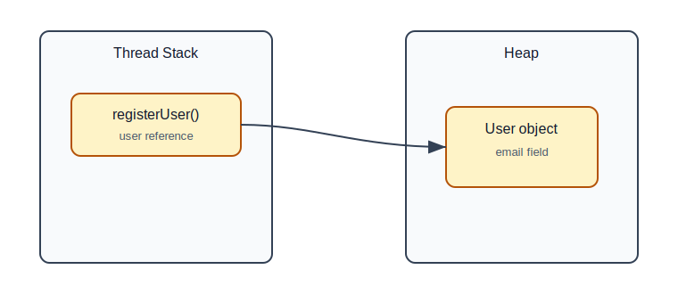
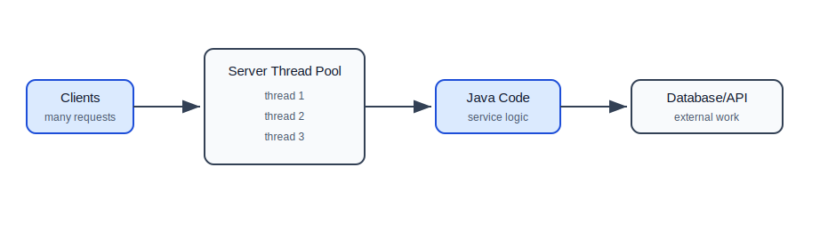
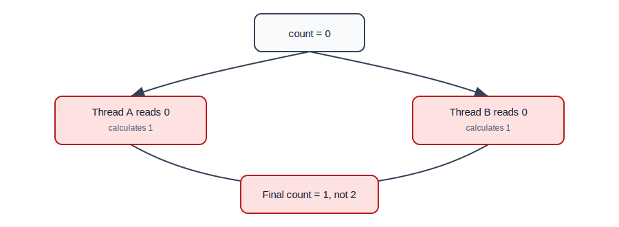
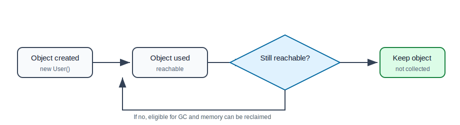

# Advanced Java, JVM, Threads, Concurrency, and Garbage Collection

## Why This Topic Matters

Backend applications do not run one request at a time. A server may handle hundreds or thousands of requests concurrently. Your Java code runs inside the JVM, uses heap memory, creates objects, opens database connections, starts background tasks, and depends on garbage collection.

You do not need to become a JVM engineer before learning Spring, but you should understand the core ideas well enough to debug real backend problems.

## Design Patterns

Design patterns are common solutions to common design problems.

They are not rules. They are vocabulary. When a senior developer says "use a strategy here" or "this factory is doing too much", they are using pattern language to discuss design.

## Strategy Pattern

Use the Strategy pattern when an algorithm should be replaceable.

Example problem: different users may receive different discount rules.

```java
public interface DiscountStrategy {
    double apply(double amount);
}
```

```java
public class RegularCustomerDiscount implements DiscountStrategy {
    @Override
    public double apply(double amount) {
        return amount * 0.95;
    }
}
```

```java
public class PremiumCustomerDiscount implements DiscountStrategy {
    @Override
    public double apply(double amount) {
        return amount * 0.85;
    }
}
```

```java
public class BillingService {
    private final DiscountStrategy discountStrategy;

    public BillingService(DiscountStrategy discountStrategy) {
        this.discountStrategy = discountStrategy;
    }

    public double finalAmount(double amount) {
        return discountStrategy.apply(amount);
    }
}
```

Why this is useful:

- avoids large `if-else` chains,
- makes rules easier to test,
- lets Spring inject the right implementation later.

## Factory Pattern

Use a factory when object creation has decision logic.

```java
public class NotificationFactory {
    public NotificationService create(String type) {
        return switch (type) {
            case "email" -> new EmailNotificationService();
            case "sms" -> new SmsNotificationService();
            default -> throw new IllegalArgumentException("Unsupported type: " + type);
        };
    }
}
```

Factory pattern keeps creation decisions in one place.

## Singleton Pattern

A singleton has only one instance.

```java
public enum AppSettings {
    INSTANCE;

    public String applicationName() {
        return "backend-service";
    }
}
```

In Spring applications, most beans are singleton by default, so you usually do not write singleton classes yourself.

## Pattern Selection Flow



## What Is The JVM?

JVM means Java Virtual Machine. It runs compiled Java bytecode.

Java code does not directly run as `.java` files. First it is compiled into `.class` files. The JVM loads those class files and executes them.

## JVM Execution Flow



## JVM Memory Areas

| Area | What It Stores | Beginner Explanation |
| --- | --- | --- |
| Heap | Objects | most objects created with `new` live here |
| Stack | Method calls and local variables | each thread has its own stack |
| Metaspace | Class metadata | information about loaded classes |
| Program Counter | Current instruction | tracks what each thread is executing |
| Native Method Stack | Native calls | supports non-Java native code |

## Stack vs Heap Example

```java
public void registerUser() {
    User user = new User("asha@example.com");
    sendWelcomeEmail(user);
}
```

Mental model:

- `user` reference variable is on the stack,
- actual `User` object is on the heap,
- when method ends, stack frame is removed,
- if no reachable reference points to the object, it may be garbage collected.



## Class Loading

The JVM loads classes when they are needed.

Simplified steps:

1. Load class bytecode.
2. Verify bytecode safety.
3. Prepare class metadata.
4. Initialize static fields.
5. Use the class at runtime.

This is why missing dependencies often fail when an application starts or when a class is first used.

## JIT Compiler

JIT means Just-In-Time compiler.

At first, the JVM can interpret bytecode. When some code runs many times, the JVM may compile it into optimized machine code.

Backend meaning:

- Java apps can become faster after warm-up,
- performance tests should include warm-up time,
- first request after startup may be slower.

## Threads

A thread is an independent path of execution.

```java
Thread thread = new Thread(() -> {
    System.out.println("Running in another thread");
});

thread.start();
```

In backend servers, threads allow multiple requests to be handled at the same time.

## Request Handling Mental Model



## Why Manual Thread Creation Is Risky

This is usually not a good backend habit:

```java
for (int i = 0; i < 1000; i++) {
    new Thread(() -> processJob()).start();
}
```

Problems:

- too many threads consume memory,
- CPU spends time switching between threads,
- no central control over shutdown,
- failures are hard to track.

## ExecutorService

Use a thread pool to manage worker threads.

```java
ExecutorService executor = Executors.newFixedThreadPool(4);

executor.submit(() -> {
    System.out.println("Processing background job");
});

executor.shutdown();
```

The pool controls how many tasks run at the same time.

## Callable and Future

`Runnable` does not return a value. `Callable` returns a value.

```java
ExecutorService executor = Executors.newSingleThreadExecutor();

Future<Integer> future = executor.submit(() -> {
    return 10 + 20;
});

Integer result = future.get();
executor.shutdown();
```

`future.get()` waits for the result.

## CompletableFuture

`CompletableFuture` helps run and combine asynchronous tasks.

```java
CompletableFuture<String> userFuture =
        CompletableFuture.supplyAsync(() -> "user-details");

CompletableFuture<String> orderFuture =
        CompletableFuture.supplyAsync(() -> "order-details");

CompletableFuture<String> combined =
        userFuture.thenCombine(orderFuture, (user, order) -> user + " " + order);
```

Use it when independent tasks can run in parallel.

## Race Condition

A race condition happens when multiple threads access shared mutable state and the final result depends on timing.

Unsafe:

```java
public class Counter {
    private int count = 0;

    public void increment() {
        count++;
    }

    public int getCount() {
        return count;
    }
}
```

`count++` looks like one operation, but it is actually:

1. read current value,
2. add one,
3. write new value.

Two threads can interfere with each other.

## Race Condition Flow



## synchronized

`synchronized` allows only one thread at a time to enter a protected section.

```java
public class SafeCounter {
    private int count = 0;

    public synchronized void increment() {
        count++;
    }

    public synchronized int getCount() {
        return count;
    }
}
```

This fixes the race, but too much synchronization can reduce throughput.

## AtomicInteger

For simple counters, atomic classes are cleaner.

```java
public class AtomicCounter {
    private final AtomicInteger count = new AtomicInteger();

    public void increment() {
        count.incrementAndGet();
    }

    public int getCount() {
        return count.get();
    }
}
```

## Concurrent Collections

Some collections are designed for concurrent access.

```java
Map<String, Integer> counts = new ConcurrentHashMap<>();
counts.merge("PAID", 1, Integer::sum);
```

Use `ConcurrentHashMap` when multiple threads need to safely update a map.

## Immutability

Immutable objects cannot be changed after creation.

```java
public final class Money {
    private final BigDecimal amount;
    private final String currency;

    public Money(BigDecimal amount, String currency) {
        this.amount = amount;
        this.currency = currency;
    }
}
```

Immutable objects are easier to share between threads because no thread can modify them.

## Garbage Collection

Garbage collection automatically frees memory from objects that are no longer reachable.

```java
public void process() {
    User user = new User("a@example.com");
}
```

When `process` ends, if nothing else references the `User`, it becomes eligible for garbage collection.

## Garbage Collection Flow



## Young and Old Generation

Many JVM garbage collectors divide heap memory conceptually:

| Area | Meaning |
| --- | --- |
| Young generation | new, short-lived objects |
| Old generation | objects that survived longer |

Backend apps create many short-lived objects:

- request DTOs,
- response DTOs,
- strings,
- temporary collections,
- JSON parsing objects.

GC is optimized around the idea that many objects die young.

## Memory Leak In Java

Java has garbage collection, but memory leaks can still happen when objects remain reachable accidentally.

Example:

```java
public class BadCache {
    private final Map<String, User> cache = new HashMap<>();

    public void add(User user) {
        cache.put(user.getEmail(), user);
    }
}
```

If this cache grows forever and never removes old users, memory usage keeps growing.

## Backend Concurrency Rules

- Prefer local variables over shared fields.
- Prefer immutable data where possible.
- Use thread pools, not unlimited manual threads.
- Protect shared mutable state.
- Use database transactions for data consistency.
- Use queues for long-running work.
- Always set timeouts for external calls.
- Do not optimize concurrency without measuring.

## Common Mistakes

| Mistake | Why It Hurts | Better Approach |
| --- | --- | --- |
| Starting unlimited threads | memory and CPU pressure | use `ExecutorService` |
| Sharing mutable objects casually | race conditions | immutable objects or synchronization |
| Assuming `count++` is atomic | lost updates | use `AtomicInteger` or locks |
| Ignoring executor shutdown | app may hang | call `shutdown` |
| Building unbounded caches | memory leaks | use size/TTL limits |
| Thinking GC means memory does not matter | poor performance | reduce unnecessary object creation |

## Beginner Project: Background Job Processor

Build a console app with:

- `Job`
- `JobQueue`
- `JobProcessor`
- `Worker`

Requirements:

1. Create 20 jobs.
2. Process them using a fixed thread pool of 4 threads.
3. Record success/failure counts using `AtomicInteger`.
4. Log which thread processed each job.
5. Shut down the executor correctly.

## Self-Check Questions

1. What is the JVM?
2. What is stored on the heap?
3. Why does each thread have its own stack?
4. Why is `count++` not thread-safe?
5. When would you use `ExecutorService`?
6. How can Java have memory leaks even with garbage collection?
7. Why are immutable objects useful in concurrent code?

