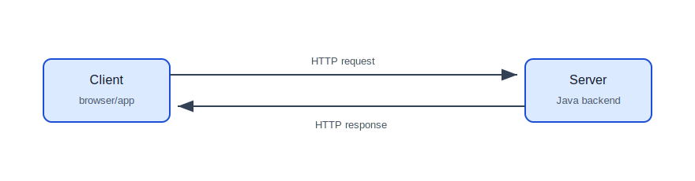
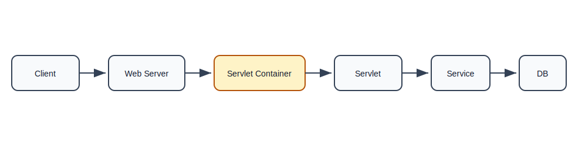
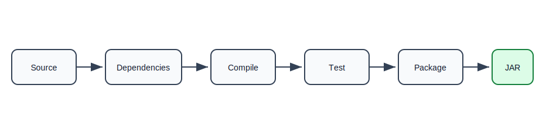
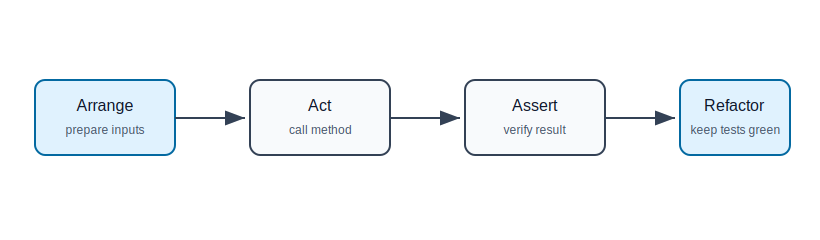
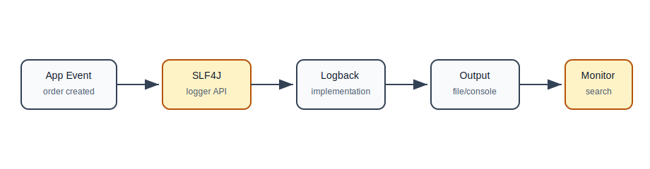

# Web, Build Tools, Servers, Testing, and Logging

## Why This Topic Matters

Java backend development is not only writing classes. You also need to know:

- how Java handles HTTP requests,
- how projects manage dependencies,
- how applications run on servers,
- how to test behavior,
- how to log useful runtime information.

This file connects core Java to real backend applications.

## Web Development Basics

The web is based on request and response.

A client sends a request:

```http
GET /users/42 HTTP/1.1
Host: example.com
```

The server sends a response:

```http
HTTP/1.1 200 OK
Content-Type: application/json

{
  "id": 42,
  "name": "Asha"
}
```

## Request Response Flow



## Servlet

A servlet is a Java class that handles HTTP requests and creates HTTP responses.

```java
public class HelloServlet extends HttpServlet {
    @Override
    protected void doGet(HttpServletRequest request, HttpServletResponse response)
            throws IOException {
        response.setContentType("text/plain");
        response.getWriter().write("Hello from servlet");
    }
}
```

Beginner explanation:

- `HttpServlet` is the base class for HTTP servlets.
- `doGet` handles GET requests.
- `HttpServletRequest` contains request data.
- `HttpServletResponse` is used to build the response.

Spring MVC is built on top of servlet concepts. Even if you rarely write raw servlets, knowing the idea helps.

## Servlet Container

A servlet does not run by itself. It runs inside a servlet container such as Tomcat or Jetty.

The container:

- listens for HTTP requests,
- creates request and response objects,
- finds the correct servlet,
- manages servlet lifecycle,
- manages threads.

## Servlet Request Flow



## JSP

JSP means JavaServer Pages. JSP is used to create server-rendered HTML pages.

```jsp
<html>
<body>
    <h1>Hello, ${user.name}</h1>
</body>
</html>
```

JSP was common in older Java web applications. Modern backend systems often expose REST APIs and let a separate frontend render the UI, but many legacy enterprise systems still use JSP.

## Build Tools

Build tools automate repetitive project work:

- compile code,
- download dependencies,
- run tests,
- package applications,
- run plugins,
- create deployable artifacts.

Without a build tool, you would manually download JAR files and compile many files by hand.

## Maven

Maven uses a file named `pom.xml`.

Basic structure:

```xml
<project>
    <modelVersion>4.0.0</modelVersion>

    <groupId>com.example</groupId>
    <artifactId>demo-app</artifactId>
    <version>1.0.0</version>

    <dependencies>
        <dependency>
            <groupId>org.junit.jupiter</groupId>
            <artifactId>junit-jupiter</artifactId>
            <version>5.10.0</version>
            <scope>test</scope>
        </dependency>
    </dependencies>
</project>
```

Common commands:

```bash
mvn clean
mvn test
mvn package
mvn clean package
```

Maven follows convention over configuration. For example:

```text
src/main/java      application code
src/test/java      test code
src/main/resources configuration files
```

## Gradle

Gradle commonly uses `build.gradle`.

```groovy
plugins {
    id 'java'
}

repositories {
    mavenCentral()
}

dependencies {
    testImplementation 'org.junit.jupiter:junit-jupiter:5.10.0'
}

test {
    useJUnitPlatform()
}
```

Common commands:

```bash
gradle test
gradle build
```

## Ant

Ant is older and task-based.

```xml
<project name="demo" default="compile">
    <target name="compile">
        <javac srcdir="src" destdir="build/classes" />
    </target>
</project>
```

You may see Ant in legacy enterprise projects.

## Build Tool Flow



## Servers

Java web applications run on servers or inside embedded servers.

| Server | Type | Notes |
| --- | --- | --- |
| Tomcat | Servlet container | very common with Spring Boot |
| Jetty | Servlet container | lightweight |
| JBoss/WildFly | Application server | enterprise Java features |
| WebLogic | Application server | enterprise, often Oracle ecosystems |
| WebSphere | Application server | enterprise, often IBM ecosystems |

## Servlet Container vs Application Server

| Concept | Meaning |
| --- | --- |
| Servlet container | runs servlets/JSP |
| Application server | supports broader enterprise Java features |

For many Spring Boot REST APIs, embedded Tomcat is enough.

## Unit Testing

Unit tests verify a small piece of code in isolation.

Example class:

```java
public class PriceCalculator {
    public double withTax(double amount, double taxRate) {
        if (amount < 0) {
            throw new IllegalArgumentException("Amount cannot be negative");
        }
        return amount + (amount * taxRate);
    }
}
```

JUnit test:

```java
class PriceCalculatorTest {
    @Test
    void addsTaxToAmount() {
        PriceCalculator calculator = new PriceCalculator();

        double result = calculator.withTax(100, 0.18);

        assertEquals(118, result);
    }

    @Test
    void rejectsNegativeAmount() {
        PriceCalculator calculator = new PriceCalculator();

        assertThrows(IllegalArgumentException.class,
                () -> calculator.withTax(-100, 0.18));
    }
}
```

Test structure:

```text
Arrange: create inputs and object
Act: call the method
Assert: verify result
```

## Testing Flow



## Mockito

Mockito creates test doubles for dependencies.

Example:

```java
public class RegistrationService {
    private final EmailClient emailClient;

    public RegistrationService(EmailClient emailClient) {
        this.emailClient = emailClient;
    }

    public void register(String email) {
        emailClient.send(email, "Welcome");
    }
}
```

Test:

```java
class RegistrationServiceTest {
    @Test
    void sendsWelcomeEmail() {
        EmailClient emailClient = mock(EmailClient.class);
        RegistrationService service = new RegistrationService(emailClient);

        service.register("a@example.com");

        verify(emailClient).send("a@example.com", "Welcome");
    }
}
```

Use mocks when you want to test one class without calling real external systems.

## Unit Test vs Integration Test

| Test Type | Scope | Example |
| --- | --- | --- |
| Unit test | one class or method | price calculation |
| Integration test | multiple components together | API + service + database |
| End-to-end test | whole system | browser or client calls deployed app |

Integration tests are slower but catch wiring and configuration problems.

## Logging

Logging records what your application is doing.

```java
private static final Logger log = LoggerFactory.getLogger(OrderService.class);

public void placeOrder(Order order) {
    log.info("Placing order orderId={} customerId={}",
            order.getId(),
            order.getCustomerId());
}
```

Use placeholders `{}` instead of string concatenation.

## Logging Tools

| Tool | Role |
| --- | --- |
| SLF4J | logging facade used by application code |
| Logback | common logging implementation |
| Log4j | older logging framework |
| Log4j2 | modern Log4j version |

Most Spring Boot apps use SLF4J with Logback by default.

## Logging Levels

| Level | Use |
| --- | --- |
| TRACE | extremely detailed diagnostics |
| DEBUG | development debugging |
| INFO | important normal events |
| WARN | unexpected but recoverable situations |
| ERROR | failures that need attention |

Example:

```java
log.debug("Validating request {}", requestId);
log.info("Order created orderId={}", orderId);
log.warn("Payment retry needed orderId={}", orderId);
log.error("Payment failed orderId={}", orderId, exception);
```

## Logging Flow



## Good Logging Rules

- Do not log passwords, tokens, OTPs, or secrets.
- Include useful IDs such as `orderId`, `userId`, and `traceId`.
- Log important business events.
- Log failures with enough context.
- Avoid noisy logs inside large loops.
- Use consistent message style.

## Beginner Project: Maven Console App With Tests

Create a Maven project:

```text
student-app
  pom.xml
  src/main/java/com/example/Student.java
  src/main/java/com/example/StudentService.java
  src/test/java/com/example/StudentServiceTest.java
```

Requirements:

1. Add students.
2. Prevent duplicate email.
3. Search student by ID.
4. Write JUnit tests.
5. Add logging when a student is added.

## Common Mistakes

| Mistake | Why It Hurts | Better Approach |
| --- | --- | --- |
| No tests | bugs are found late | test important behavior |
| Testing only happy path | edge cases break | test invalid inputs too |
| Logging secrets | security risk | mask or avoid sensitive data |
| Using `System.out.println` everywhere | hard to control in production | use SLF4J logging |
| Manually managing JARs | dependency mess | use Maven or Gradle |
| Not understanding server role | deployment confusion | learn servlet container flow |

## Self-Check Questions

1. What does a servlet do?
2. Why does a servlet need a servlet container?
3. What problem does Maven solve?
4. What is the difference between unit and integration tests?
5. Why should logs include IDs?
6. Why should passwords and tokens never be logged?

