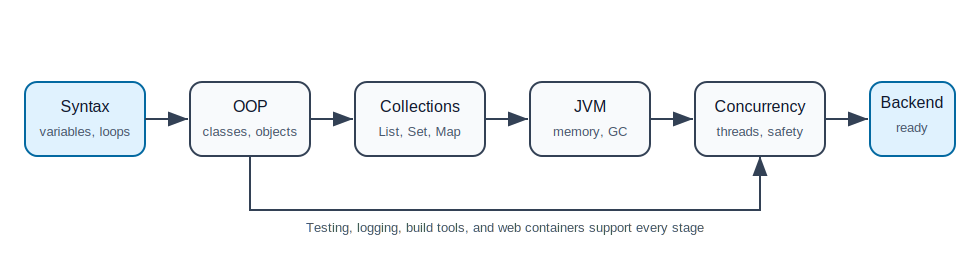

# 01. Java Fundamentals

This folder is a beginner-friendly foundation for Java backend development. It does not assume that you already know how Java programs are structured or why backend developers care about topics like OOP, collections, threads, testing, logging, build tools, and servlet containers.

## How To Study This Folder

Read the files in order. Do not rush the advanced topics. A new learner should first become comfortable writing small Java programs, then move toward backend-specific ideas.

| Order | File | What You Will Learn |
| --- | --- | --- |
| 1 | [01-basics-and-oop.md](01-basics-and-oop.md) | Java program structure, classes, objects, variables, loops, methods, and OOP |
| 2 | [02-collections-and-generics.md](02-collections-and-generics.md) | Lists, sets, maps, queues, generics, equality, and type safety |
| 3 | [03-advanced-jvm-concurrency-gc.md](03-advanced-jvm-concurrency-gc.md) | Design patterns, JVM execution, memory, threads, concurrency, and garbage collection |
| 4 | [04-web-build-tools-servers-testing-logging.md](04-web-build-tools-servers-testing-logging.md) | Servlets, JSP, Maven, Gradle, servers, JUnit, Mockito, and logging |

## What "Java Fundamentals" Means For Backend Development

For backend work, Java fundamentals are not only syntax. You need to understand how code becomes a running application, how objects model business problems, how data is stored in memory, how multiple requests can run at the same time, and how to verify behavior with tests.

## Learning Path

## Minimum Practice Before Moving To Spring

Before starting the Spring Framework folder, build these small programs:

1. A console-based student management app using classes, lists, maps, and basic validation.
2. A banking app using encapsulation, inheritance or interfaces, exceptions, and unit tests.
3. A small multithreaded job processor using `ExecutorService`.
4. A Maven project with JUnit tests and Logback logging.

## Key Rule

If you cannot explain a concept without Spring, you do not fully understand it yet. Spring makes backend development easier, but Java fundamentals explain what Spring is doing underneath.

