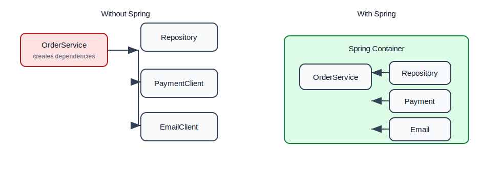
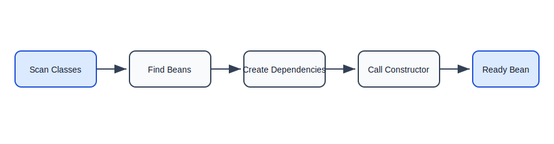
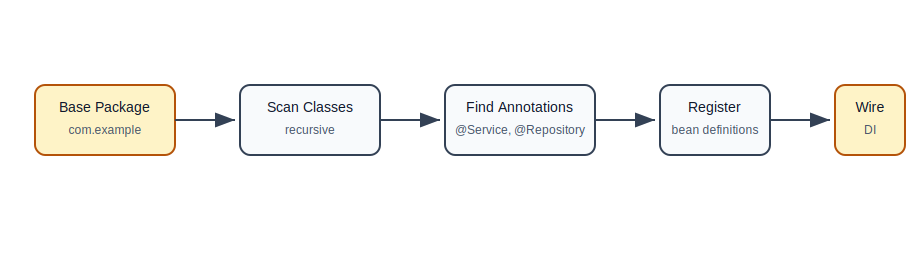
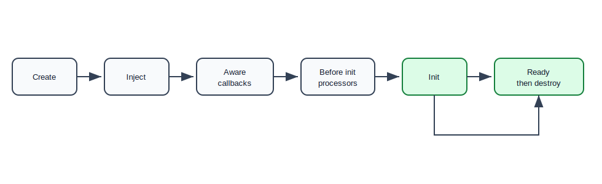
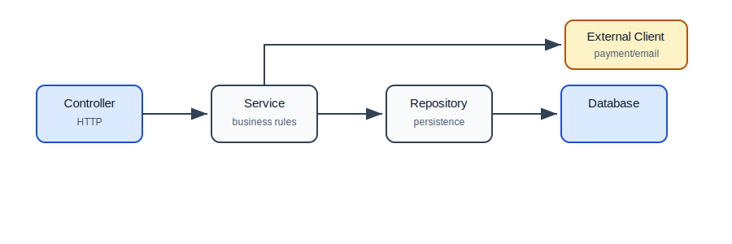

# Core Container, IoC, Dependency Injection, and Bean Lifecycle

## Why This Topic Matters

Spring Framework became popular because it solved a painful problem in Java applications: object wiring.

In a real backend app, one class often needs many other classes:

- controller needs service,
- service needs repository,
- repository needs database connection,
- service may also need email client, payment client, cache client, logger, validator.

If every class creates its own dependencies manually, the code becomes tightly coupled and hard to test. Spring solves this by creating objects and injecting dependencies for you.

## The Problem Without Spring

Imagine this service:

```java
public class OrderService {
    private final OrderRepository orderRepository;
    private final PaymentClient paymentClient;
    private final EmailClient emailClient;

    public OrderService() {
        this.orderRepository = new JdbcOrderRepository();
        this.paymentClient = new RazorpayPaymentClient();
        this.emailClient = new SmtpEmailClient();
    }
}
```

This looks simple, but it creates problems:

- `OrderService` is tightly tied to specific implementations.
- Testing is hard because you cannot easily replace real payment/email clients.
- Changing implementation requires modifying service code.
- Object creation logic spreads across the application.

## The Spring Way

```java
@Service
public class OrderService {
    private final OrderRepository orderRepository;
    private final PaymentClient paymentClient;
    private final EmailClient emailClient;

    public OrderService(
            OrderRepository orderRepository,
            PaymentClient paymentClient,
            EmailClient emailClient) {
        this.orderRepository = orderRepository;
        this.paymentClient = paymentClient;
        this.emailClient = emailClient;
    }
}
```

Now `OrderService` declares what it needs. Spring decides how to provide those dependencies.

## Manual Object Creation vs Spring



## Inversion of Control

Inversion of Control means control is inverted from your code to the framework.

Without IoC:

```java
OrderRepository repository = new JdbcOrderRepository();
OrderService service = new OrderService(repository);
```

Your code controls object creation.

With IoC:

```java
ApplicationContext context =
        new AnnotationConfigApplicationContext(AppConfig.class);

OrderService service = context.getBean(OrderService.class);
```

Spring controls object creation and wiring.

## Dependency Injection

Dependency injection means an object receives its dependencies from outside instead of creating them internally.

There are three common forms:

1. Constructor injection
2. Setter injection
3. Field injection

## Constructor Injection

Constructor injection is the preferred style.

```java
@Service
public class UserService {
    private final UserRepository userRepository;
    private final PasswordEncoder passwordEncoder;

    public UserService(UserRepository userRepository,
                       PasswordEncoder passwordEncoder) {
        this.userRepository = userRepository;
        this.passwordEncoder = passwordEncoder;
    }
}
```

Why it is preferred:

- required dependencies are obvious,
- fields can be `final`,
- object cannot be created without dependencies,
- easier to test,
- avoids partially initialized objects.

## Setter Injection

Setter injection is useful for optional dependencies.

```java
@Service
public class ReportService {
    private AuditLogger auditLogger;

    @Autowired
    public void setAuditLogger(AuditLogger auditLogger) {
        this.auditLogger = auditLogger;
    }
}
```

Use it when the dependency is truly optional or can change after construction.

## Field Injection

Field injection works but should usually be avoided.

```java
@Service
public class UserService {
    @Autowired
    private UserRepository userRepository;
}
```

Problems:

- dependencies are hidden,
- difficult to test without Spring,
- fields cannot be `final`,
- object can exist in an invalid state.

## Dependency Injection Flow



## What Is A Bean?

A bean is an object managed by the Spring container.

If Spring creates it, stores it, wires it, and manages its lifecycle, it is a bean.

Examples:

```java
@Service
public class OrderService {
}
```

```java
@Repository
public class JdbcOrderRepository {
}
```

```java
@Configuration
public class AppConfig {
    @Bean
    public Clock clock() {
        return Clock.systemUTC();
    }
}
```

All of these can become Spring beans.

## Common Bean Annotations

| Annotation | Meaning | Typical Layer |
| --- | --- | --- |
| `@Component` | generic Spring-managed object | any |
| `@Service` | business logic class | service layer |
| `@Repository` | data access class | repository layer |
| `@Controller` | web controller returning views | web layer |
| `@RestController` | web controller returning data | REST layer |
| `@Configuration` | class declaring bean definitions | config layer |
| `@Bean` | method creates a bean | config method |

The annotations help humans understand intent. They also help Spring discover objects.

## Component Scanning

Component scanning means Spring scans packages and finds classes annotated with stereotypes like `@Component`, `@Service`, and `@Repository`.

```java
@Configuration
@ComponentScan(basePackages = "com.example")
public class AppConfig {
}
```

If `OrderService` is inside `com.example`, Spring can find it.

```java
package com.example.order;

@Service
public class OrderService {
}
```

## Component Scanning Flow



## Java Configuration

Sometimes a class cannot be annotated directly. This happens often with third-party library objects.

Use `@Bean` for those cases.

```java
@Configuration
public class TimeConfig {
    @Bean
    public Clock clock() {
        return Clock.systemUTC();
    }
}
```

```java
@Service
public class InvoiceService {
    private final Clock clock;

    public InvoiceService(Clock clock) {
        this.clock = clock;
    }
}
```

Spring creates the `Clock` bean and injects it.

## ApplicationContext

`ApplicationContext` is the central Spring container used by most applications.

It can:

- create beans,
- inject dependencies,
- manage bean lifecycle,
- publish events,
- read environment properties,
- support internationalization,
- integrate with web applications.

Example:

```java
ApplicationContext context =
        new AnnotationConfigApplicationContext(AppConfig.class);

OrderService orderService = context.getBean(OrderService.class);
```

In Spring Boot apps, you rarely create `ApplicationContext` manually, but it still exists behind the scenes.

## BeanFactory vs ApplicationContext

`BeanFactory` is the basic container. `ApplicationContext` is a richer container built for real applications.

| Feature | BeanFactory | ApplicationContext |
| --- | --- | --- |
| Bean creation | yes | yes |
| Dependency injection | yes | yes |
| Events | limited | yes |
| Message resources | no | yes |
| Environment access | limited | yes |
| Web support | limited | yes |
| Common in apps | rarely directly | yes |

Beginner rule: learn `ApplicationContext`; know that `BeanFactory` is the lower-level base concept.

## Bean Names

Every bean has a name.

```java
@Service
public class PaymentService {
}
```

Default bean name:

```text
paymentService
```

You can specify a custom name:

```java
@Service("stripePaymentService")
public class StripePaymentService {
}
```

## Multiple Beans Of Same Type

If two beans implement the same interface, Spring may not know which one to inject.

```java
public interface PaymentProcessor {
    void pay(double amount);
}
```

```java
@Service
public class CardPaymentProcessor implements PaymentProcessor {
}
```

```java
@Service
public class UpiPaymentProcessor implements PaymentProcessor {
}
```

This injection is ambiguous:

```java
public CheckoutService(PaymentProcessor paymentProcessor) {
}
```

Fix with `@Qualifier`:

```java
public CheckoutService(
        @Qualifier("upiPaymentProcessor") PaymentProcessor paymentProcessor) {
    this.paymentProcessor = paymentProcessor;
}
```

Or mark one as primary:

```java
@Primary
@Service
public class CardPaymentProcessor implements PaymentProcessor {
}
```

## Bean Scope

Scope controls how many bean instances Spring creates.

| Scope | Meaning |
| --- | --- |
| `singleton` | one instance per Spring container |
| `prototype` | new instance each time requested |
| `request` | one instance per HTTP request |
| `session` | one instance per HTTP session |

Default scope is singleton.

Important: singleton does not mean global JVM singleton. It means one instance inside one Spring container.

## Bean Lifecycle

Spring beans have a lifecycle.



## Lifecycle Hooks

Use lifecycle hooks when a bean needs setup or cleanup.

```java
@Component
public class CacheWarmup {
    @PostConstruct
    public void loadCache() {
        System.out.println("Loading cache");
    }

    @PreDestroy
    public void releaseResources() {
        System.out.println("Releasing resources");
    }
}
```

Use `@PostConstruct` for light initialization. Avoid heavy business workflows at startup unless required.

## Circular Dependencies

A circular dependency happens when beans depend on each other.

```java
@Service
public class AService {
    public AService(BService bService) {
    }
}
```

```java
@Service
public class BService {
    public BService(AService aService) {
    }
}
```

This is often a design smell. Usually it means responsibilities are mixed.

Fix options:

- extract shared logic into a third service,
- move one responsibility to the correct layer,
- introduce domain events,
- redesign the dependency direction.

## Typical Backend Layering



Layer responsibilities:

| Layer | Job |
| --- | --- |
| Controller | HTTP request/response |
| Service | business rules and transactions |
| Repository | persistence |
| External Client | calls third-party or other services |
| Configuration | creates infrastructure beans |

## Common Beginner Mistakes

| Mistake | Why It Hurts | Better Approach |
| --- | --- | --- |
| Creating Spring-managed classes with `new` | dependencies are not injected | let Spring create beans |
| Using field injection everywhere | hard to test and reason about | use constructor injection |
| Putting logic in configuration classes | config becomes business logic | keep logic in services |
| Making every class a bean | bloated container | register only app components |
| Ignoring ambiguous beans | startup errors | use `@Qualifier` or `@Primary` |
| Circular service dependencies | confusing design | refactor responsibilities |
| Adding static helpers for dependencies | bypasses Spring and tests | inject collaborators |

## Practice Exercise

Create a small Spring Framework app with:

- `NotificationService` interface,
- `EmailNotificationService`,
- `SmsNotificationService`,
- `UserService`,
- `AppConfig`.

Requirements:

1. Register both notification services as beans.
2. Inject one into `UserService` using `@Qualifier`.
3. Add a `Clock` bean using `@Bean`.
4. Print all bean names from the `ApplicationContext`.
5. Add `@PostConstruct` to one service and observe when it runs.

## Self-Check Questions

1. What is a Spring bean?
2. What does Inversion of Control mean?
3. Why is constructor injection usually preferred?
4. What does component scanning do?
5. When should you use `@Bean` instead of `@Component`?
6. What happens if Spring finds two beans of the same interface?
7. Why are circular dependencies usually a design problem?

