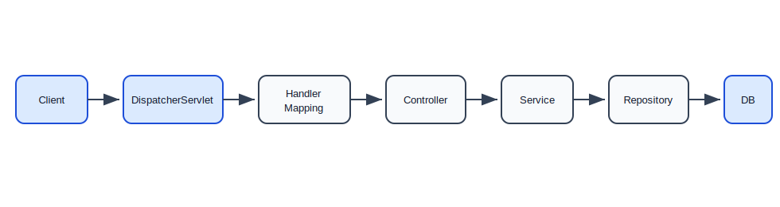
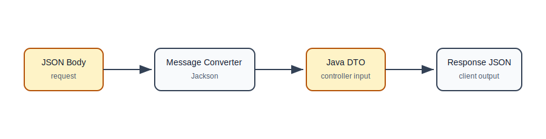
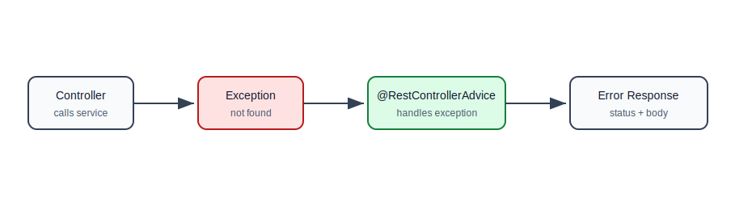
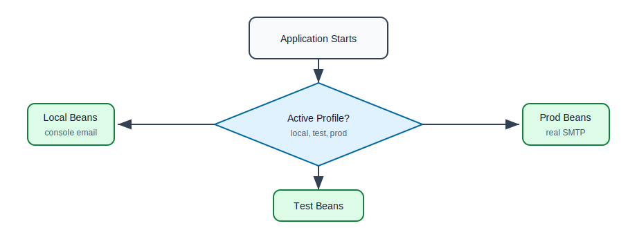

# Spring MVC, Annotations, Configuration, and Profiles

## Why This Topic Matters

Most Java backend developers meet Spring through web APIs. Spring MVC is the part of Spring that receives HTTP requests, maps them to Java methods, converts JSON into Java objects, validates input, and returns responses.

To build real APIs later with Spring Boot, you first need to understand the Spring MVC request flow.

## What Is Spring MVC?

MVC means Model-View-Controller.

In modern REST APIs, the word "view" usually means the response body, often JSON.

Core idea:

- client sends HTTP request,
- Spring finds a matching controller method,
- controller calls service,
- service performs business logic,
- response is converted to JSON and returned.

## Spring MVC Request Flow



## DispatcherServlet

`DispatcherServlet` is the front controller of Spring MVC.

It receives incoming web requests and coordinates the rest of the MVC process.

It does not contain your business logic. Its job is routing and orchestration.

Simplified responsibilities:

- receive request,
- find matching controller method,
- call argument resolvers,
- call controller,
- handle return value,
- produce response.

## Controller

A controller handles web requests.

```java
@RestController
@RequestMapping("/api/users")
public class UserController {
    private final UserService userService;

    public UserController(UserService userService) {
        this.userService = userService;
    }

    @GetMapping("/{id}")
    public UserResponse getUser(@PathVariable Long id) {
        return userService.findById(id);
    }
}
```

Explanation:

- `@RestController` tells Spring this class handles REST requests.
- `@RequestMapping("/api/users")` sets the base URL.
- `@GetMapping("/{id}")` maps GET requests like `/api/users/10`.
- `@PathVariable Long id` reads `10` from the URL.
- The return object is converted to JSON.

## `@Controller` vs `@RestController`

| Annotation | Used For | Return Value Means |
| --- | --- | --- |
| `@Controller` | server-rendered web pages | view name unless annotated otherwise |
| `@RestController` | REST APIs | response body directly |

`@RestController` is basically `@Controller` plus `@ResponseBody`.

## Common Request Mapping Annotations

| Annotation | HTTP Method | Example |
| --- | --- | --- |
| `@GetMapping` | GET | read user |
| `@PostMapping` | POST | create user |
| `@PutMapping` | PUT | replace user |
| `@PatchMapping` | PATCH | partially update user |
| `@DeleteMapping` | DELETE | delete user |
| `@RequestMapping` | any or base mapping | class-level base path |

## Reading Path Variables

```java
@GetMapping("/{id}")
public UserResponse getUser(@PathVariable Long id) {
    return userService.findById(id);
}
```

Request:

```http
GET /api/users/42
```

`id` becomes `42`.

## Reading Query Parameters

```java
@GetMapping
public List<UserResponse> searchUsers(
        @RequestParam(required = false) String name,
        @RequestParam(defaultValue = "0") int page,
        @RequestParam(defaultValue = "20") int size) {
    return userService.search(name, page, size);
}
```

Request:

```http
GET /api/users?name=asha&page=0&size=10
```

Use query parameters for filtering, sorting, and pagination.

## Reading JSON Request Body

```java
public record CreateUserRequest(
        String name,
        String email
) {
}
```

```java
@PostMapping
@ResponseStatus(HttpStatus.CREATED)
public UserResponse createUser(@RequestBody CreateUserRequest request) {
    return userService.create(request);
}
```

Request:

```json
{
  "name": "Asha",
  "email": "asha@example.com"
}
```

Spring uses an HTTP message converter, commonly Jackson, to convert JSON into Java objects.

## JSON Conversion Flow



## Validation

Validation checks whether input is acceptable before business logic runs.

```java
public record CreateUserRequest(
        @NotBlank(message = "Name is required")
        String name,

        @Email(message = "Email must be valid")
        @NotBlank(message = "Email is required")
        String email
) {
}
```

```java
@PostMapping
@ResponseStatus(HttpStatus.CREATED)
public UserResponse createUser(@Valid @RequestBody CreateUserRequest request) {
    return userService.create(request);
}
```

If validation fails, Spring can return a `400 Bad Request`.

## Why DTOs Matter

DTO means Data Transfer Object.

Use DTOs for API request and response objects.

Avoid exposing database entities directly.

Bad:

```java
@GetMapping("/{id}")
public UserEntity getUser(@PathVariable Long id) {
    return userRepository.findById(id).orElseThrow();
}
```

Better:

```java
@GetMapping("/{id}")
public UserResponse getUser(@PathVariable Long id) {
    return userService.findById(id);
}
```

Why:

- avoids leaking internal database fields,
- gives stable API contracts,
- prevents accidental serialization of relationships,
- lets API shape differ from database shape.

## Global Exception Handling

Controllers should not repeat error-handling logic everywhere.

Use `@RestControllerAdvice`.

```java
@RestControllerAdvice
public class ApiExceptionHandler {
    @ExceptionHandler(UserNotFoundException.class)
    @ResponseStatus(HttpStatus.NOT_FOUND)
    public ErrorResponse handleUserNotFound(UserNotFoundException ex) {
        return new ErrorResponse("USER_NOT_FOUND", ex.getMessage());
    }
}
```

```java
public record ErrorResponse(String code, String message) {
}
```

## Error Handling Flow



## Configuration

Spring configuration tells the application how to create and customize objects.

```java
@Configuration
public class WebConfig implements WebMvcConfigurer {
    @Override
    public void addCorsMappings(CorsRegistry registry) {
        registry.addMapping("/api/**")
                .allowedOrigins("https://example.com")
                .allowedMethods("GET", "POST", "PUT", "DELETE");
    }
}
```

This configures CORS for API endpoints.

## What Is CORS?

CORS means Cross-Origin Resource Sharing.

Browsers use CORS to decide whether frontend code from one origin can call APIs on another origin.

Example:

- frontend: `http://localhost:3000`
- backend: `http://localhost:8080`

These are different origins, so CORS may be needed.

## Properties And Environment

Spring can read values from properties.

```properties
app.email.sender=no-reply@example.com
```

```java
@Component
public class EmailSettings {
    private final String sender;

    public EmailSettings(@Value("${app.email.sender}") String sender) {
        this.sender = sender;
    }
}
```

Use properties for values that change by environment.

## Profiles

Profiles let you enable different beans or settings in different environments.

Common profiles:

- `local`
- `dev`
- `test`
- `stage`
- `prod`

Example:

```java
@Configuration
@Profile("local")
public class LocalEmailConfig {
    @Bean
    public EmailClient emailClient() {
        return new ConsoleEmailClient();
    }
}
```

```java
@Configuration
@Profile("prod")
public class ProdEmailConfig {
    @Bean
    public EmailClient emailClient() {
        return new SmtpEmailClient();
    }
}
```

In local, emails print to console. In prod, emails go through real SMTP.

## Profile Selection Flow



## Layered MVC Example

### Request DTO

```java
public record CreateUserRequest(
        @NotBlank String name,
        @Email String email
) {
}
```

### Response DTO

```java
public record UserResponse(
        Long id,
        String name,
        String email
) {
}
```

### Controller

```java
@RestController
@RequestMapping("/api/users")
public class UserController {
    private final UserService userService;

    public UserController(UserService userService) {
        this.userService = userService;
    }

    @PostMapping
    @ResponseStatus(HttpStatus.CREATED)
    public UserResponse create(@Valid @RequestBody CreateUserRequest request) {
        return userService.create(request);
    }
}
```

### Service

```java
@Service
public class UserService {
    private final UserRepository userRepository;

    public UserService(UserRepository userRepository) {
        this.userRepository = userRepository;
    }

    public UserResponse create(CreateUserRequest request) {
        User user = new User(request.name(), request.email());
        User saved = userRepository.save(user);
        return new UserResponse(saved.getId(), saved.getName(), saved.getEmail());
    }
}
```

## Common Beginner Mistakes

| Mistake | Why It Hurts | Better Approach |
| --- | --- | --- |
| Putting business logic in controller | controllers become huge | move rules to services |
| Returning entities directly | leaks database design | use DTOs |
| Skipping validation | bad data enters system | use validation annotations |
| Handling exceptions in every method | duplicated code | use `@RestControllerAdvice` |
| Hardcoding URLs/secrets | environment changes become painful | use properties/profiles |
| Confusing path and query params | unclear APIs | path identifies resource, query filters |
| Allowing all CORS origins in prod | security risk | restrict allowed origins |

## Practice Exercise

Create a Spring MVC user API with:

1. `GET /api/users/{id}`
2. `GET /api/users?name=...`
3. `POST /api/users`
4. request validation,
5. response DTO,
6. global exception handler,
7. local and prod profile versions of an `EmailClient`.

## Self-Check Questions

1. What does `DispatcherServlet` do?
2. What is the difference between `@Controller` and `@RestController`?
3. When should you use `@PathVariable`?
4. When should you use `@RequestParam`?
5. Why should request and response DTOs be separate from entities?
6. What does `@Valid` do?
7. Why are profiles useful?

