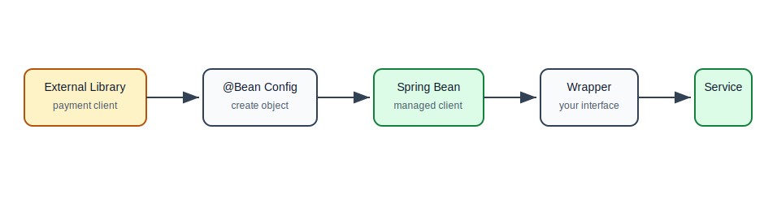
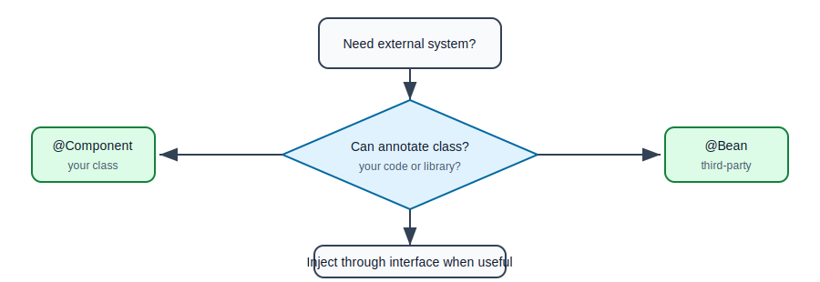
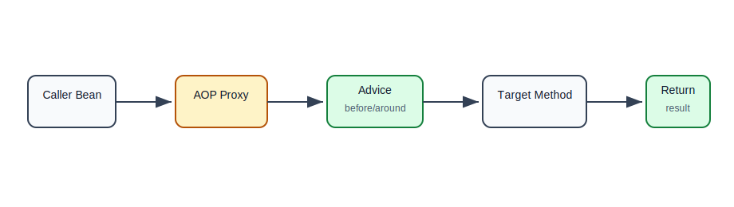
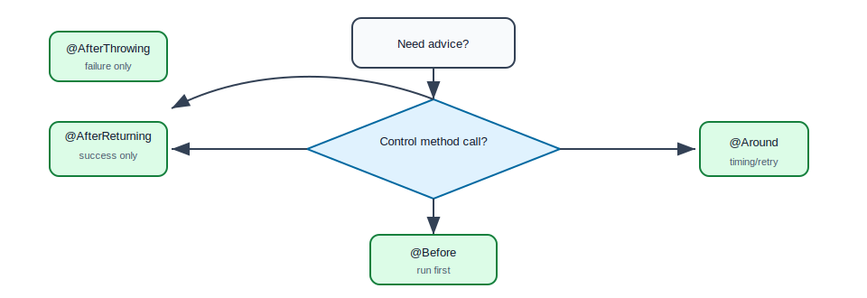
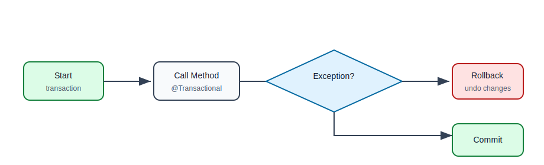

# Integration and AOP

## Why This Topic Matters

Real backend applications rarely live alone. They connect to:

- databases,
- payment gateways,
- email providers,
- caches,
- message brokers,
- file storage,
- monitoring tools,
- other internal services.

Spring helps integrate these dependencies cleanly. It also provides AOP, which lets you add common behavior such as logging, metrics, transactions, and security checks without duplicating the same code everywhere.

## What Integration Means In Spring

Integration means making an external library, framework, or system usable inside your Spring application.

The usual Spring approach:

1. Create or configure the external object.
2. Register it as a bean.
3. Inject it into services.
4. Keep business code dependent on an interface where possible.

## Integration Flow



## Example: External Payment Client

Suppose a payment provider gives you this library class:

```java
public class PaymentGatewayClient {
    private final String apiKey;

    public PaymentGatewayClient(String apiKey) {
        this.apiKey = apiKey;
    }

    public PaymentResult charge(String customerId, double amount) {
        return new PaymentResult("SUCCESS");
    }
}
```

You usually cannot add `@Component` to third-party library code.

So you register it using `@Bean`.

```java
@Configuration
public class PaymentConfig {
    @Bean
    public PaymentGatewayClient paymentGatewayClient(
            @Value("${payment.api-key}") String apiKey) {
        return new PaymentGatewayClient(apiKey);
    }
}
```

Now it can be injected.

```java
@Service
public class PaymentService {
    private final PaymentGatewayClient paymentGatewayClient;

    public PaymentService(PaymentGatewayClient paymentGatewayClient) {
        this.paymentGatewayClient = paymentGatewayClient;
    }

    public void charge(String customerId, double amount) {
        paymentGatewayClient.charge(customerId, amount);
    }
}
```

## Better Integration With An Interface

Directly depending on third-party clients can make tests and future changes harder.

Better:

```java
public interface PaymentProvider {
    PaymentResult charge(String customerId, double amount);
}
```

```java
@Service
public class GatewayPaymentProvider implements PaymentProvider {
    private final PaymentGatewayClient client;

    public GatewayPaymentProvider(PaymentGatewayClient client) {
        this.client = client;
    }

    @Override
    public PaymentResult charge(String customerId, double amount) {
        return client.charge(customerId, amount);
    }
}
```

```java
@Service
public class CheckoutService {
    private final PaymentProvider paymentProvider;

    public CheckoutService(PaymentProvider paymentProvider) {
        this.paymentProvider = paymentProvider;
    }
}
```

Now `CheckoutService` depends on your interface, not on the payment library.

## Common Integration Types

| Integration | Example | Spring Approach |
| --- | --- | --- |
| Database | PostgreSQL, MySQL | datasource/repository beans |
| HTTP API | payment, SMS, maps | client bean or interface wrapper |
| Cache | Redis | cache manager/template beans |
| Messaging | Kafka, RabbitMQ | producer/consumer beans |
| File storage | S3, local disk | storage client bean |
| Monitoring | metrics/tracing | interceptor/aspect/exporter beans |

## Configuration Properties For Integrations

Hardcoding integration values is risky.

Bad:

```java
new PaymentGatewayClient("live-secret-key");
```

Better:

```properties
payment.api-key=${PAYMENT_API_KEY}
payment.timeout-ms=3000
```

```java
public class PaymentProperties {
    private String apiKey;
    private int timeoutMs;

    // getters and setters
}
```

This keeps secrets and environment-specific values out of source code.

## Integration Design Flow



## What Is AOP?

AOP means Aspect-Oriented Programming.

It helps apply common behavior around many method calls without manually writing that behavior in every method.

Examples:

- log every service method,
- measure method duration,
- start and commit transactions,
- check permissions,
- audit sensitive operations,
- retry failed external calls.

## The Problem AOP Solves

Without AOP, repeated logging might look like this:

```java
public UserResponse findUser(Long id) {
    long start = System.currentTimeMillis();
    try {
        return userRepository.findById(id)
                .map(UserResponse::from)
                .orElseThrow();
    } finally {
        long duration = System.currentTimeMillis() - start;
        log.info("findUser took {} ms", duration);
    }
}
```

Now imagine writing this in 50 service methods. The business logic becomes noisy.

AOP moves this repeated concern into one place.

## AOP Terms

| Term | Meaning | Simple Example |
| --- | --- | --- |
| Aspect | class containing cross-cutting behavior | logging aspect |
| Join point | point where behavior can be applied | method call |
| Pointcut | rule selecting join points | all service methods |
| Advice | code that runs at join points | log before/after method |
| Weaving | applying aspect to target code | proxy intercepts method |

## AOP Flow



## Spring AOP Uses Proxies

Spring usually applies AOP by creating a proxy object.

When another bean calls your service, it may actually call a proxy first.

The proxy:

1. runs advice,
2. calls the real target method,
3. runs more advice,
4. returns the result.

This is why AOP usually works when one Spring bean calls another Spring bean.

## Logging Aspect Example

```java
@Aspect
@Component
public class LoggingAspect {
    private static final Logger log = LoggerFactory.getLogger(LoggingAspect.class);

    @Around("execution(* com.example.service..*(..))")
    public Object logServiceMethods(ProceedingJoinPoint joinPoint) throws Throwable {
        long start = System.currentTimeMillis();
        try {
            return joinPoint.proceed();
        } finally {
            long duration = System.currentTimeMillis() - start;
            log.info("method={} durationMs={}",
                    joinPoint.getSignature().toShortString(),
                    duration);
        }
    }
}
```

Explanation:

- `@Aspect` marks this class as an aspect.
- `@Component` lets Spring discover it.
- `@Around` means run code around the target method.
- `execution(* com.example.service..*(..))` selects methods inside the service package.
- `joinPoint.proceed()` calls the actual method.

## Advice Types

| Advice | When It Runs | Use Case |
| --- | --- | --- |
| `@Before` | before method | permission checks, logging input |
| `@After` | after method, success or failure | cleanup |
| `@AfterReturning` | after successful return | audit success |
| `@AfterThrowing` | after exception | error logging |
| `@Around` | before and after, controls call | timing, retries, transactions |

## Pointcut Examples

All methods in service package:

```java
@Pointcut("execution(* com.example.service..*(..))")
public void serviceMethods() {
}
```

Methods annotated with custom annotation:

```java
@Pointcut("@annotation(com.example.Audited)")
public void auditedMethods() {
}
```

## Custom Annotation With AOP

```java
@Retention(RetentionPolicy.RUNTIME)
@Target(ElementType.METHOD)
public @interface Audited {
    String action();
}
```

```java
@Audited(action = "DELETE_USER")
public void deleteUser(Long id) {
    userRepository.deleteById(id);
}
```

```java
@Aspect
@Component
public class AuditAspect {
    @AfterReturning("@annotation(audited)")
    public void audit(Audited audited) {
        System.out.println("Audit action: " + audited.action());
    }
}
```

## AOP Advice Selection Flow



## Transactions Are AOP-Like

When you write:

```java
@Transactional
public void placeOrder(CreateOrderRequest request) {
    orderRepository.save(order);
    paymentRepository.save(payment);
}
```

Spring uses proxy-based behavior to start a transaction before the method and commit or roll it back after the method.

Simplified:

```text
start transaction
call placeOrder
if success: commit
if exception: rollback
```

## Transaction Flow



## When To Use AOP

Good use cases:

- logging,
- metrics,
- tracing,
- transactions,
- auditing,
- security checks,
- method timing.

Poor use cases:

- core business rules,
- code that should be obvious in the method,
- logic that only applies to one method,
- complex branching behavior hidden from readers.

## AOP Limitations To Know

Beginner-friendly version:

- AOP can make code harder to follow if overused.
- Spring AOP usually works through proxies.
- Calls from one method to another method in the same class may bypass the proxy.
- Private methods are not normally advised by Spring AOP.
- Business logic should not be hidden inside aspects.

## Common Beginner Mistakes

| Mistake | Why It Hurts | Better Approach |
| --- | --- | --- |
| Wrapping third-party clients directly everywhere | hard to replace and test | create your own interface wrapper |
| Hardcoding API keys | security risk | use properties/env vars |
| Putting business rules in aspects | hidden behavior | keep business logic in services |
| Overusing broad pointcuts | surprising behavior | keep pointcuts specific |
| Forgetting `proceed()` in `@Around` | target method never runs | always call it unless intentionally blocking |
| Logging sensitive request data | leaks secrets | mask or omit sensitive fields |
| Assuming AOP applies to private methods | advice does not run | apply advice to Spring bean public methods |

## Practice Exercise

Create:

- `PaymentProvider` interface,
- `FakePaymentProvider`,
- `CheckoutService`,
- `PaymentConfig`,
- `LoggingAspect`,
- `@Audited` annotation,
- `AuditAspect`.

Requirements:

1. Register payment client using `@Bean`.
2. Inject provider through an interface.
3. Add an aspect that logs service method duration.
4. Add `@Audited` to one method.
5. Confirm that the business method still contains business logic, not logging/timing code.

## Self-Check Questions

1. Why should third-party integrations often be wrapped behind your own interface?
2. When should you use `@Bean` for integration?
3. What is a cross-cutting concern?
4. What is a pointcut?
5. What does `joinPoint.proceed()` do?
6. Why can overusing AOP make code harder to understand?
7. How is `@Transactional` conceptually related to AOP?

