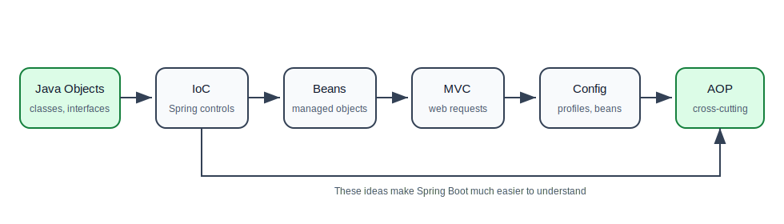

# 02. Spring Framework

Spring Framework is the foundation underneath Spring Boot. Before learning auto-configuration, starters, REST APIs, Spring Data, or Spring Security, you should understand how Spring creates objects, wires dependencies, handles web requests, manages configuration, and applies cross-cutting behavior.

This folder is written for a learner who knows basic Java but is new to Spring.

## How To Study This Folder

Read these files in order:

| Order | File | What You Will Learn |
| --- | --- | --- |
| 1 | [01-core-container-di-beans.md](01-core-container-di-beans.md) | IoC, DI, beans, application context, lifecycle, component scanning |
| 2 | [02-spring-mvc-config-profiles.md](02-spring-mvc-config-profiles.md) | MVC request flow, controllers, annotations, validation, configuration, profiles |
| 3 | [03-integration-and-aop.md](03-integration-and-aop.md) | Integrating external libraries and using AOP for logging, metrics, transactions, and security-style concerns |

## The Big Idea

Spring is mostly about object management.

Without Spring, your code creates and connects objects manually. With Spring, you describe what objects exist and what they need. Spring creates them, wires them together, and manages their lifecycle.

## Spring Learning Path

## What You Should Be Able To Explain After This Folder

You should be able to explain:

- what a Spring bean is,
- why dependency injection is useful,
- how `ApplicationContext` differs from manually using `new`,
- why constructor injection is preferred,
- how a request reaches a Spring MVC controller,
- why controllers, services, and repositories are separate,
- how profiles help separate local, test, and production configuration,
- what AOP means and when it is useful.

## Practice Project Before Moving To Spring Boot

Build a small Spring Framework application with:

1. `UserController`
2. `UserService`
3. `UserRepository`
4. Java configuration class
5. One external client bean
6. One profile-specific bean
7. One simple logging aspect

The goal is not to build a full production app. The goal is to see Spring create and connect objects for you.

