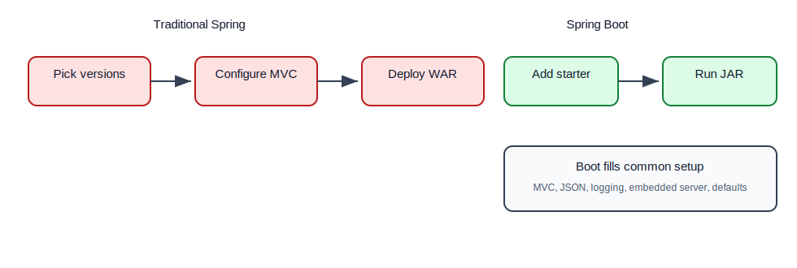
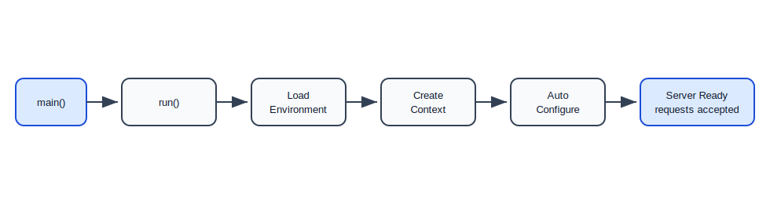
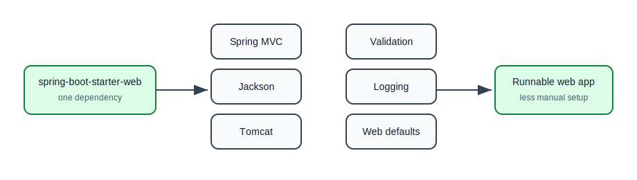
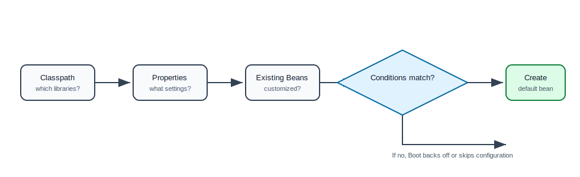
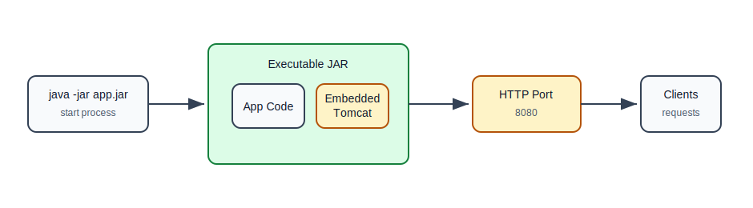

# Why Spring Boot and Auto-Configuration

## Why This Topic Matters

Spring Boot is often the first thing new Java backend developers use, but many learners misunderstand it.

Spring Boot is not a separate framework that replaces Spring. It is a layer that helps you create Spring applications faster by providing:

- starter dependencies,
- auto-configuration,
- embedded servers,
- externalized configuration,
- production-ready features,
- sensible defaults.

If you understand why Boot exists, you will be less confused when something is configured "automatically".

## The Problem Before Spring Boot

Before Spring Boot, creating a Spring web application often required many manual steps:

1. Choose compatible dependency versions.
2. Configure Spring MVC.
3. Configure a servlet container.
4. Configure JSON conversion.
5. Configure logging.
6. Configure database connections.
7. Package the app as WAR.
8. Deploy it to an external server.

This was powerful, but slow for common applications.

## Traditional Spring vs Spring Boot



## What Spring Boot Adds

| Spring Boot Feature | What It Solves |
| --- | --- |
| Starters | avoids manually listing many related dependencies |
| Auto-configuration | creates common beans automatically |
| Embedded server | app can run as `java -jar app.jar` |
| External config | properties/YAML/env vars without code changes |
| Actuator | health, metrics, info, operational endpoints |
| Opinionated defaults | less setup for common use cases |

## Your First Boot Application

```java
@SpringBootApplication
public class TaskManagerApplication {
    public static void main(String[] args) {
        SpringApplication.run(TaskManagerApplication.class, args);
    }
}
```

This small class starts an entire Spring application.

## What `@SpringBootApplication` Means

`@SpringBootApplication` combines three important ideas:

```java
@SpringBootConfiguration
@EnableAutoConfiguration
@ComponentScan
public @interface SpringBootApplication {
}
```

Beginner explanation:

- `@SpringBootConfiguration`: this class is a configuration class.
- `@EnableAutoConfiguration`: Boot should apply automatic setup based on dependencies and properties.
- `@ComponentScan`: scan the current package and subpackages for Spring components.

## Main Class Package Rule

Put the main application class at the root package.

Good:

```text
com.example.taskmanager
  TaskManagerApplication.java
  controller/
  service/
  repository/
```

Risky:

```text
com.example.taskmanager.app
  TaskManagerApplication.java
com.example.taskmanager.service
  TaskService.java
```

If the main class is too deep, component scanning may not find sibling packages.

## Boot Startup Flow



## Starter Dependencies

A starter is a dependency that groups related dependencies for a common feature.

Instead of manually adding Spring MVC, Jackson, validation, logging, and embedded server dependencies one by one, you can add:

```xml
<dependency>
    <groupId>org.springframework.boot</groupId>
    <artifactId>spring-boot-starter-web</artifactId>
</dependency>
```

This starter brings what a typical web application needs.

## Common Starters

| Starter | Use |
| --- | --- |
| `spring-boot-starter-web` | REST APIs and Spring MVC |
| `spring-boot-starter-validation` | validation annotations like `@NotBlank` |
| `spring-boot-starter-data-jpa` | JPA and relational database repositories |
| `spring-boot-starter-jdbc` | JDBC database access |
| `spring-boot-starter-security` | authentication and authorization |
| `spring-boot-starter-test` | JUnit, Mockito, Spring test support |
| `spring-boot-starter-actuator` | health, metrics, production endpoints |

## Starter Dependency Flow



## Auto-Configuration

Auto-configuration means Spring Boot examines your application and configures common beans automatically.

Boot looks at:

- dependencies on the classpath,
- properties and YAML configuration,
- existing beans you already defined,
- conditions in auto-configuration classes.

Example:

If `spring-boot-starter-web` is present, Boot sees Spring MVC and an embedded server dependency. It configures a web application context, DispatcherServlet, JSON conversion, and server defaults.

## Auto-Configuration Mental Model

Auto-configuration is not magic. It is conditional configuration.

Simplified idea:

```java
if (SpringMvcIsOnClasspath && noCustomWebConfigExists) {
    createDefaultSpringMvcBeans();
}

if (JacksonIsOnClasspath && noCustomObjectMapperExists) {
    createDefaultObjectMapper();
}
```

Actual Boot code is more sophisticated, but this mental model is enough for a learner.

## Auto-Configuration Flow



## Conditions

Boot auto-configuration uses conditions.

Common condition ideas:

| Condition | Meaning |
| --- | --- |
| class exists | configure only if a library is present |
| bean missing | create default only if user did not define one |
| property enabled | configure only if a property says so |
| web app detected | configure only for web applications |

Example style:

```java
@ConditionalOnClass(DataSource.class)
@ConditionalOnMissingBean(DataSource.class)
public DataSource dataSource() {
    return createDefaultDataSource();
}
```

You do not write this often as a beginner, but you should understand how Boot decides what to create.

## Embedded Server

In old-style Java web apps, you often built a WAR file and deployed it to an external Tomcat server.

With Spring Boot, the server is usually embedded inside the application.

```bash
mvn spring-boot:run
```

or:

```bash
java -jar target/task-manager.jar
```

The application starts its own server.

## Embedded Server Flow



## Simple REST Controller

```java
@RestController
@RequestMapping("/api/health")
public class HealthController {
    @GetMapping
    public Map<String, String> health() {
        return Map.of("status", "UP");
    }
}
```

When the app runs:

```http
GET http://localhost:8080/api/health
```

Response:

```json
{
  "status": "UP"
}
```

## How Boot Finds This Controller

1. Main class starts.
2. Component scanning begins from the main class package.
3. Spring finds `@RestController`.
4. Spring MVC maps `/api/health`.
5. Embedded server listens for requests.
6. Request reaches the controller method.

## Overriding Boot Defaults

Boot provides defaults, but you can override them.

Example: change server port.

```properties
server.port=9090
```

Example: customize JSON mapper.

```java
@Bean
public ObjectMapper objectMapper() {
    return new ObjectMapper()
            .findAndRegisterModules();
}
```

Boot usually backs off when you provide your own bean.

## Spring Boot Is Opinionated, Not Restrictive

Opinionated means Boot chooses useful defaults. It does not mean you cannot customize.

Good default:

- use embedded Tomcat for web apps,
- use Logback for logging,
- expose JSON using Jackson,
- use common MVC setup.

You can change these when needed.

## Common Beginner Mistakes

| Mistake | Why It Hurts | Better Approach |
| --- | --- | --- |
| Thinking Boot replaces Spring | confusion about beans/MVC | learn Boot as Spring setup layer |
| Putting main class in wrong package | components not discovered | keep it at root package |
| Adding random starters | dependency conflicts or unused features | add only what you need |
| Fighting auto-configuration blindly | hard debugging | understand conditions and defaults |
| Hardcoding config in Java | difficult deployment | use properties/YAML |
| Ignoring startup logs | missed configuration clues | read logs when app starts |

## Practice Exercise

Create a basic Boot project with:

- `TaskManagerApplication`
- `HealthController`
- `TaskController`
- `TaskService`

Requirements:

1. Add `spring-boot-starter-web`.
2. Create `GET /api/health`.
3. Create `GET /api/tasks`.
4. Change server port using properties.
5. Move the main class into a wrong package temporarily and observe what breaks.
6. Move it back to the root package.

## Self-Check Questions

1. What problem did Spring Boot solve?
2. What is a starter dependency?
3. What does `@SpringBootApplication` include?
4. What does auto-configuration mean?
5. Why is embedded Tomcat useful?
6. How can you override a Boot default?
7. Why should the main class be placed in the root package?

