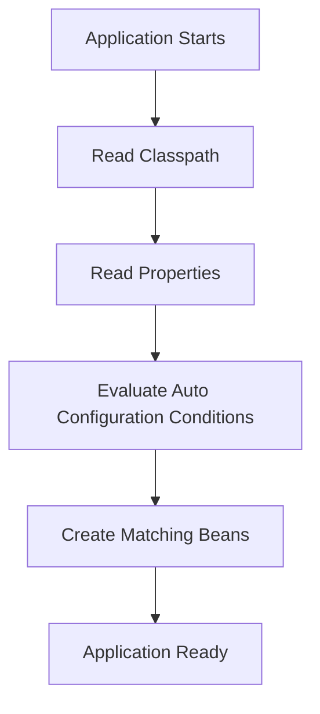
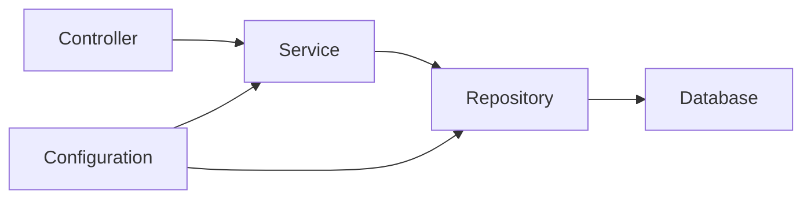

# Why Spring Boot and Auto-Configuration

## Why Spring Boot Exists

Traditional Spring applications required a lot of manual setup:

- dependency versions,
- servlet container setup,
- XML or Java configuration,
- database configuration,
- JSON converter configuration,
- logging setup.

Spring Boot provides defaults so you can build applications faster.

## Main Advantages

| Feature | Benefit |
| --- | --- |
| Starters | Group related dependencies |
| Auto-configuration | Creates beans based on classpath and properties |
| Embedded server | Run as a standalone app |
| Externalized config | Use properties/YAML/env vars |
| Actuator | Health, metrics, info endpoints |
| Opinionated defaults | Less boilerplate |

## Main Application Class

```java
@SpringBootApplication
public class BackendApplication {
    public static void main(String[] args) {
        SpringApplication.run(BackendApplication.class, args);
    }
}
```

`@SpringBootApplication` combines:

- `@Configuration`,
- `@EnableAutoConfiguration`,
- `@ComponentScan`.

## Auto-Configuration

Auto-configuration checks what is available and creates useful beans.

Example:

- If Spring MVC is on the classpath, Boot configures web MVC.
- If Jackson is on the classpath, Boot configures JSON serialization.
- If a database driver is present, Boot can configure a datasource.



## Starter Dependencies

```xml
<dependency>
    <groupId>org.springframework.boot</groupId>
    <artifactId>spring-boot-starter-web</artifactId>
</dependency>
```

This brings Spring MVC, embedded server support, JSON handling, validation support, and related dependencies.

## Controller Example

```java
@RestController
@RequestMapping("/api/health")
public class HealthController {
    @GetMapping
    public Map<String, String> health() {
        return Map.of("status", "UP");
    }
}
```

## Boot Application Layers



## When Spring Boot Helps Most

- creating REST APIs,
- building microservices,
- integrating databases quickly,
- packaging apps for containers,
- exposing health and metrics,
- reducing repetitive configuration.

