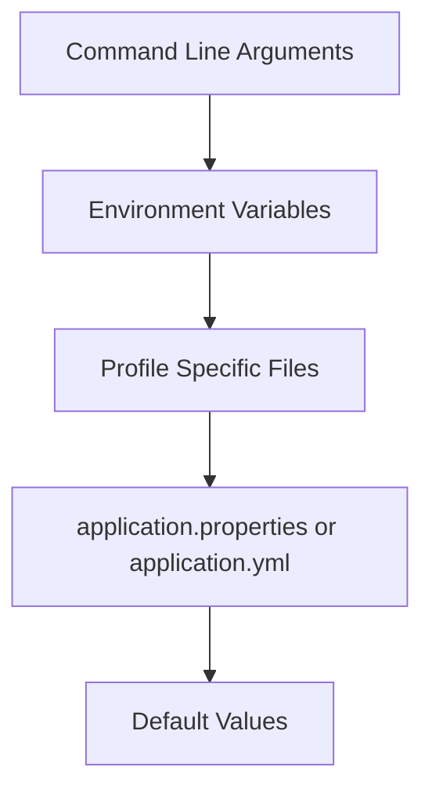

# Properties, YAML, and Configuration Binding

## Externalized Configuration

Spring Boot lets configuration live outside code.

`application.properties`:

```properties
server.port=8081
spring.application.name=order-service
payment.timeout-seconds=5
```

`application.yml`:

```yaml
server:
  port: 8081

spring:
  application:
    name: order-service

payment:
  timeout-seconds: 5
```

YAML is better for nested settings. Properties are simple and explicit.

## Reading Values With `@Value`

```java
@Service
public class PaymentService {
    private final int timeoutSeconds;

    public PaymentService(@Value("${payment.timeout-seconds}") int timeoutSeconds) {
        this.timeoutSeconds = timeoutSeconds;
    }
}
```

Use `@Value` for a small number of simple values.

## Configuration Properties

For grouped settings, prefer `@ConfigurationProperties`.

```java
@ConfigurationProperties(prefix = "payment")
public class PaymentProperties {
    private int timeoutSeconds;
    private String provider;

    public int getTimeoutSeconds() {
        return timeoutSeconds;
    }

    public void setTimeoutSeconds(int timeoutSeconds) {
        this.timeoutSeconds = timeoutSeconds;
    }

    public String getProvider() {
        return provider;
    }

    public void setProvider(String provider) {
        this.provider = provider;
    }
}
```

```java
@Configuration
@EnableConfigurationProperties(PaymentProperties.class)
public class PaymentConfig {
}
```

## Profiles With YAML

```yaml
spring:
  profiles:
    active: local

---
spring:
  config:
    activate:
      on-profile: local

server:
  port: 8080

---
spring:
  config:
    activate:
      on-profile: prod

server:
  port: 80
```

## Configuration Priority

Configuration can come from many places. A common simplified priority is:



Higher-priority values override lower-priority values.

## Environment Variables

Environment variables are common in Docker, Kubernetes, and cloud deployments.

```bash
SERVER_PORT=9090
SPRING_PROFILES_ACTIVE=prod
```

## Best Practices

- Keep secrets out of source control.
- Use profiles for environment differences.
- Use `@ConfigurationProperties` for grouped settings.
- Validate important configuration at startup.
- Keep defaults safe for local development.

