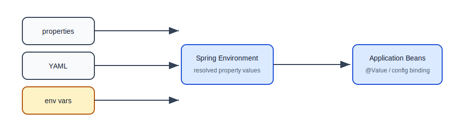
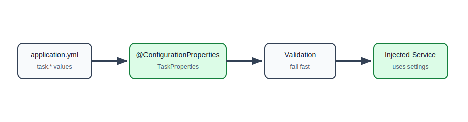
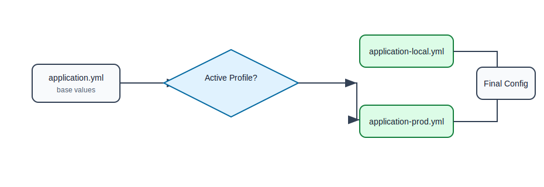

# Properties, YAML, and Configuration Binding

## Why This Topic Matters

A backend application needs different values in different environments.

Examples:

- local app runs on port `8080`, production app runs behind a gateway,
- local database is on your laptop, production database is managed in cloud,
- local email client prints messages, production sends real email,
- local logging can be verbose, production logging should be structured,
- secrets must come from environment variables or secret managers.

Spring Boot gives a standard way to keep these values outside Java code.

## Configuration Should Not Be Hardcoded

Bad:

```java
public class PaymentClient {
    private final String apiKey = "live-secret-key";
    private final int timeoutMs = 3000;
}
```

Problems:

- secret may be committed to source control,
- changing timeout requires code deployment,
- local and production cannot easily differ,
- tests become harder to configure.

Better:

```properties
payment.api-key=${PAYMENT_API_KEY}
payment.timeout-ms=3000
```

The application reads values from configuration.

## Configuration Sources



## `application.properties`

Properties format is simple key-value text.

```properties
server.port=8081
spring.application.name=task-manager
task.default-page-size=20
task.allow-delete=true
```

Pros:

- simple,
- explicit,
- easy to search.

Cons:

- nested configuration can become repetitive.

## `application.yml`

YAML is useful for grouped settings.

```yaml
server:
  port: 8081

spring:
  application:
    name: task-manager

task:
  default-page-size: 20
  allow-delete: true
```

This represents the same idea as properties, but with nesting.

## Properties vs YAML

| Need | Better Choice |
| --- | --- |
| very simple flat config | properties |
| grouped nested config | YAML |
| team prefers explicit keys | properties |
| many environment blocks | YAML |

Both are valid. Many Spring Boot projects use YAML because it is easier to structure.

## Reading A Single Value With `@Value`

```properties
task.default-page-size=20
```

```java
@Service
public class TaskService {
    private final int defaultPageSize;

    public TaskService(@Value("${task.default-page-size}") int defaultPageSize) {
        this.defaultPageSize = defaultPageSize;
    }
}
```

Use `@Value` for one or two simple settings.

Avoid scattering many `@Value` expressions across many classes.

## Default Values With `@Value`

```java
public TaskService(
        @Value("${task.default-page-size:20}") int defaultPageSize) {
    this.defaultPageSize = defaultPageSize;
}
```

If `task.default-page-size` is missing, Spring uses `20`.

## Configuration Properties

For grouped settings, prefer `@ConfigurationProperties`.

```yaml
task:
  default-page-size: 20
  max-page-size: 100
  allow-delete: true
```

```java
@ConfigurationProperties(prefix = "task")
public class TaskProperties {
    private int defaultPageSize;
    private int maxPageSize;
    private boolean allowDelete;

    public int getDefaultPageSize() {
        return defaultPageSize;
    }

    public void setDefaultPageSize(int defaultPageSize) {
        this.defaultPageSize = defaultPageSize;
    }

    public int getMaxPageSize() {
        return maxPageSize;
    }

    public void setMaxPageSize(int maxPageSize) {
        this.maxPageSize = maxPageSize;
    }

    public boolean isAllowDelete() {
        return allowDelete;
    }

    public void setAllowDelete(boolean allowDelete) {
        this.allowDelete = allowDelete;
    }
}
```

Enable it:

```java
@Configuration
@EnableConfigurationProperties(TaskProperties.class)
public class TaskConfig {
}
```

Use it:

```java
@Service
public class TaskService {
    private final TaskProperties taskProperties;

    public TaskService(TaskProperties taskProperties) {
        this.taskProperties = taskProperties;
    }
}
```

## Configuration Binding Flow



## Why Configuration Properties Are Better For Groups

Benefits:

- related settings stay together,
- easier to test,
- easier to validate,
- less string duplication,
- better IDE support in mature projects.

## Validating Configuration

Configuration can be validated at startup.

```java
@Validated
@ConfigurationProperties(prefix = "payment")
public class PaymentProperties {
    @NotBlank
    private String apiKey;

    @Min(100)
    private int timeoutMs;

    // getters and setters
}
```

If required configuration is missing or invalid, the application should fail at startup instead of failing during a customer request.

## Profiles

Profiles allow different configuration for different environments.

Common profile files:

```text
application.yml
application-local.yml
application-test.yml
application-prod.yml
```

Base file:

```yaml
spring:
  application:
    name: task-manager

task:
  default-page-size: 20
```

Local file:

```yaml
server:
  port: 8080

logging:
  level:
    com.example: DEBUG
```

Production file:

```yaml
server:
  port: 8080

logging:
  level:
    com.example: INFO
```

## Activating Profiles

Properties:

```properties
spring.profiles.active=local
```

Command line:

```bash
java -jar app.jar --spring.profiles.active=prod
```

Environment variable:

```bash
SPRING_PROFILES_ACTIVE=prod
```

## Profile Configuration Flow



## Environment Variables

Environment variables are common in Docker, Kubernetes, and cloud platforms.

```bash
SERVER_PORT=9090
SPRING_PROFILES_ACTIVE=prod
PAYMENT_API_KEY=secret
```

Spring Boot can map environment variable style to property style.

Example:

```text
SERVER_PORT
```

maps to:

```text
server.port
```

## Configuration Priority

When the same value is defined in multiple places, higher-priority sources win.

Simplified priority:


This is why a command-line argument can override a value in `application.yml`.

## Sensitive Configuration

Never commit real secrets.

Avoid committing:

- database passwords,
- API keys,
- JWT signing secrets,
- OAuth client secrets,
- private keys.

Safer sources:

- environment variables,
- local untracked files,
- Docker/Kubernetes secrets,
- cloud secret managers.

## Configuration Naming

Use clear names.

Good:

```yaml
payment:
  timeout-ms: 3000
  retry-count: 3
```

Less clear:

```yaml
pmt:
  t: 3000
  r: 3
```

Configuration is documentation for operations teams and future developers.

## Example: Feature Flag

```yaml
features:
  task-archive-enabled: false
```

```java
@ConfigurationProperties(prefix = "features")
public class FeatureProperties {
    private boolean taskArchiveEnabled;

    public boolean isTaskArchiveEnabled() {
        return taskArchiveEnabled;
    }

    public void setTaskArchiveEnabled(boolean taskArchiveEnabled) {
        this.taskArchiveEnabled = taskArchiveEnabled;
    }
}
```

Feature flags are useful, but do not let old flags live forever. Remove them after rollout is complete.

## Common Beginner Mistakes

| Mistake | Why It Hurts | Better Approach |
| --- | --- | --- |
| Hardcoding environment values | deployments become risky | use config files/env vars |
| Committing secrets | security incident | use secret management |
| Using many scattered `@Value`s | hard to maintain | group with `@ConfigurationProperties` |
| No validation for config | runtime failures | validate at startup |
| Confusing YAML indentation | app reads wrong structure | keep YAML simple and aligned |
| Using prod profile locally by accident | dangerous actions | make local defaults safe |
| Hiding config names with abbreviations | unclear operations | use readable names |

## Practice Exercise

In the task manager app:

1. Add `application.yml`.
2. Add `application-local.yml`.
3. Add `application-prod.yml`.
4. Create `TaskProperties`.
5. Bind `task.default-page-size`, `task.max-page-size`, and `task.allow-delete`.
6. Add validation to ensure `max-page-size` is at least `1`.
7. Override one value with an environment variable.

## Self-Check Questions

1. Why should configuration live outside Java code?
2. When is `@Value` acceptable?
3. Why is `@ConfigurationProperties` better for grouped settings?
4. What is a Spring profile?
5. How do environment variables help deployments?
6. Why should config validation happen at startup?
7. Why should secrets not be committed?

