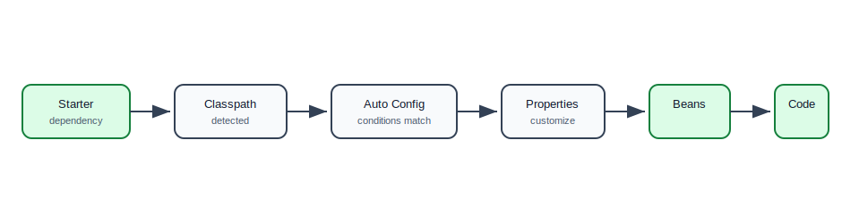
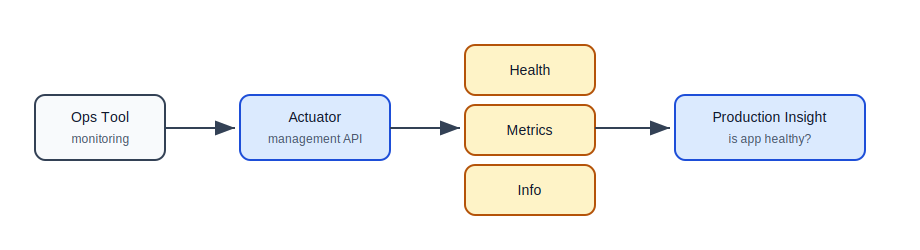
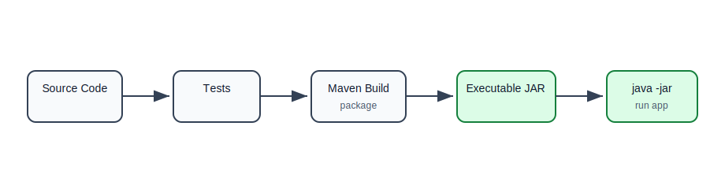
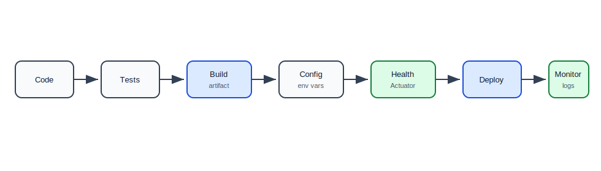

# Integrations and Production Readiness

## Why This Topic Matters

A Spring Boot app is usually not finished when the controller works locally. A backend service must also be buildable, configurable, observable, testable, packageable, and safe to run in real environments.

This file explains common Boot integrations and the basic production-readiness features you should understand before building larger APIs.

## Common Spring Boot Integrations

Spring Boot provides starters and auto-configuration for common backend needs.

| Need | Common Starter |
| --- | --- |
| REST API | `spring-boot-starter-web` |
| Validation | `spring-boot-starter-validation` |
| Database with JPA | `spring-boot-starter-data-jpa` |
| Database with JDBC | `spring-boot-starter-jdbc` |
| MongoDB | `spring-boot-starter-data-mongodb` |
| Security | `spring-boot-starter-security` |
| Health and metrics | `spring-boot-starter-actuator` |
| Testing | `spring-boot-starter-test` |

## Integration Mental Model

When you add a starter:

1. Dependencies are added.
2. Boot detects them on the classpath.
3. Auto-configuration creates useful beans.
4. You configure behavior with properties.
5. Your application code injects and uses the beans.

## Boot Integration Flow



## REST API Integration

With `spring-boot-starter-web`, Boot configures Spring MVC and an embedded server.

```java
@RestController
@RequestMapping("/api/tasks")
public class TaskController {
    private final TaskService taskService;

    public TaskController(TaskService taskService) {
        this.taskService = taskService;
    }

    @GetMapping
    public List<TaskResponse> findAll() {
        return taskService.findAll();
    }
}
```

What Boot helps with:

- starts web server,
- configures Spring MVC,
- configures JSON conversion,
- maps controller endpoints,
- provides default error handling.

## Validation Integration

With validation dependency:

```java
public record CreateTaskRequest(
        @NotBlank String title,
        @Size(max = 500) String description
) {
}
```

```java
@PostMapping
public TaskResponse create(@Valid @RequestBody CreateTaskRequest request) {
    return taskService.create(request);
}
```

Validation keeps invalid data from entering the service layer.

## Database Integration Preview

You will study databases later, but here is the Boot idea.

If you add JPA starter and database driver, Boot can configure JPA infrastructure.

```java
@Entity
public class Task {
    @Id
    @GeneratedValue(strategy = GenerationType.IDENTITY)
    private Long id;

    private String title;
    private boolean completed;
}
```

```java
public interface TaskRepository extends JpaRepository<Task, Long> {
    List<Task> findByCompleted(boolean completed);
}
```

Boot helps create the repository proxy and database-related beans.

## Testing Integration

`spring-boot-starter-test` includes common test tools.

Typical tools:

- JUnit,
- AssertJ,
- Mockito,
- Spring Test,
- MockMvc.

Example:

```java
@SpringBootTest
class TaskManagerApplicationTest {
    @Test
    void contextLoads() {
    }
}
```

This checks whether the Spring application context can start.

Controller test:

```java
@WebMvcTest(TaskController.class)
class TaskControllerTest {
    @Autowired
    private MockMvc mockMvc;

    @MockBean
    private TaskService taskService;

    @Test
    void returnsTasks() throws Exception {
        given(taskService.findAll()).willReturn(List.of());

        mockMvc.perform(get("/api/tasks"))
                .andExpect(status().isOk());
    }
}
```

## Actuator

Actuator adds production-focused endpoints.

Dependency:

```xml
<dependency>
    <groupId>org.springframework.boot</groupId>
    <artifactId>spring-boot-starter-actuator</artifactId>
</dependency>
```

Common endpoints:

| Endpoint | Purpose |
| --- | --- |
| `/actuator/health` | app health status |
| `/actuator/info` | app information |
| `/actuator/metrics` | metrics |
| `/actuator/env` | environment properties, sensitive in prod |
| `/actuator/loggers` | logger levels |

Expose only what you need.

```yaml
management:
  endpoints:
    web:
      exposure:
        include: health,info,metrics
  endpoint:
    health:
      show-details: when_authorized
```

## Actuator Flow



## Health Checks

Health checks tell platforms whether an app is alive and ready.

Example response:

```json
{
  "status": "UP"
}
```

In real systems, health may include:

- database connection,
- disk space,
- message broker,
- cache,
- custom dependency checks.

## Liveness vs Readiness

| Check | Meaning |
| --- | --- |
| Liveness | should the app process be restarted? |
| Readiness | is the app ready to receive traffic? |

An app can be alive but not ready if it is still starting or cannot reach a required dependency.

## Metrics

Metrics are numeric measurements over time.

Common metrics:

- request count,
- request latency,
- error count,
- JVM memory,
- thread usage,
- garbage collection,
- database connection pool usage.

Metrics help answer: "Is the system healthy and fast?"

## Logging

Boot configures logging by default.

You can use SLF4J:

```java
private static final Logger log = LoggerFactory.getLogger(TaskService.class);

public TaskResponse create(CreateTaskRequest request) {
    log.info("Creating task title={}", request.title());
    return saveTask(request);
}
```

Configuration:

```yaml
logging:
  level:
    com.example.taskmanager: DEBUG
```

In production, avoid logging sensitive data and avoid excessive debug logs.

## Packaging

Spring Boot apps are commonly packaged as executable JAR files.

Maven:

```bash
mvn clean package
```

Run:

```bash
java -jar target/task-manager-1.0.0.jar
```

The JAR contains:

- your application classes,
- dependencies,
- embedded server,
- Boot launcher.

## Packaging Flow



## Deployment Basics

Spring Boot apps are often deployed as:

- executable JAR on a VM,
- Docker container,
- Kubernetes workload,
- cloud platform service,
- serverless/container service.

The deployment target may change, but the app should still get configuration from outside.

## Production Readiness Flow



## Basic Production Checklist

Before calling a Boot service production-ready, check:

- configuration is externalized,
- secrets are not committed,
- health endpoint exists,
- metrics are available,
- logs include useful IDs,
- validation is applied at API boundaries,
- error responses are consistent,
- timeouts exist for external calls,
- tests cover important behavior,
- build creates a repeatable artifact,
- app can be configured by environment variables.

## Safe Actuator Rules

Do:

- expose health and info carefully,
- protect sensitive endpoints,
- show detailed health only to authorized users,
- avoid exposing full environment details publicly.

Do not:

- publicly expose `/actuator/env`,
- publicly expose heap dumps,
- leak secrets through endpoint responses.

## Common Beginner Mistakes

| Mistake | Why It Hurts | Better Approach |
| --- | --- | --- |
| Thinking app is done when endpoint works locally | production needs operations | add health, logs, config, tests |
| Exposing all Actuator endpoints | security risk | expose minimal endpoints |
| No validation | bad data enters business layer | validate request DTOs |
| No startup test | broken context found late | add `contextLoads` or focused tests |
| Manual build steps | inconsistent deployments | use Maven/Gradle build |
| Logging secrets | security issue | mask or omit sensitive values |
| No timeout for external calls | threads can hang | configure timeouts |

## Practice Exercise

Enhance the task manager app:

1. Add Actuator.
2. Expose health and info endpoints only.
3. Add a simple `TaskController`.
4. Add validation to `CreateTaskRequest`.
5. Add a controller test with `@WebMvcTest`.
6. Configure logging level in `application-local.yml`.
7. Build an executable JAR.
8. Run the JAR with a different port from command line.

## Self-Check Questions

1. What happens when you add a starter?
2. What does Actuator provide?
3. Why should Actuator endpoints be restricted?
4. What is the difference between liveness and readiness?
5. Why is an executable JAR useful?
6. What should be externalized before production?
7. Why is a working local API not enough for production readiness?

