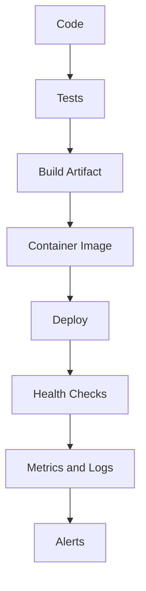

# Integrations and Production Readiness

## Common Spring Boot Integrations

| Integration | Starter or Tool |
| --- | --- |
| REST API | `spring-boot-starter-web` |
| Validation | `spring-boot-starter-validation` |
| JPA | `spring-boot-starter-data-jpa` |
| JDBC | `spring-boot-starter-jdbc` |
| MongoDB | `spring-boot-starter-data-mongodb` |
| Security | `spring-boot-starter-security` |
| Actuator | `spring-boot-starter-actuator` |
| Testing | `spring-boot-starter-test` |

## REST API Integration

```java
@RestController
@RequestMapping("/api/orders")
public class OrderController {
    private final OrderService orderService;

    public OrderController(OrderService orderService) {
        this.orderService = orderService;
    }

    @GetMapping("/{id}")
    public OrderResponse findById(@PathVariable Long id) {
        return orderService.findById(id);
    }
}
```

## Database Integration

```java
@Entity
public class Order {
    @Id
    @GeneratedValue(strategy = GenerationType.IDENTITY)
    private Long id;

    private String status;
}
```

```java
public interface OrderRepository extends JpaRepository<Order, Long> {
    List<Order> findByStatus(String status);
}
```

## Actuator

Actuator exposes operational endpoints.

```properties
management.endpoints.web.exposure.include=health,info,metrics
management.endpoint.health.show-details=when_authorized
```

Useful endpoints:

- `/actuator/health`
- `/actuator/info`
- `/actuator/metrics`

## Packaging

Spring Boot apps are commonly packaged as executable JAR files.

```bash
mvn clean package
java -jar target/app.jar
```

## Production Readiness Flow



## Production Checklist

- Add input validation.
- Use global error handling.
- Enable health checks.
- Configure structured logging.
- Externalize configuration.
- Protect secrets.
- Add timeouts for external calls.
- Add tests for critical paths.
- Monitor latency, errors, traffic, and saturation.

