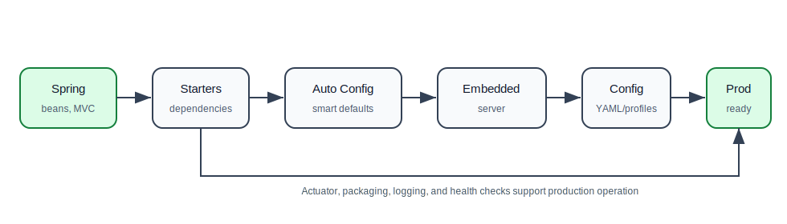

# 03. Spring Boot

Spring Boot is built on top of Spring Framework. It does not replace Spring. It makes Spring applications faster to create, easier to configure, easier to run, and more production-ready.

This folder assumes you understand basic Spring concepts such as beans, dependency injection, `ApplicationContext`, Spring MVC, and configuration.

## How To Study This Folder

Read these files in order:

| Order | File | What You Will Learn |
| --- | --- | --- |
| 1 | [01-why-spring-boot-autoconfiguration.md](01-why-spring-boot-autoconfiguration.md) | why Boot exists, starters, embedded servers, auto-configuration, application startup |
| 2 | [02-properties-yaml-configuration.md](02-properties-yaml-configuration.md) | `application.properties`, YAML, profiles, environment variables, configuration binding |
| 3 | [03-integrations-production-readiness.md](03-integrations-production-readiness.md) | common integrations, Actuator, health checks, packaging, production checklist |

## The Big Idea

Spring Framework gives you the programming model. Spring Boot gives you the application setup and production defaults.

In plain language:

- Spring asks: "How should objects be created and connected?"
- Spring MVC asks: "How should web requests reach Java code?"
- Spring Boot asks: "How can we create, configure, run, package, and monitor this app with less boilerplate?"

## Spring Boot Learning Path

## What You Should Be Able To Explain After This Folder

You should be able to explain:

- why Spring Boot was created,
- what a starter dependency is,
- what auto-configuration does,
- how `@SpringBootApplication` works at a high level,
- why embedded Tomcat matters,
- how Boot reads configuration,
- how profiles change application behavior,
- how Actuator helps production operations,
- how a Boot app becomes a runnable JAR.

## Practice Project Before Moving To REST API Development

Build a small Spring Boot task manager app with:

1. `TaskController`
2. `TaskService`
3. in-memory repository
4. `application.yml`
5. `local` and `prod` profiles
6. Actuator health endpoint
7. executable JAR build

Do not add database or security yet. The goal is to understand the Boot application model first.

