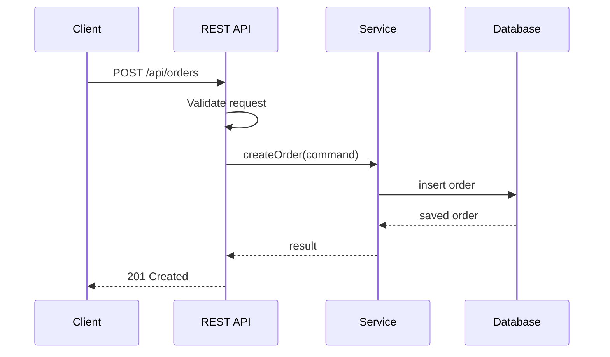

# HTTP Methods and REST Resource Design

## Resources

REST APIs model resources. A resource is usually a noun.

Good:

```text
/api/users
/api/users/42
/api/orders/1001/items
```

Avoid verb-heavy URLs:

```text
/api/createUser
/api/deleteOrder
```

The HTTP method already describes the action.

## HTTP Methods

| Method | Purpose | Safe | Idempotent |
| --- | --- | --- | --- |
| GET | Read data | Yes | Yes |
| POST | Create or trigger processing | No | No |
| PUT | Replace a resource | No | Yes |
| PATCH | Partially update a resource | No | Usually |
| DELETE | Delete a resource | No | Yes |
| OPTIONS | Describe communication options | Yes | Yes |
| TRACE | Diagnostic echo | Yes | Yes |

Safe means it should not change server state. Idempotent means repeated identical requests should have the same final effect.

## GET

```java
@GetMapping("/{id}")
public UserResponse getUser(@PathVariable Long id) {
    return userService.findById(id);
}
```

Use GET for reads. Do not put request bodies in GET APIs.

## POST

```java
@PostMapping
@ResponseStatus(HttpStatus.CREATED)
public UserResponse createUser(@Valid @RequestBody CreateUserRequest request) {
    return userService.create(request);
}
```

Use POST when creating a new resource or starting a server-side operation.

## PUT

```java
@PutMapping("/{id}")
public UserResponse replaceUser(
        @PathVariable Long id,
        @Valid @RequestBody ReplaceUserRequest request) {
    return userService.replace(id, request);
}
```

PUT usually replaces the full resource.

## DELETE

```java
@DeleteMapping("/{id}")
@ResponseStatus(HttpStatus.NO_CONTENT)
public void deleteUser(@PathVariable Long id) {
    userService.delete(id);
}
```

DELETE should be idempotent. Deleting an already-deleted resource should not corrupt state.

## OPTIONS

OPTIONS tells a client which methods are supported.

```text
OPTIONS /api/users/42
Allow: GET, PUT, DELETE, OPTIONS
```

Browsers also use OPTIONS for CORS preflight requests.

## TRACE

TRACE echoes the received request for diagnostics. It is often disabled in production due to security concerns.

## REST Request Flow



## Pagination

```text
GET /api/orders?page=0&size=20&sort=createdAt,desc
```

Always paginate collection endpoints that can grow.

## Filtering

```text
GET /api/orders?status=PAID&customerId=42
```

## API Design Rules

- Use nouns for resources.
- Use plural names: `/users`, `/orders`.
- Use HTTP methods consistently.
- Validate input.
- Return consistent errors.
- Do not expose internal database entities directly.
- Use DTOs for requests and responses.

