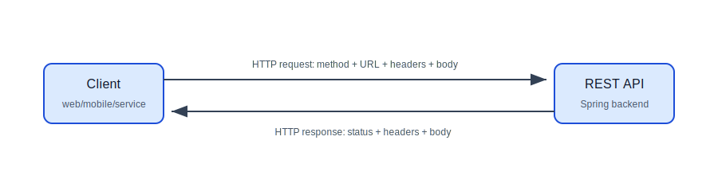
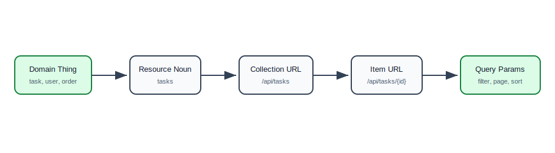
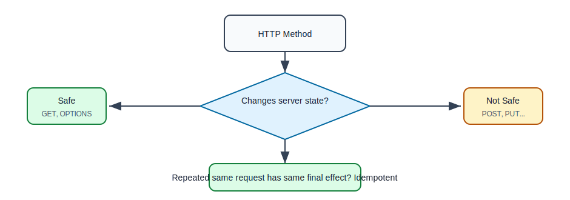
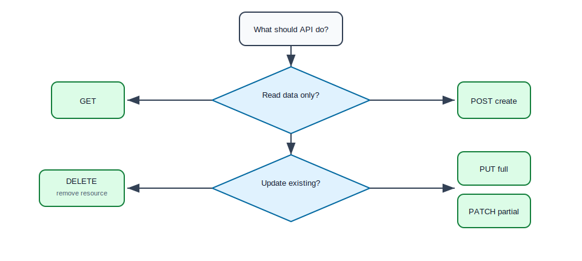
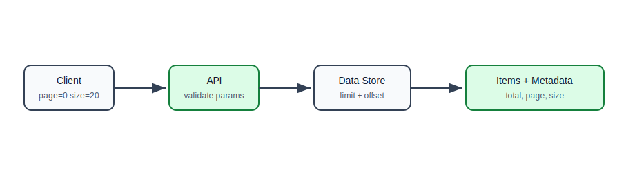

# HTTP Methods and REST Resource Design

## Why This Topic Matters

REST APIs are the public face of a backend system. Even if the internal code is excellent, a poorly designed API can make the system hard to use, hard to test, and hard to evolve.

This file teaches the basic design rules behind REST APIs:

- how to name resources,
- how to choose HTTP methods,
- how to design URLs,
- how to think about safety and idempotency,
- how to support filtering, sorting, and pagination.

## HTTP Request And Response

Every API call is a request followed by a response.

Request:

```http
GET /api/tasks/42 HTTP/1.1
Host: example.com
Authorization: Bearer token
```

Response:

```http
HTTP/1.1 200 OK
Content-Type: application/json

{
  "id": 42,
  "title": "Learn REST",
  "completed": false
}
```

## Request Response Flow



## What Is A Resource?

A resource is a thing your API exposes.

Examples:

- user,
- task,
- order,
- product,
- payment,
- invoice,
- comment,
- notification.

In REST, URLs should usually identify resources, not actions.

Good:

```text
/api/users
/api/users/42
/api/orders/1001/items
/api/tasks/7/comments
```

Poor:

```text
/api/createUser
/api/getUserById
/api/deleteOrder
/api/addCommentToTask
```

The HTTP method already tells the action.

## Resource URL Design

Use plural nouns for collections.

| Purpose | URL |
| --- | --- |
| all users | `/api/users` |
| one user | `/api/users/{id}` |
| all orders of one user | `/api/users/{userId}/orders` |
| one order item | `/api/orders/{orderId}/items/{itemId}` |

## Resource Design Flow



## HTTP Methods Overview

| Method | Main Use | Request Body? | Safe? | Idempotent? |
| --- | --- | --- | --- | --- |
| GET | read data | usually no | yes | yes |
| POST | create or trigger processing | yes | no | no by default |
| PUT | replace full resource | yes | no | yes |
| PATCH | partial update | yes | no | usually, if designed carefully |
| DELETE | delete resource | usually no | no | yes |
| OPTIONS | ask supported communication options | no | yes | yes |
| TRACE | diagnostic echo | no | yes | yes |

## Safe Methods

A safe method should not change server state.

GET should be safe:

```http
GET /api/tasks/42
```

This should read the task, not mark it completed.

Do not design APIs like this:

```http
GET /api/tasks/42/complete
```

That uses GET to change state, which is incorrect and dangerous.

## Idempotency

Idempotent means repeated identical requests have the same final effect.

Example:

```http
DELETE /api/tasks/42
```

If the client sends this once, task 42 is deleted. If the client sends it five times, the final result is still "task 42 is deleted".

This matters because networks fail. Clients may retry requests when they do not receive a response.

## Safe And Idempotent Flow



## GET

Use GET to retrieve data.

```java
@GetMapping("/{id}")
public TaskResponse findById(@PathVariable Long id) {
    return taskService.findById(id);
}
```

Example:

```http
GET /api/tasks/42
```

GET should not create, update, or delete data.

## GET Collection

```java
@GetMapping
public PageResponse<TaskResponse> findAll(
        @RequestParam(defaultValue = "0") int page,
        @RequestParam(defaultValue = "20") int size) {
    return taskService.findAll(page, size);
}
```

Example:

```http
GET /api/tasks?page=0&size=20
```

Collections that can grow should be paginated.

## POST

Use POST to create a new resource or start a server-side operation.

```java
@PostMapping
@ResponseStatus(HttpStatus.CREATED)
public TaskResponse create(@Valid @RequestBody CreateTaskRequest request) {
    return taskService.create(request);
}
```

Example:

```http
POST /api/tasks
Content-Type: application/json

{
  "title": "Write API notes",
  "description": "Prepare beginner-friendly REST material"
}
```

POST is not idempotent by default. If the same POST is sent twice, it may create two tasks.

For sensitive creation operations such as payments, use idempotency keys. That topic appears again in backend engineering.

## PUT

Use PUT to replace the full resource.

```java
@PutMapping("/{id}")
public TaskResponse replace(
        @PathVariable Long id,
        @Valid @RequestBody ReplaceTaskRequest request) {
    return taskService.replace(id, request);
}
```

Example:

```http
PUT /api/tasks/42
Content-Type: application/json

{
  "title": "Write REST notes",
  "description": "Full replacement",
  "completed": false
}
```

PUT should usually include the complete new representation.

## PATCH

Use PATCH for partial updates.

```java
@PatchMapping("/{id}")
public TaskResponse updatePartially(
        @PathVariable Long id,
        @RequestBody UpdateTaskRequest request) {
    return taskService.updatePartially(id, request);
}
```

Example:

```http
PATCH /api/tasks/42
Content-Type: application/json

{
  "completed": true
}
```

PATCH is useful when the client wants to update only a few fields.

## PUT vs PATCH

| Need | Use |
| --- | --- |
| replace entire resource | PUT |
| update selected fields | PATCH |
| client sends full representation | PUT |
| client sends partial representation | PATCH |

## DELETE

Use DELETE to remove a resource.

```java
@DeleteMapping("/{id}")
@ResponseStatus(HttpStatus.NO_CONTENT)
public void delete(@PathVariable Long id) {
    taskService.delete(id);
}
```

Example:

```http
DELETE /api/tasks/42
```

Successful deletion often returns `204 No Content`.

## OPTIONS

OPTIONS asks what communication options are available for a resource.

Example:

```http
OPTIONS /api/tasks/42
```

Response may include:

```http
Allow: GET, PUT, PATCH, DELETE, OPTIONS
```

Browsers also use OPTIONS for CORS preflight requests before certain cross-origin calls.

## TRACE

TRACE echoes the received request for diagnostics.

In many production systems, TRACE is disabled because it can create security risk and is rarely needed by normal API clients.

## Choosing HTTP Method



## Filtering

Filtering narrows a collection.

```http
GET /api/tasks?status=OPEN
GET /api/tasks?completed=false
GET /api/tasks?assignedTo=17
```

Spring example:

```java
@GetMapping
public List<TaskResponse> search(
        @RequestParam(required = false) Boolean completed,
        @RequestParam(required = false) Long assignedTo) {
    return taskService.search(completed, assignedTo);
}
```

Use query parameters for filtering.

## Sorting

```http
GET /api/tasks?sort=createdAt,desc
GET /api/tasks?sort=title,asc
```

Sorting should be predictable. Document supported sort fields.

## Pagination

Never return an unbounded collection if it can grow.

```http
GET /api/tasks?page=0&size=20
```

Example response:

```json
{
  "items": [
    {
      "id": 1,
      "title": "Learn REST"
    }
  ],
  "page": 0,
  "size": 20,
  "totalItems": 125,
  "totalPages": 7
}
```

## Pagination Flow



## Request DTO And Response DTO

Request DTO:

```java
public record CreateTaskRequest(
        @NotBlank String title,
        @Size(max = 500) String description
) {
}
```

Response DTO:

```java
public record TaskResponse(
        Long id,
        String title,
        String description,
        boolean completed,
        Instant createdAt
) {
}
```

Do not assume request and response should have the same fields.

## REST Controller Example

```java
@RestController
@RequestMapping("/api/tasks")
public class TaskController {
    private final TaskService taskService;

    public TaskController(TaskService taskService) {
        this.taskService = taskService;
    }

    @GetMapping("/{id}")
    public TaskResponse findById(@PathVariable Long id) {
        return taskService.findById(id);
    }

    @PostMapping
    @ResponseStatus(HttpStatus.CREATED)
    public TaskResponse create(@Valid @RequestBody CreateTaskRequest request) {
        return taskService.create(request);
    }

    @DeleteMapping("/{id}")
    @ResponseStatus(HttpStatus.NO_CONTENT)
    public void delete(@PathVariable Long id) {
        taskService.delete(id);
    }
}
```

## Common Beginner Mistakes

| Mistake | Why It Hurts | Better Approach |
| --- | --- | --- |
| using verbs in URLs | duplicates HTTP method meaning | use nouns for resources |
| using GET to change state | unsafe and cache-unfriendly | use POST, PUT, PATCH, or DELETE |
| returning huge lists | slow and risky | paginate collections |
| exposing database entities | leaks internal design | use DTOs |
| using POST for every operation | unclear API behavior | choose method based on intent |
| confusing PUT and PATCH | update semantics unclear | PUT replaces, PATCH partially updates |
| not documenting filters/sorts | clients guess behavior | define supported query params |

## Practice Exercise

Design URLs and methods for a task app:

1. Create task.
2. Get one task.
3. Get all open tasks.
4. Mark task complete.
5. Replace task details.
6. Delete task.
7. Get comments for one task.
8. Add comment to task.

Then implement:

- controller methods,
- request DTOs,
- response DTOs,
- validation annotations.

## Self-Check Questions

1. What is a REST resource?
2. Why should URLs usually use nouns instead of verbs?
3. What does safe mean in HTTP?
4. What does idempotent mean?
5. Why is GET not appropriate for changing data?
6. When should you use PATCH instead of PUT?
7. Why should growing collections be paginated?

