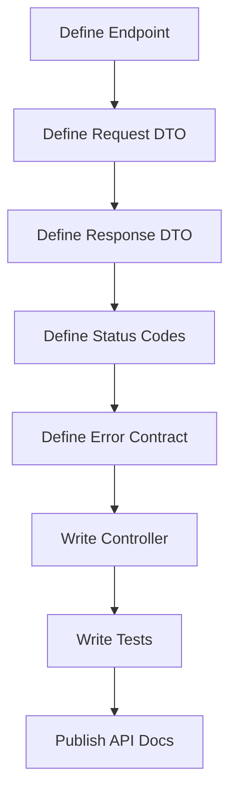

# HTTP Status Codes, Errors, and API Contracts

## Status Code Families

| Family | Meaning |
| --- | --- |
| 1xx | Informational |
| 2xx | Success |
| 3xx | Redirection |
| 4xx | Client error |
| 5xx | Server error |

## Common 2xx Codes

| Code | Meaning | Use |
| --- | --- | --- |
| 200 | OK | Successful read or update |
| 201 | Created | Resource created |
| 202 | Accepted | Async processing accepted |
| 204 | No Content | Success with no response body |

## Common 3xx Codes

| Code | Meaning |
| --- | --- |
| 301 | Moved permanently |
| 302 | Found |
| 304 | Not modified |

`304 Not Modified` is useful with caching headers.

## Common 4xx Codes

| Code | Meaning | Example |
| --- | --- | --- |
| 400 | Bad Request | Invalid JSON or invalid input |
| 401 | Unauthorized | Missing or invalid authentication |
| 403 | Forbidden | Authenticated but not allowed |
| 404 | Not Found | Resource does not exist |
| 409 | Conflict | Duplicate email or version conflict |
| 422 | Unprocessable Entity | Valid syntax but semantic validation failed |
| 429 | Too Many Requests | Rate limit exceeded |

## Common 5xx Codes

| Code | Meaning |
| --- | --- |
| 500 | Internal Server Error |
| 502 | Bad Gateway |
| 503 | Service Unavailable |
| 504 | Gateway Timeout |

5xx means the client likely cannot fix the issue by changing the request.

## Error Response Contract

Use a consistent error shape.

```java
public record ErrorResponse(
        String code,
        String message,
        Instant timestamp,
        String path
) {
}
```

Example JSON:

```json
{
  "code": "USER_NOT_FOUND",
  "message": "User 42 was not found",
  "timestamp": "2026-05-12T10:00:00Z",
  "path": "/api/users/42"
}
```

## Global Error Handler

```java
@RestControllerAdvice
public class GlobalExceptionHandler {
    @ExceptionHandler(ResourceNotFoundException.class)
    @ResponseStatus(HttpStatus.NOT_FOUND)
    public ErrorResponse notFound(ResourceNotFoundException ex, HttpServletRequest request) {
        return new ErrorResponse(
                "RESOURCE_NOT_FOUND",
                ex.getMessage(),
                Instant.now(),
                request.getRequestURI()
        );
    }
}
```

## API Contract

An API contract defines how clients and servers communicate.

It includes:

- endpoints,
- methods,
- request bodies,
- response bodies,
- status codes,
- authentication requirements,
- error format.

## Contract Flow



## Good REST Testing

```java
@WebMvcTest(UserController.class)
class UserControllerTest {
    @Autowired
    private MockMvc mockMvc;

    @MockBean
    private UserService userService;

    @Test
    void returnsNotFound() throws Exception {
        given(userService.findById(42L))
                .willThrow(new ResourceNotFoundException("User not found"));

        mockMvc.perform(get("/api/users/42"))
                .andExpect(status().isNotFound())
                .andExpect(jsonPath("$.code").value("RESOURCE_NOT_FOUND"));
    }
}
```

## Status Code Rules

- Use `201 Created` for successful creation.
- Use `204 No Content` when deleting successfully.
- Use `400` for malformed or invalid input.
- Use `401` for missing authentication.
- Use `403` for insufficient permissions.
- Use `404` when a resource does not exist.
- Use `409` for state conflicts.
- Avoid returning `200 OK` for every result.

