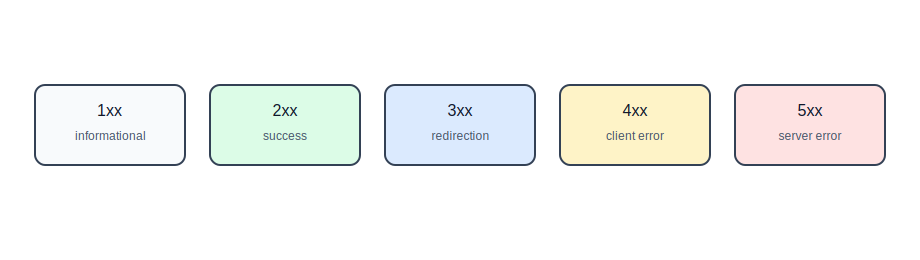
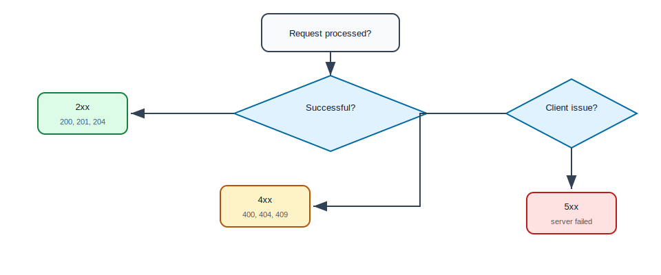
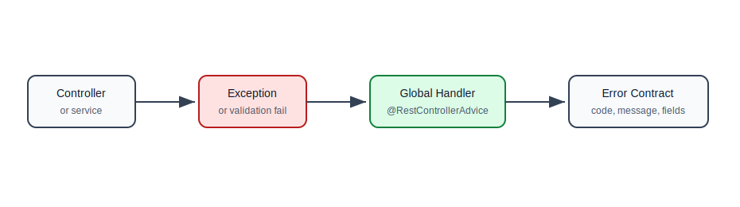
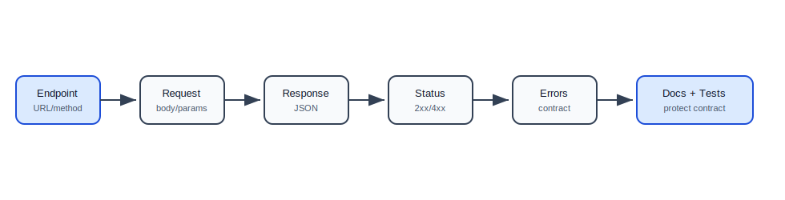
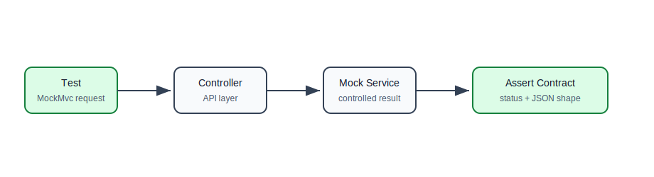

# HTTP Status Codes, Errors, and API Contracts

## Why This Topic Matters

Status codes and error responses are how your API communicates outcomes to clients.

If every response returns `200 OK`, clients cannot reliably understand what happened. If every error has a different shape, clients must write messy error-handling code.

A good backend API should make success and failure clear, consistent, and predictable.

## What Is A Status Code?

An HTTP status code is a three-digit number in the response that tells the client the result of the request.

Example:

```http
HTTP/1.1 201 Created
Content-Type: application/json
```

The status code is part of the API contract.

## Status Code Families



| Family | Meaning | Example |
| --- | --- | --- |
| 1xx | informational | request is continuing |
| 2xx | success | request succeeded |
| 3xx | redirection | client should look elsewhere or use cache |
| 4xx | client error | client request has a problem |
| 5xx | server error | server failed while processing |

## 1xx Informational

1xx status codes are rarely handled directly in normal REST API code.

Example:

| Code | Meaning |
| --- | --- |
| 100 | Continue |
| 101 | Switching Protocols |

As a beginner, know the family exists, but focus mostly on 2xx, 4xx, and 5xx.

## 2xx Success

| Code | Meaning | Use |
| --- | --- | --- |
| 200 | OK | successful read or update with response body |
| 201 | Created | new resource created |
| 202 | Accepted | request accepted for async processing |
| 204 | No Content | success with no response body |

## 200 OK

Use for successful reads and many successful updates.

```java
@GetMapping("/{id}")
public TaskResponse findById(@PathVariable Long id) {
    return taskService.findById(id);
}
```

Response:

```http
HTTP/1.1 200 OK
```

## 201 Created

Use when a new resource is created.

```java
@PostMapping
@ResponseStatus(HttpStatus.CREATED)
public TaskResponse create(@Valid @RequestBody CreateTaskRequest request) {
    return taskService.create(request);
}
```

Response:

```http
HTTP/1.1 201 Created
```

Often, APIs also include a `Location` header:

```http
Location: /api/tasks/42
```

## 202 Accepted

Use when the request was accepted but processing is not complete yet.

Example:

```http
POST /api/reports
```

Response:

```http
HTTP/1.1 202 Accepted

{
  "jobId": "report-job-123",
  "status": "QUEUED"
}
```

This is useful for long-running background jobs.

## 204 No Content

Use when the request succeeded but there is no response body.

```java
@DeleteMapping("/{id}")
@ResponseStatus(HttpStatus.NO_CONTENT)
public void delete(@PathVariable Long id) {
    taskService.delete(id);
}
```

Response:

```http
HTTP/1.1 204 No Content
```

## 3xx Redirection

3xx status codes are less common in pure JSON APIs, but still important.

| Code | Meaning | Use |
| --- | --- | --- |
| 301 | Moved Permanently | resource moved permanently |
| 302 | Found | temporary redirect |
| 304 | Not Modified | cached version is still valid |

`304 Not Modified` is important for caching.

## 4xx Client Errors

4xx means the client sent a request that cannot be processed as-is.

| Code | Meaning | Example |
| --- | --- | --- |
| 400 | Bad Request | invalid JSON or invalid field |
| 401 | Unauthorized | missing or invalid authentication |
| 403 | Forbidden | authenticated but not allowed |
| 404 | Not Found | resource does not exist |
| 405 | Method Not Allowed | method not supported |
| 409 | Conflict | duplicate email or state conflict |
| 415 | Unsupported Media Type | wrong `Content-Type` |
| 422 | Unprocessable Entity | semantic validation problem |
| 429 | Too Many Requests | rate limit exceeded |

## 400 Bad Request

Use when the request is malformed or invalid.

Examples:

- invalid JSON,
- missing required field,
- invalid field format,
- page size is negative.

```http
HTTP/1.1 400 Bad Request
```

## 401 Unauthorized

401 means the request is not authenticated.

Example:

```http
GET /api/tasks
```

without required token:

```http
HTTP/1.1 401 Unauthorized
```

Despite the name, 401 is about authentication, not authorization.

## 403 Forbidden

403 means the user is authenticated but does not have permission.

Example:

- normal user tries to delete another user's task,
- support user tries to access admin settings.

```http
HTTP/1.1 403 Forbidden
```

## 404 Not Found

Use when a requested resource does not exist.

```java
public TaskResponse findById(Long id) {
    return taskRepository.findById(id)
            .map(TaskResponse::from)
            .orElseThrow(() -> new ResourceNotFoundException("Task not found"));
}
```

## 409 Conflict

Use when the request conflicts with current server state.

Examples:

- duplicate email,
- trying to cancel an already shipped order,
- optimistic locking version mismatch.

## 429 Too Many Requests

Use when the client exceeded a rate limit.

```http
HTTP/1.1 429 Too Many Requests
Retry-After: 60
```

## 5xx Server Errors

5xx means the server failed while processing a valid-looking request.

| Code | Meaning | Example |
| --- | --- | --- |
| 500 | Internal Server Error | unhandled bug |
| 502 | Bad Gateway | upstream service gave invalid response |
| 503 | Service Unavailable | server temporarily unavailable |
| 504 | Gateway Timeout | upstream service timed out |

Clients usually cannot fix 5xx by changing the request.

## Choosing A Status Code



## Error Response Contract

A consistent error response helps clients handle failures reliably.

Recommended shape:

```java
public record ErrorResponse(
        String code,
        String message,
        String path,
        Instant timestamp,
        List<FieldErrorResponse> fieldErrors
) {
}
```

```java
public record FieldErrorResponse(
        String field,
        String message
) {
}
```

Example:

```json
{
  "code": "VALIDATION_FAILED",
  "message": "Request validation failed",
  "path": "/api/tasks",
  "timestamp": "2026-05-16T12:00:00Z",
  "fieldErrors": [
    {
      "field": "title",
      "message": "must not be blank"
    }
  ]
}
```

## Error Response Flow



## Global Exception Handler

```java
@RestControllerAdvice
public class ApiExceptionHandler {
    @ExceptionHandler(ResourceNotFoundException.class)
    @ResponseStatus(HttpStatus.NOT_FOUND)
    public ErrorResponse handleNotFound(
            ResourceNotFoundException ex,
            HttpServletRequest request) {
        return new ErrorResponse(
                "RESOURCE_NOT_FOUND",
                ex.getMessage(),
                request.getRequestURI(),
                Instant.now(),
                List.of()
        );
    }
}
```

## Validation Error Handler

```java
@ExceptionHandler(MethodArgumentNotValidException.class)
@ResponseStatus(HttpStatus.BAD_REQUEST)
public ErrorResponse handleValidation(
        MethodArgumentNotValidException ex,
        HttpServletRequest request) {

    List<FieldErrorResponse> fieldErrors = ex.getBindingResult()
            .getFieldErrors()
            .stream()
            .map(error -> new FieldErrorResponse(
                    error.getField(),
                    error.getDefaultMessage()))
            .toList();

    return new ErrorResponse(
            "VALIDATION_FAILED",
            "Request validation failed",
            request.getRequestURI(),
            Instant.now(),
            fieldErrors
    );
}
```

## API Contract

An API contract defines what clients can expect.

It includes:

- URL,
- HTTP method,
- request headers,
- request body,
- path variables,
- query parameters,
- response body,
- success status codes,
- error status codes,
- authentication requirements,
- validation rules.

## API Contract Flow



## Example Contract: Create Task

Endpoint:

```http
POST /api/tasks
```

Request:

```json
{
  "title": "Learn APIs",
  "description": "Study status codes"
}
```

Success:

```http
HTTP/1.1 201 Created
Location: /api/tasks/42
```

```json
{
  "id": 42,
  "title": "Learn APIs",
  "description": "Study status codes",
  "completed": false,
  "createdAt": "2026-05-16T12:00:00Z"
}
```

Validation failure:

```http
HTTP/1.1 400 Bad Request
```

```json
{
  "code": "VALIDATION_FAILED",
  "message": "Request validation failed",
  "path": "/api/tasks",
  "timestamp": "2026-05-16T12:00:00Z",
  "fieldErrors": [
    {
      "field": "title",
      "message": "must not be blank"
    }
  ]
}
```

## Backward Compatibility

Once clients use your API, changing it carelessly can break them.

Usually safe:

- adding optional response fields,
- adding new endpoints,
- adding optional query parameters,
- adding optional request fields.

Risky or breaking:

- removing fields,
- renaming fields,
- changing field type,
- changing meaning of a field,
- changing status codes,
- making optional fields required.

## API Versioning Preview

For breaking changes, versioning may be needed.

Common URL version:

```text
/api/v1/tasks
/api/v2/tasks
```

Versioning is covered more deeply in backend engineering, but learners should know why it exists: clients need time to migrate.

## Testing API Behavior

Controller tests verify API contract behavior.

```java
@WebMvcTest(TaskController.class)
class TaskControllerTest {
    @Autowired
    private MockMvc mockMvc;

    @MockBean
    private TaskService taskService;

    @Test
    void returnsNotFoundWhenTaskDoesNotExist() throws Exception {
        given(taskService.findById(99L))
                .willThrow(new ResourceNotFoundException("Task not found"));

        mockMvc.perform(get("/api/tasks/99"))
                .andExpect(status().isNotFound())
                .andExpect(jsonPath("$.code").value("RESOURCE_NOT_FOUND"));
    }
}
```

## What To Test

Test:

- success status code,
- response JSON shape,
- validation failure status code,
- validation error body,
- not-found behavior,
- conflict behavior,
- method not allowed behavior when relevant,
- authentication/authorization behavior when security exists.

## API Testing Flow



## Common Beginner Mistakes

| Mistake | Why It Hurts | Better Approach |
| --- | --- | --- |
| returning `200 OK` for every result | clients cannot understand outcome | use correct status codes |
| inconsistent error bodies | client error handling becomes messy | define one error contract |
| exposing stack traces | leaks internals | return safe error messages |
| using 500 for validation errors | blames server for client mistake | use 400 or suitable 4xx |
| changing response fields casually | breaks clients | preserve contracts or version |
| not testing errors | failures break in production | test success and failure paths |
| vague error codes | hard to automate handling | use stable machine-readable codes |

## Practice Exercise

For the task API:

1. Define success status codes for every endpoint.
2. Define error responses for validation failure, not found, and conflict.
3. Create `ErrorResponse` and `FieldErrorResponse`.
4. Create `ApiExceptionHandler`.
5. Write controller tests for:
   - create success,
   - validation failure,
   - get not found,
   - delete success.

## Self-Check Questions

1. What does a 2xx status mean?
2. What is the difference between 401 and 403?
3. When should you use 404?
4. When should you use 409?
5. Why should APIs have a consistent error response shape?
6. What belongs in an API contract?
7. Why can changing a response field break clients?

