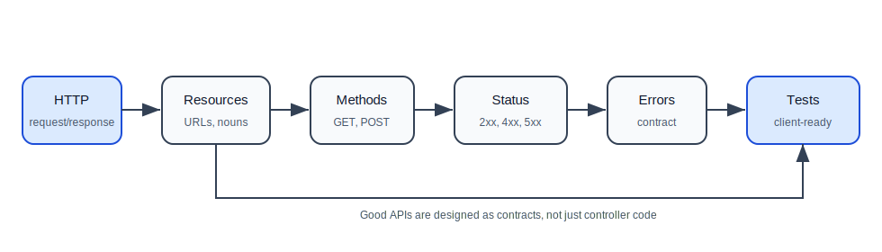

# 04. REST API Development

REST APIs are how backend services expose functionality to clients such as web apps, mobile apps, other backend services, and automation tools.

This folder is written for a learner who understands basic Spring Boot and now needs to learn how HTTP APIs should be designed, implemented, tested, and documented.

## How To Study This Folder

Read these files in order:

| Order | File | What You Will Learn |
| --- | --- | --- |
| 1 | [01-http-methods-resource-design.md](01-http-methods-resource-design.md) | resources, URLs, HTTP methods, idempotency, pagination, filtering, REST request flow |
| 2 | [02-status-codes-errors-contracts.md](02-status-codes-errors-contracts.md) | status codes, error response design, API contracts, controller tests, compatibility |

## The Big Idea

REST API design is not just writing controller methods. A good API should be:

- predictable,
- consistent,
- easy to test,
- clear about success and failure,
- safe for clients to retry where appropriate,
- stable enough that clients can depend on it.

## REST API Learning Path

## What You Should Be Able To Explain After This Folder

You should be able to explain:

- what a REST resource is,
- why URLs should usually use nouns,
- when to use GET, POST, PUT, PATCH, DELETE, OPTIONS, and TRACE,
- what safe and idempotent mean,
- how to choose status codes,
- why every API should have a consistent error response,
- why request/response DTOs are part of the API contract,
- how pagination and filtering should be represented,
- what should be tested in API/controller tests.

## Practice Project Before Moving To Databases

Build a Spring Boot REST API for task management using in-memory storage:

1. `GET /api/tasks`
2. `GET /api/tasks/{id}`
3. `POST /api/tasks`
4. `PUT /api/tasks/{id}`
5. `PATCH /api/tasks/{id}`
6. `DELETE /api/tasks/{id}`
7. consistent error response
8. validation errors
9. controller tests

Do not add a database yet. This module is about API design, not persistence.

