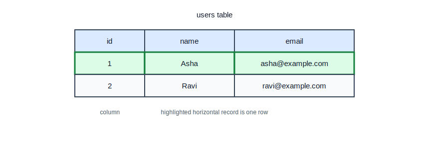
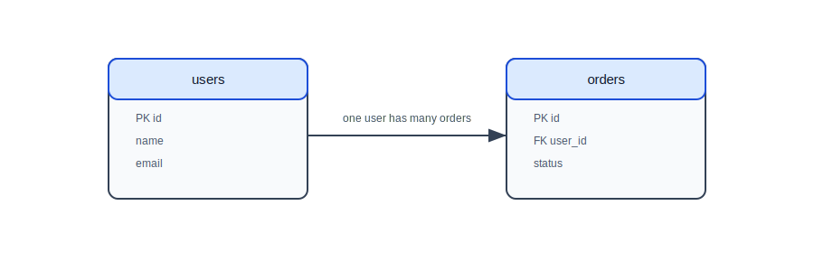
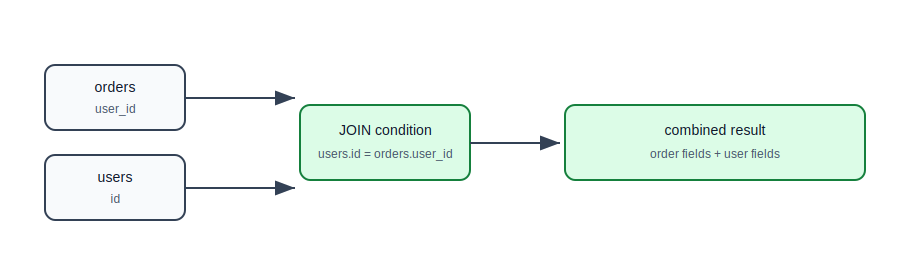
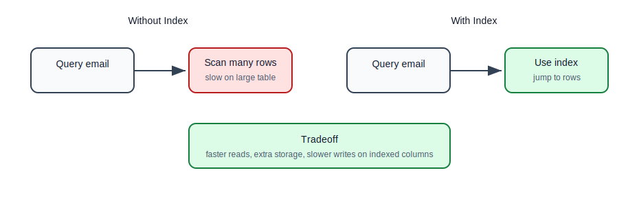
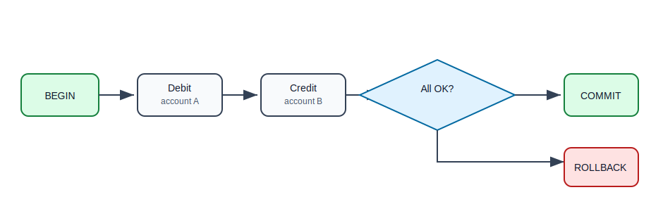
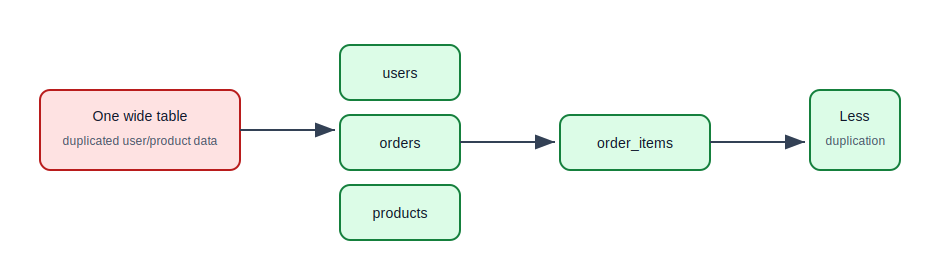

# SQL Databases: MySQL, PostgreSQL, and Oracle

## Why This Topic Matters

Relational databases are still the default choice for many backend systems because they are reliable, structured, queryable, and good at protecting data consistency.

If you are building APIs for users, orders, payments, invoices, products, or tasks, there is a strong chance a SQL database is a good starting point.

## What Is A Relational Database?

A relational database stores data in tables. Tables contain rows and columns.

Example: `users` table

| id | name | email |
| --- | --- | --- |
| 1 | Asha | asha@example.com |
| 2 | Ravi | ravi@example.com |

Table:

- represents one type of thing,
- has columns that describe fields,
- has rows that represent actual records.

## Table, Row, And Column



## Creating A Table

```sql
CREATE TABLE users (
    id BIGINT PRIMARY KEY,
    name VARCHAR(100) NOT NULL,
    email VARCHAR(150) NOT NULL UNIQUE,
    created_at TIMESTAMP NOT NULL
);
```

Explanation:

- `id BIGINT PRIMARY KEY`: unique identifier.
- `name VARCHAR(100) NOT NULL`: name is required.
- `email VARCHAR(150) NOT NULL UNIQUE`: email is required and cannot duplicate.
- `created_at TIMESTAMP NOT NULL`: when the record was created.

## Primary Key

A primary key uniquely identifies a row.

```sql
CREATE TABLE products (
    id BIGINT PRIMARY KEY,
    name VARCHAR(100) NOT NULL,
    price DECIMAL(10, 2) NOT NULL
);
```

Primary keys should:

- be unique,
- be stable,
- not contain business meaning that may change.

Common choices:

- auto-increment numeric ID,
- UUID,
- database sequence.

## Foreign Key

A foreign key connects one table to another.

```sql
CREATE TABLE orders (
    id BIGINT PRIMARY KEY,
    user_id BIGINT NOT NULL,
    status VARCHAR(30) NOT NULL,
    created_at TIMESTAMP NOT NULL,
    CONSTRAINT fk_orders_user
        FOREIGN KEY (user_id) REFERENCES users(id)
);
```

`orders.user_id` points to `users.id`.

This means an order belongs to a user.

## Relationship Diagram



## Relationship Types

| Relationship | Example | Meaning |
| --- | --- | --- |
| one-to-one | user and profile | one user has one profile |
| one-to-many | user and orders | one user has many orders |
| many-to-many | students and courses | many students join many courses |

Many-to-many usually needs a join table.

```sql
CREATE TABLE student_courses (
    student_id BIGINT NOT NULL,
    course_id BIGINT NOT NULL,
    PRIMARY KEY (student_id, course_id),
    FOREIGN KEY (student_id) REFERENCES students(id),
    FOREIGN KEY (course_id) REFERENCES courses(id)
);
```

## Basic SQL Queries

### SELECT

```sql
SELECT id, name, email
FROM users;
```

### WHERE

```sql
SELECT id, name, email
FROM users
WHERE email = 'asha@example.com';
```

### INSERT

```sql
INSERT INTO users (id, name, email, created_at)
VALUES (1, 'Asha', 'asha@example.com', CURRENT_TIMESTAMP);
```

### UPDATE

```sql
UPDATE users
SET name = 'Asha Sharma'
WHERE id = 1;
```

### DELETE

```sql
DELETE FROM users
WHERE id = 1;
```

Always be careful with `UPDATE` and `DELETE`. Missing `WHERE` can affect every row.

## JOIN

JOIN combines data from related tables.

```sql
SELECT
    o.id AS order_id,
    o.status,
    u.name AS customer_name
FROM orders o
JOIN users u ON u.id = o.user_id
WHERE o.id = 1001;
```

This returns order data together with user data.

## Join Flow



## Common Join Types

| Join | Meaning |
| --- | --- |
| `INNER JOIN` | return matching rows only |
| `LEFT JOIN` | return all left rows and matching right rows |
| `RIGHT JOIN` | return all right rows and matching left rows |
| `FULL JOIN` | return all rows from both sides where supported |

Example: users with order count, including users with no orders:

```sql
SELECT
    u.id,
    u.name,
    COUNT(o.id) AS order_count
FROM users u
LEFT JOIN orders o ON o.user_id = u.id
GROUP BY u.id, u.name;
```

## Indexes

An index helps the database find rows faster.

```sql
CREATE INDEX idx_users_email ON users(email);
CREATE INDEX idx_orders_user_id ON orders(user_id);
CREATE INDEX idx_orders_status ON orders(status);
```

Without an index, the database may scan many rows.

With an index, it can often jump to relevant rows faster.

## Index Mental Model

Think of an index like the index at the back of a book. Instead of reading every page, you look up the term and jump to the right page.

## Index Flow



## Index Tradeoffs

Indexes are not free.

Benefits:

- faster filtering,
- faster joins,
- faster sorting in some cases.

Costs:

- extra storage,
- slower inserts,
- slower updates for indexed columns,
- maintenance overhead.

Add indexes based on real query patterns.

## Constraints

Constraints protect data quality.

| Constraint | Purpose |
| --- | --- |
| `PRIMARY KEY` | unique row identity |
| `FOREIGN KEY` | relationship integrity |
| `UNIQUE` | prevents duplicates |
| `NOT NULL` | requires value |
| `CHECK` | enforces condition |

Example:

```sql
CREATE TABLE accounts (
    id BIGINT PRIMARY KEY,
    balance DECIMAL(12, 2) NOT NULL,
    CHECK (balance >= 0)
);
```

Do not rely only on Java validation. Critical rules should also exist in the database.

## Transactions

A transaction groups operations so they succeed or fail together.

Example money transfer:

```sql
BEGIN;

UPDATE accounts
SET balance = balance - 100
WHERE id = 1;

UPDATE accounts
SET balance = balance + 100
WHERE id = 2;

COMMIT;
```

If something fails, the transaction can roll back.

```sql
ROLLBACK;
```

## Transaction Flow



## ACID

ACID describes important transaction guarantees.

| Property | Meaning | Example |
| --- | --- | --- |
| Atomicity | all operations happen or none happen | money leaves one account and enters another |
| Consistency | rules remain valid | balance cannot become negative |
| Isolation | concurrent transactions do not corrupt each other | two withdrawals do not overwrite each other |
| Durability | committed data survives failure | saved order remains after restart |

## Normalization

Normalization organizes data to reduce duplication and protect consistency.

Bad design:

| order_id | user_name | user_email | product_name |
| --- | --- | --- | --- |
| 1 | Asha | asha@example.com | Keyboard |
| 2 | Asha | asha@example.com | Mouse |

User data is duplicated.

Better design:

- `users`
- `orders`
- `products`
- `order_items`

## Normalization Flow



## MySQL

MySQL is widely used in web applications.

Strengths:

- common hosting support,
- large community,
- simple setup,
- good for many CRUD applications.

Common use cases:

- e-commerce,
- CMS systems,
- SaaS backends,
- internal tools.

## PostgreSQL

PostgreSQL is a powerful relational database with strong standards support.

Strengths:

- advanced SQL features,
- strong indexing options,
- JSON support,
- good transactional behavior,
- rich extensions.

Common use cases:

- backend APIs,
- analytics-heavy operational systems,
- geospatial applications,
- systems needing complex queries.

## Oracle

Oracle Database is common in large enterprises.

Strengths:

- mature enterprise tooling,
- strong transaction support,
- advanced performance features,
- common in banking, insurance, telecom, and large corporate environments.

Tradeoff:

- licensing and operations can be more complex than MySQL/PostgreSQL.

## SQL Database Selection

| Need | Reasonable Choice |
| --- | --- |
| common web app | MySQL or PostgreSQL |
| advanced SQL and extensions | PostgreSQL |
| enterprise Oracle environment | Oracle |
| strong relational consistency | any mature SQL database |
| simple local learning | PostgreSQL or MySQL |

## Common Beginner Mistakes

| Mistake | Why It Hurts | Better Approach |
| --- | --- | --- |
| no primary keys | rows are hard to identify | always define primary keys |
| no foreign keys | invalid relationships can exist | enforce relationships |
| too many indexes | slow writes and wasted storage | index based on queries |
| no indexes on foreign keys | joins may become slow | index join columns |
| storing repeated data everywhere | inconsistent updates | normalize first |
| relying only on application validation | data can still be corrupted | add database constraints |
| running UPDATE/DELETE without WHERE | changes too much data | verify conditions first |

## Practice Exercise

Design a task management SQL schema:

1. `users`
2. `tasks`
3. `comments`
4. `task_assignments`

Requirements:

1. Each task has a creator.
2. A task may have many comments.
3. A task may be assigned to many users.
4. Email must be unique.
5. Task status must be restricted to known values.
6. Queries should efficiently find tasks by creator and status.

Write:

- `CREATE TABLE` statements,
- primary keys,
- foreign keys,
- useful indexes,
- one join query.

## Self-Check Questions

1. What is a primary key?
2. What is a foreign key?
3. Why do indexes speed up reads but slow some writes?
4. What does a transaction protect?
5. What does ACID mean?
6. Why should important rules exist in the database too?
7. When would you choose PostgreSQL over MySQL?

