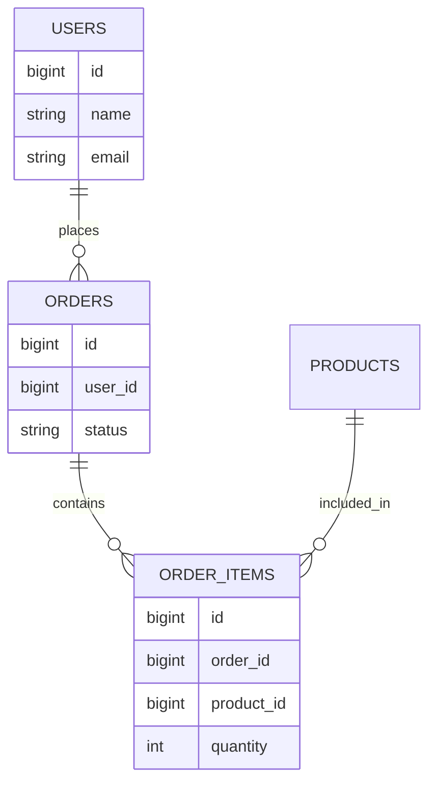

# SQL Databases: MySQL, PostgreSQL, and Oracle

## Relational Database Basics

SQL databases store data in tables with rows and columns.

```sql
CREATE TABLE users (
    id BIGINT PRIMARY KEY,
    name VARCHAR(100) NOT NULL,
    email VARCHAR(150) NOT NULL UNIQUE,
    created_at TIMESTAMP NOT NULL
);
```

## Tables and Relationships



## Primary Key

A primary key uniquely identifies a row.

```sql
CREATE TABLE products (
    id BIGINT PRIMARY KEY,
    name VARCHAR(100) NOT NULL
);
```

## Foreign Key

A foreign key references another table.

```sql
CREATE TABLE orders (
    id BIGINT PRIMARY KEY,
    user_id BIGINT NOT NULL,
    status VARCHAR(30) NOT NULL,
    CONSTRAINT fk_orders_user FOREIGN KEY (user_id) REFERENCES users(id)
);
```

## Indexes

Indexes speed up reads but add cost to writes.

```sql
CREATE INDEX idx_orders_user_id ON orders(user_id);
CREATE INDEX idx_orders_status ON orders(status);
```

Create indexes for frequently filtered, joined, or sorted columns.

## Transactions

A transaction groups database operations into one unit.

ACID:

| Property | Meaning |
| --- | --- |
| Atomicity | All operations succeed or all fail |
| Consistency | Data rules remain valid |
| Isolation | Concurrent transactions do not corrupt each other |
| Durability | Committed data survives failure |

```sql
BEGIN;
UPDATE accounts SET balance = balance - 100 WHERE id = 1;
UPDATE accounts SET balance = balance + 100 WHERE id = 2;
COMMIT;
```

## MySQL

MySQL is widely used for web applications.

Strengths:

- simple operations,
- broad hosting support,
- good read performance,
- common in startups and legacy apps.

## PostgreSQL

PostgreSQL is powerful and standards-oriented.

Strengths:

- advanced SQL features,
- JSON support,
- strong indexing options,
- good consistency behavior.

## Oracle

Oracle is common in large enterprises.

Strengths:

- mature enterprise tooling,
- strong transaction support,
- advanced partitioning and performance features,
- common in banking and large corporate systems.

## SQL Query Examples

```sql
SELECT id, name, email
FROM users
WHERE email = 'a@example.com';
```

```sql
SELECT u.name, COUNT(o.id) AS order_count
FROM users u
LEFT JOIN orders o ON o.user_id = u.id
GROUP BY u.name;
```

## SQL Best Practices

- Normalize data until duplication has a real reason.
- Use transactions for multi-step updates.
- Add indexes based on query patterns.
- Avoid `SELECT *` in production queries.
- Use migrations for schema changes.
- Keep database constraints for important invariants.

