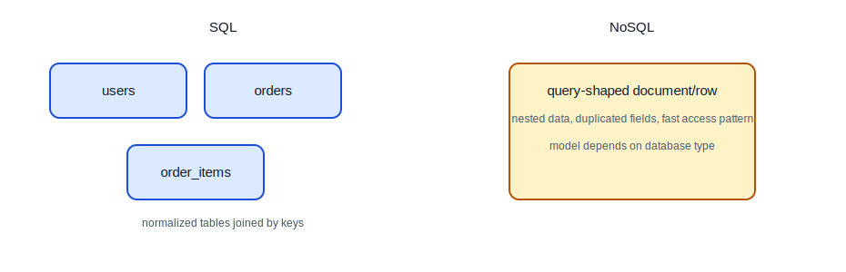
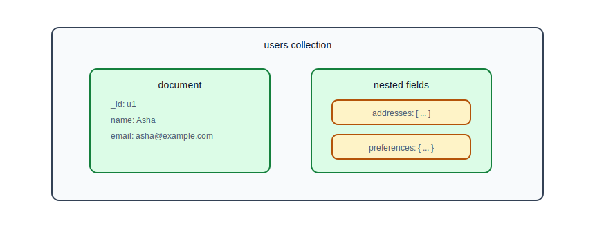
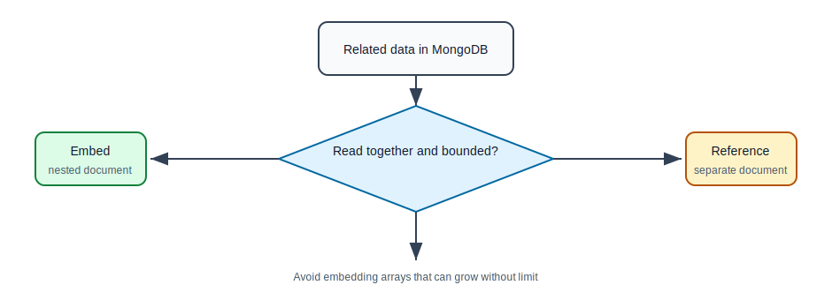
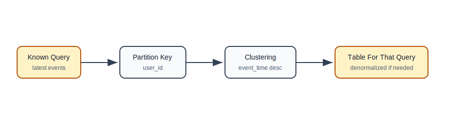
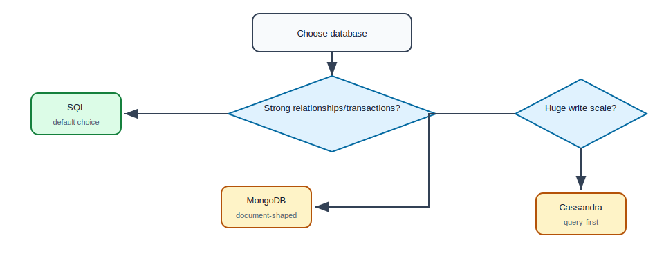

# NoSQL Databases: MongoDB and Cassandra

## Why This Topic Matters

NoSQL databases are useful, but they are often misunderstood by beginners.

NoSQL does not mean "better than SQL". It means the database uses a different data model and different tradeoffs.

A good backend developer should know:

- why NoSQL exists,
- when document databases are useful,
- when wide-column databases are useful,
- why query patterns matter,
- when not to use NoSQL.

## What Is NoSQL?

NoSQL is a broad category of databases that do not primarily model data as normalized relational tables.

Common NoSQL types:

| Type | Example | Data Model |
| --- | --- | --- |
| Document | MongoDB | JSON-like documents |
| Wide-column | Cassandra | partitioned rows and columns |
| Key-value | Redis, DynamoDB style usage | key to value |
| Graph | Neo4j | nodes and relationships |

This roadmap focuses on MongoDB and Cassandra.

## SQL vs NoSQL Mental Model



## MongoDB

MongoDB is a document database. It stores data as BSON documents, which are similar to JSON.

Example user document:

```json
{
  "_id": "u1",
  "name": "Asha",
  "email": "asha@example.com",
  "addresses": [
    {
      "type": "home",
      "city": "Bengaluru",
      "pincode": "560001"
    }
  ],
  "preferences": {
    "emailNotifications": true,
    "theme": "dark"
  }
}
```

This document can contain nested data.

## MongoDB Collection

A collection is like a group of documents.

```text
database
  users collection
    document 1
    document 2
    document 3
```

Documents in a collection do not need to have exactly the same fields, but uncontrolled variation can become messy.

## Document Model Diagram



## Why MongoDB Can Be Useful

MongoDB works well when:

- data is naturally document-shaped,
- nested data is usually read together,
- schema changes often,
- you want flexible fields,
- you do not need many relational joins.

Examples:

- user profile with preferences,
- product catalog with variable attributes,
- content management system,
- event payload storage,
- configuration documents.

## MongoDB Query Examples

Find by email:

```javascript
db.users.find({ email: "asha@example.com" })
```

Find users from a city:

```javascript
db.users.find({ "addresses.city": "Bengaluru" })
```

Update preference:

```javascript
db.users.updateOne(
  { email: "asha@example.com" },
  { $set: { "preferences.theme": "light" } }
)
```

## Embedding vs Referencing

In MongoDB, you must decide whether to embed data inside a document or reference another document.

### Embed

```json
{
  "_id": "order1",
  "customerId": "u1",
  "items": [
    {
      "productId": "p1",
      "name": "Keyboard",
      "quantity": 1
    }
  ]
}
```

Embedding is useful when nested data is read together and does not grow without limit.

### Reference

```json
{
  "_id": "order1",
  "customerId": "u1"
}
```

```json
{
  "_id": "item1",
  "orderId": "order1",
  "productId": "p1"
}
```

Referencing is useful when data is large, shared, or independently queried.

## Embed vs Reference Flow



## MongoDB Tradeoffs

Strengths:

- flexible document shape,
- easy nested data,
- fast reads when document matches query need,
- natural JSON-like model for APIs.

Tradeoffs:

- joins are not as natural as SQL,
- duplicated data can become inconsistent,
- schema flexibility can become schema chaos,
- transactions exist but should not be your main modeling strategy.

## Cassandra

Cassandra is a distributed wide-column database built for high write throughput and horizontal scaling.

It is very different from a relational database.

Cassandra is often used for:

- time-series events,
- IoT data,
- activity logs,
- very large write-heavy workloads,
- globally distributed systems.

## Cassandra Table Example

```sql
CREATE TABLE user_events (
    user_id text,
    event_time timestamp,
    event_type text,
    payload text,
    PRIMARY KEY (user_id, event_time)
) WITH CLUSTERING ORDER BY (event_time DESC);
```

This table is designed for a specific query:

```sql
SELECT *
FROM user_events
WHERE user_id = 'u1'
LIMIT 20;
```

## Cassandra Query-First Modeling

In relational databases, beginners often model entities first and then write many queries.

In Cassandra, you model around queries first.



## Partition Key And Clustering Column

In the example:

```sql
PRIMARY KEY (user_id, event_time)
```

`user_id` is the partition key.

`event_time` is the clustering column.

Meaning:

- events for the same user are stored together,
- inside one user's partition, events are ordered by time.

This makes "latest events for a user" efficient.

## Cassandra Strengths

- high write throughput,
- horizontal scalability,
- distributed architecture,
- good for append-heavy workloads,
- tunable consistency.

## Cassandra Tradeoffs

- limited ad hoc querying,
- denormalization is common,
- joins are not supported like SQL,
- data modeling requires knowing queries upfront,
- operational complexity can be high.

## SQL vs MongoDB vs Cassandra

| Need | SQL | MongoDB | Cassandra |
| --- | --- | --- | --- |
| complex joins | strong | limited | not the model |
| flexible nested documents | possible but not primary | strong | weak |
| strong multi-row transactions | strong | possible but not central | limited |
| high write scale across nodes | possible with effort | possible | strong |
| ad hoc reporting | strong | moderate | weak |
| query-first design | useful | useful | required |

## Choosing A Database



## When SQL Is The Better Default

Start with SQL when:

- your data has clear relationships,
- you need transactions,
- you need reporting queries,
- data consistency matters strongly,
- the team is comfortable with relational design,
- you do not have a specific NoSQL need.

This applies to many backend applications.

## When MongoDB Is A Good Fit

Use MongoDB when:

- documents map naturally to your data,
- nested data is read together,
- schema needs flexibility,
- the application does not need many joins,
- you understand duplication and consistency tradeoffs.

## When Cassandra Is A Good Fit

Use Cassandra when:

- write volume is very high,
- data is naturally partitioned,
- query patterns are known,
- you need horizontal scaling across many nodes,
- eventual consistency is acceptable for the use case.

## Common Beginner Mistakes

| Mistake | Why It Hurts | Better Approach |
| --- | --- | --- |
| choosing NoSQL because it sounds modern | wrong tradeoff | choose based on requirements |
| using MongoDB like a relational database | awkward joins and references | design documents around access patterns |
| embedding unbounded arrays | huge documents | reference or split large child data |
| using Cassandra for ad hoc queries | Cassandra is not designed for that | model by query upfront |
| ignoring consistency needs | data bugs | understand transaction requirements |
| duplicating data without update strategy | stale data | define ownership and sync rules |

## Practice Exercise

For a task management system, design:

1. a MongoDB document for user preferences,
2. a MongoDB document for a task with small comments embedded,
3. a Cassandra table for task activity events by task ID,
4. a Cassandra table for user activity events by user ID.

For each design, write which query it supports.

## Self-Check Questions

1. What does NoSQL mean?
2. When is MongoDB useful?
3. What is the difference between embedding and referencing?
4. Why does Cassandra require query-first modeling?
5. What is a partition key?
6. Why are joins natural in SQL but not in Cassandra?
7. Why is SQL often the best default for new backend systems?

