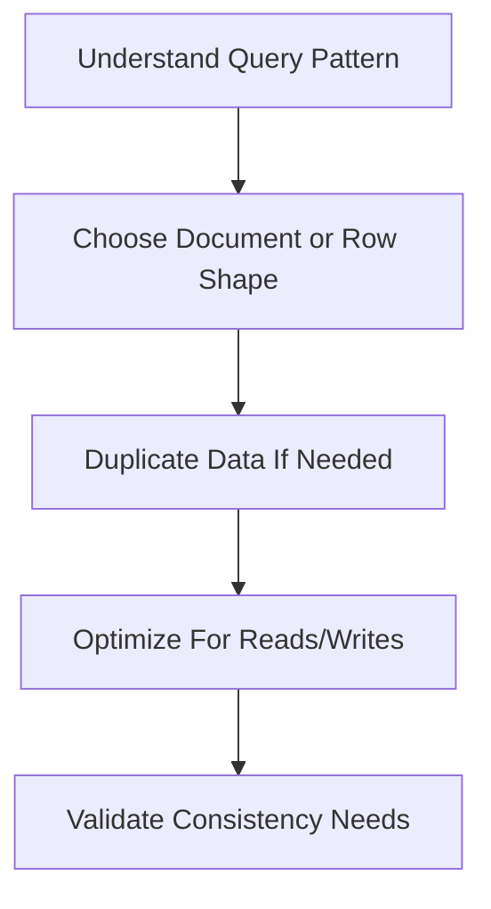

# NoSQL Databases: MongoDB and Cassandra

## What Is NoSQL?

NoSQL databases are non-relational databases designed for flexible schemas, high scale, or specialized access patterns.

NoSQL does not mean SQL is bad. It means the database model is different.

## MongoDB

MongoDB stores documents as BSON, which is similar to JSON.

Example document:

```json
{
  "_id": "u1",
  "name": "Asha",
  "email": "asha@example.com",
  "addresses": [
    {
      "type": "home",
      "city": "Bengaluru"
    }
  ]
}
```

## MongoDB Use Cases

- flexible user profiles,
- content management,
- event data,
- product catalogs,
- rapidly changing schemas.

## MongoDB Query

```javascript
db.users.find({ email: "asha@example.com" })
```

## Cassandra

Cassandra is a distributed wide-column database designed for high write throughput and horizontal scaling.

Example table:

```sql
CREATE TABLE user_events (
    user_id text,
    event_time timestamp,
    event_type text,
    payload text,
    PRIMARY KEY (user_id, event_time)
) WITH CLUSTERING ORDER BY (event_time DESC);
```

## Cassandra Use Cases

- time-series events,
- IoT data,
- activity feeds,
- high-volume logs,
- globally distributed write-heavy systems.

## SQL vs NoSQL

| Need | SQL | NoSQL |
| --- | --- | --- |
| Strong relational joins | Excellent | Limited |
| Flexible schema | Moderate | Strong |
| Complex transactions | Strong | Varies |
| Horizontal write scaling | Possible | Often stronger |
| Query flexibility | Strong | Depends on model |

## NoSQL Modeling Rule

In relational databases, you often model around entities and relationships.

In NoSQL databases, you usually model around queries.



## When To Avoid NoSQL

Avoid NoSQL when:

- the domain requires many joins,
- strong multi-table transactions are central,
- reporting queries are unpredictable,
- the team does not understand the data model tradeoffs.

## Practical Rule

Start with PostgreSQL or MySQL unless there is a clear reason not to. Add NoSQL when the access pattern or scale requirement justifies it.

