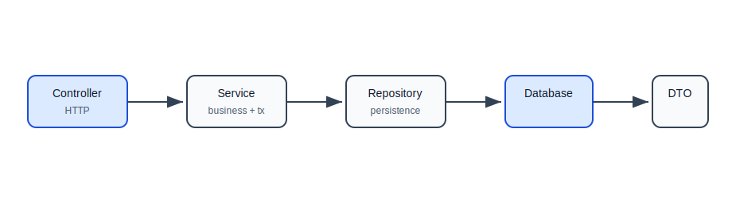
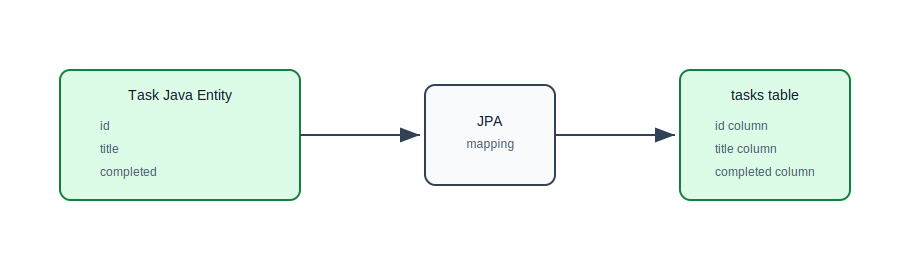
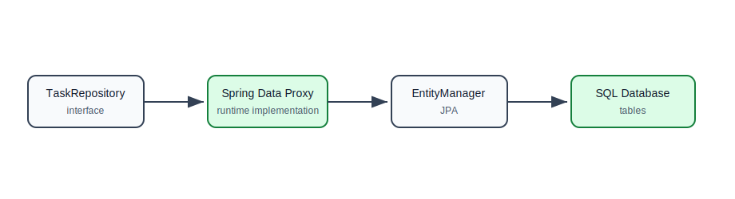
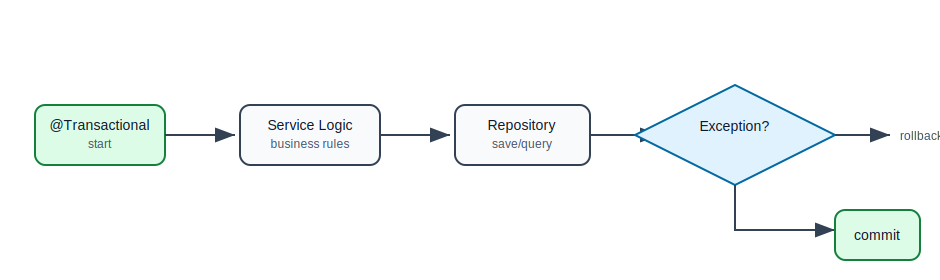
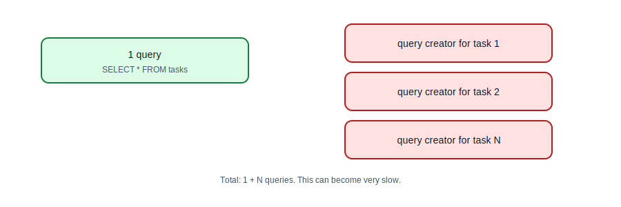
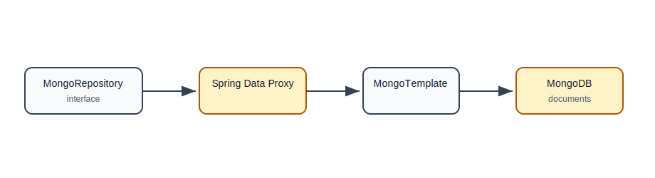
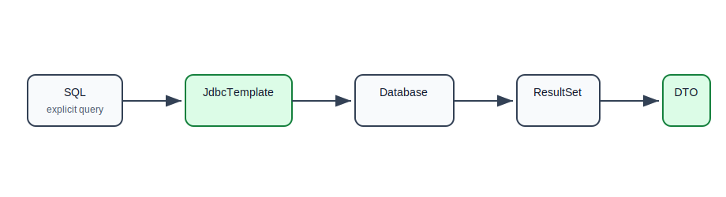

# Spring Data JPA, MongoDB, and JDBC

## Why This Topic Matters

In Java backend applications, you rarely write raw database connection code manually for every query. Spring provides tools that reduce boilerplate and help keep persistence code organized.

This file explains three common approaches:

- Spring Data JPA for relational database access through entities and repositories,
- Spring Data MongoDB for document database access,
- JDBC for direct SQL control.

## Persistence Layer In A Backend App

The persistence layer is responsible for saving and loading data.

Typical flow:



Controller should not directly talk to the database. Service should coordinate business rules and transactions. Repository should handle database access.

## Spring Data JPA

JPA means Java Persistence API. It is a standard for mapping Java objects to relational database tables.

Spring Data JPA builds on JPA and makes repository code easier.

Main ideas:

- entity maps to table,
- repository provides database operations,
- transaction controls unit of work,
- JPA provider generates SQL behind the scenes.

## Entity

An entity is a Java class mapped to a database table.

```java
@Entity
@Table(name = "tasks")
public class Task {
    @Id
    @GeneratedValue(strategy = GenerationType.IDENTITY)
    private Long id;

    @Column(nullable = false, length = 150)
    private String title;

    @Column(length = 500)
    private String description;

    @Column(nullable = false)
    private boolean completed;

    protected Task() {
        // Required by JPA
    }

    public Task(String title, String description) {
        this.title = title;
        this.description = description;
        this.completed = false;
    }
}
```

Important annotations:

| Annotation | Meaning |
| --- | --- |
| `@Entity` | this class is persisted by JPA |
| `@Table` | maps class to table |
| `@Id` | primary key |
| `@GeneratedValue` | database generates ID |
| `@Column` | column configuration |

## Entity Mapping Flow



## Repository

A repository provides database operations.

```java
public interface TaskRepository extends JpaRepository<Task, Long> {
    List<Task> findByCompleted(boolean completed);
    List<Task> findByTitleContainingIgnoreCase(String title);
}
```

`JpaRepository<Task, Long>` means:

- entity type is `Task`,
- primary key type is `Long`.

Spring Data creates the implementation automatically.

## Repository Proxy Flow



## Common Repository Methods

From `JpaRepository`, you get:

```java
save(entity)
findById(id)
findAll()
deleteById(id)
existsById(id)
count()
```

You do not need to implement these manually.

## Derived Query Methods

Spring Data can derive queries from method names.

```java
List<Task> findByCompleted(boolean completed);

Optional<Task> findByTitle(String title);

List<Task> findByTitleContainingIgnoreCase(String title);

boolean existsByTitle(String title);
```

Use derived queries for simple cases. For complex queries, use explicit JPQL or SQL.

## Custom JPQL Query

```java
@Query("""
       select t
       from Task t
       where t.completed = false
       order by t.id desc
       """)
List<Task> findOpenTasksNewestFirst();
```

JPQL uses entity names and fields, not table and column names.

## Native SQL Query

```java
@Query(
        value = "SELECT * FROM tasks WHERE completed = false ORDER BY id DESC",
        nativeQuery = true
)
List<Task> findOpenTasksNative();
```

Use native queries when you need database-specific SQL or performance tuning.

## Service With Transaction

Transactions usually belong in the service layer.

```java
@Service
public class TaskService {
    private final TaskRepository taskRepository;

    public TaskService(TaskRepository taskRepository) {
        this.taskRepository = taskRepository;
    }

    @Transactional
    public TaskResponse create(CreateTaskRequest request) {
        Task task = new Task(request.title(), request.description());
        Task saved = taskRepository.save(task);
        return TaskResponse.from(saved);
    }
}
```

`@Transactional` makes the method execute inside a database transaction.

## Transaction Boundary Flow



## Entity vs DTO

Do not expose entities directly from controllers.

Entity:

```java
@Entity
public class Task {
    // database mapping
}
```

Response DTO:

```java
public record TaskResponse(
        Long id,
        String title,
        String description,
        boolean completed
) {
    public static TaskResponse from(Task task) {
        return new TaskResponse(
                task.getId(),
                task.getTitle(),
                task.getDescription(),
                task.isCompleted()
        );
    }
}
```

Why:

- API shape should not be tied to table shape,
- prevents accidental data exposure,
- avoids serialization problems with relationships,
- makes API versioning easier.

## Relationships In JPA

Example: one user has many tasks.

```java
@Entity
public class User {
    @Id
    @GeneratedValue(strategy = GenerationType.IDENTITY)
    private Long id;

    @OneToMany(mappedBy = "creator")
    private List<Task> tasks = new ArrayList<>();
}
```

```java
@Entity
public class Task {
    @ManyToOne(fetch = FetchType.LAZY)
    @JoinColumn(name = "creator_id", nullable = false)
    private User creator;
}
```

Use relationships carefully. Loading too much related data accidentally can hurt performance.

## Lazy Loading

Lazy loading means related data is loaded only when accessed.

This can be useful, but it can also cause surprises:

- queries happen later than expected,
- serialization can trigger extra loads,
- accessing lazy data outside transaction can fail.

Beginner rule: keep entity relationships simple and map to DTOs inside service methods.

## N+1 Query Problem

N+1 happens when one query loads parent records and then one extra query runs for each parent.

Example:

1 query for tasks:

```sql
SELECT * FROM tasks;
```

Then one query per task for creator:

```sql
SELECT * FROM users WHERE id = ?;
```

If there are 100 tasks, this can become 101 queries.

## N+1 Flow



Fix options:

- fetch joins,
- entity graphs,
- DTO projections,
- explicit queries.

## Spring Data MongoDB

Spring Data MongoDB maps Java objects to MongoDB documents.

```java
@Document(collection = "tasks")
public class TaskDocument {
    @Id
    private String id;

    private String title;
    private String description;
    private boolean completed;
}
```

Repository:

```java
public interface TaskMongoRepository
        extends MongoRepository<TaskDocument, String> {

    List<TaskDocument> findByCompleted(boolean completed);
}
```

## Mongo Repository Flow



## JPA Entity vs Mongo Document

| Concept | JPA | MongoDB |
| --- | --- | --- |
| Stored as | table row | document |
| Annotation | `@Entity` | `@Document` |
| ID annotation | `@Id` | `@Id` |
| Repository | `JpaRepository` | `MongoRepository` |
| Query model | relational/JPQL/SQL | document queries |

## JDBC

JDBC gives direct SQL control.

Spring's `JdbcTemplate` reduces boilerplate while keeping SQL explicit.

```java
@Repository
public class TaskJdbcRepository {
    private final JdbcTemplate jdbcTemplate;

    public TaskJdbcRepository(JdbcTemplate jdbcTemplate) {
        this.jdbcTemplate = jdbcTemplate;
    }

    public List<TaskSummary> findOpenTaskSummaries() {
        return jdbcTemplate.query(
                """
                SELECT id, title
                FROM tasks
                WHERE completed = false
                ORDER BY id DESC
                """,
                (rs, rowNum) -> new TaskSummary(
                        rs.getLong("id"),
                        rs.getString("title")
                )
        );
    }
}
```

## JDBC Flow



## When To Use JPA, MongoDB, Or JDBC

| Need | Good Fit |
| --- | --- |
| standard CRUD with relational data | Spring Data JPA |
| complex relational model with transactions | Spring Data JPA |
| explicit SQL performance tuning | JDBC or jOOQ |
| document-shaped data | Spring Data MongoDB |
| flexible document storage | Spring Data MongoDB |
| reporting query with custom SQL | JDBC |

## Testing Repositories

JPA repository test:

```java
@DataJpaTest
class TaskRepositoryTest {
    @Autowired
    private TaskRepository taskRepository;

    @Test
    void findsCompletedTasks() {
        taskRepository.save(new Task("Learn SQL", "Practice joins"));

        List<Task> completed = taskRepository.findByCompleted(false);

        assertThat(completed).isNotEmpty();
    }
}
```

Repository tests verify mapping and query behavior.

## Migration Tools

Real projects should manage schema changes with migration tools.

Common tools:

- Flyway,
- Liquibase.

Example Flyway file:

```text
src/main/resources/db/migration/V1__create_tasks_table.sql
```

```sql
CREATE TABLE tasks (
    id BIGINT GENERATED BY DEFAULT AS IDENTITY PRIMARY KEY,
    title VARCHAR(150) NOT NULL,
    description VARCHAR(500),
    completed BOOLEAN NOT NULL
);
```

Migrations make schema changes repeatable across environments.

## Common Beginner Mistakes

| Mistake | Why It Hurts | Better Approach |
| --- | --- | --- |
| putting database code in controllers | mixes HTTP and persistence | use service/repository layers |
| exposing entities directly | leaks internal model | use DTOs |
| using JPA relationships carelessly | performance surprises | keep relationships intentional |
| ignoring transactions | partial updates | use `@Transactional` in service layer |
| using derived query names for complex logic | unreadable method names | use `@Query` |
| not testing repositories | broken mappings found late | use repository tests |
| changing schema manually | environment drift | use Flyway or Liquibase |

## Practice Exercise

Upgrade the task API using Spring Data JPA:

1. Create `Task` entity.
2. Create `TaskRepository`.
3. Add `findByCompleted`.
4. Add service methods with `@Transactional`.
5. Map entity to response DTO.
6. Add a Flyway migration.
7. Write `@DataJpaTest`.
8. Add one JDBC query for task summaries.

## Self-Check Questions

1. What is a JPA entity?
2. What does `JpaRepository<Task, Long>` mean?
3. Why should transactions usually be in the service layer?
4. Why should controllers return DTOs instead of entities?
5. What is lazy loading?
6. What is the N+1 query problem?
7. When might JDBC be better than JPA?

