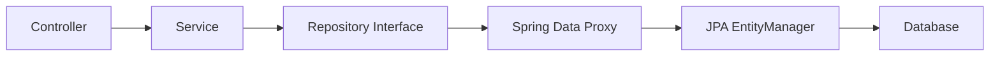

# Spring Data JPA, MongoDB, and JDBC

## Spring Data JPA

Spring Data JPA reduces boilerplate for relational database access using JPA.

## Entity

```java
@Entity
@Table(name = "users")
public class User {
    @Id
    @GeneratedValue(strategy = GenerationType.IDENTITY)
    private Long id;

    @Column(nullable = false)
    private String name;

    @Column(nullable = false, unique = true)
    private String email;
}
```

## Repository

```java
public interface UserRepository extends JpaRepository<User, Long> {
    Optional<User> findByEmail(String email);
    List<User> findByNameContainingIgnoreCase(String name);
}
```

Spring Data generates implementations at runtime.

## Service With Transaction

```java
@Service
public class UserService {
    private final UserRepository userRepository;

    public UserService(UserRepository userRepository) {
        this.userRepository = userRepository;
    }

    @Transactional
    public User create(String name, String email) {
        User user = new User(name, email);
        return userRepository.save(user);
    }
}
```

`@Transactional` ensures the database work succeeds or rolls back as a unit.

## JPA Flow



## Common JPA Concepts

| Concept | Meaning |
| --- | --- |
| Entity | Java object mapped to table |
| Repository | Data access abstraction |
| EntityManager | JPA persistence manager |
| Transaction | Unit of work |
| Lazy loading | Load related data only when needed |
| JPQL | Object-oriented query language |

## Spring Data MongoDB

```java
@Document(collection = "users")
public class UserDocument {
    @Id
    private String id;
    private String name;
    private String email;
}
```

```java
public interface UserMongoRepository extends MongoRepository<UserDocument, String> {
    Optional<UserDocument> findByEmail(String email);
}
```

## JDBC

JDBC is lower-level and gives direct SQL control.

```java
@Repository
public class UserJdbcRepository {
    private final JdbcTemplate jdbcTemplate;

    public UserJdbcRepository(JdbcTemplate jdbcTemplate) {
        this.jdbcTemplate = jdbcTemplate;
    }

    public List<User> findAll() {
        return jdbcTemplate.query(
                "SELECT id, name, email FROM users",
                (rs, rowNum) -> new User(
                        rs.getLong("id"),
                        rs.getString("name"),
                        rs.getString("email")
                )
        );
    }
}
```

## Choosing JPA, MongoDB, or JDBC

| Need | Best Fit |
| --- | --- |
| CRUD-heavy relational app | Spring Data JPA |
| Complex SQL and performance tuning | JDBC or jOOQ |
| Document storage | Spring Data MongoDB |
| Dynamic schema | MongoDB |
| Strict relational consistency | JPA or JDBC with SQL database |

## Repository Best Practices

- Keep business logic out of repositories.
- Use DTO projections for read-heavy APIs.
- Watch for N+1 query problems.
- Use transactions in services.
- Add database constraints, not only Java validation.
- Prefer explicit queries for complex cases.

