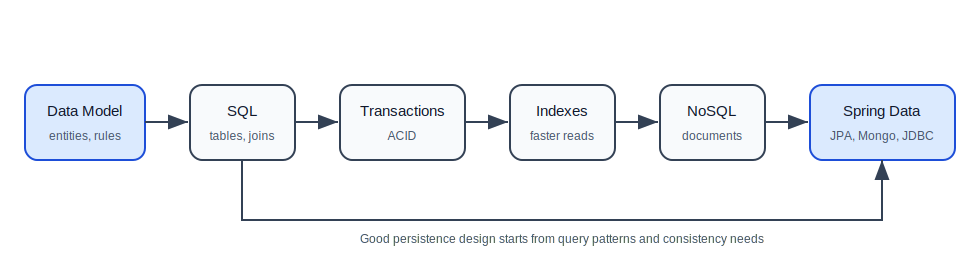

# 05. Databases

Most backend applications need to store and retrieve data reliably. Databases are where application state lives after a request is finished and after the server restarts.

This folder teaches databases from a backend developer point of view:

- how relational databases organize data,
- how SQL queries work,
- when NoSQL databases make sense,
- how Spring applications access databases using JPA, MongoDB, and JDBC.

## How To Study This Folder

Read these files in order:

| Order | File | What You Will Learn |
| --- | --- | --- |
| 1 | [01-sql-databases.md](01-sql-databases.md) | tables, keys, relationships, indexes, joins, transactions, MySQL, PostgreSQL, Oracle |
| 2 | [02-nosql-databases.md](02-nosql-databases.md) | document databases, wide-column databases, MongoDB, Cassandra, query-based modeling |
| 3 | [03-spring-data-jpa-mongodb-jdbc.md](03-spring-data-jpa-mongodb-jdbc.md) | entities, repositories, transactions, Spring Data JPA, MongoDB repositories, JDBC |

## The Big Idea

Databases are not just storage. They enforce rules, support queries, protect consistency, and shape how your backend is designed.

Choosing a database is a design decision. It depends on:

- data shape,
- relationships,
- query patterns,
- consistency requirements,
- scale,
- operations skills,
- reporting needs.

## Database Learning Path

## What You Should Be Able To Explain After This Folder

You should be able to explain:

- what tables, rows, columns, primary keys, and foreign keys are,
- why indexes help reads but cost writes,
- what transactions and ACID mean,
- how joins combine relational data,
- when MongoDB can be useful,
- why Cassandra models are query-driven,
- why SQL is often the default choice for backend systems,
- how Spring Data JPA repositories work,
- when JDBC is useful despite being lower-level.

## Practice Project Before Moving To Spring Security

Upgrade the task manager API:

1. Store tasks in PostgreSQL or MySQL.
2. Create a `Task` JPA entity.
3. Create a `TaskRepository`.
4. Add a service method using `@Transactional`.
5. Add query methods for completed/open tasks.
6. Add one custom SQL/JDBC query.
7. Write one repository test.

