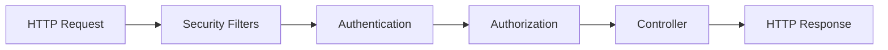
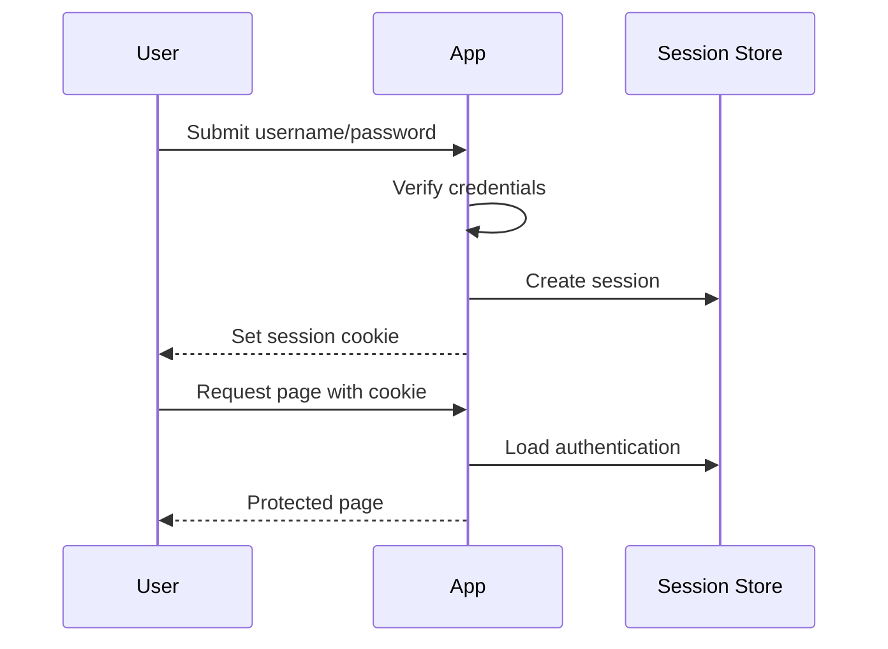

# Authentication, Authorization, and Form Login

## Authentication

Authentication verifies who the user is.

Examples:

- username and password,
- one-time password,
- OAuth2 login,
- API token,
- client certificate.

## Authorization

Authorization decides what the authenticated user can do.

Examples:

- user can read own profile,
- admin can delete accounts,
- support user can view tickets,
- service account can publish events.

## Authentication vs Authorization

| Concept | Question |
| --- | --- |
| Authentication | Who are you? |
| Authorization | What are you allowed to do? |

## Basic Security Configuration

```java
@Configuration
@EnableWebSecurity
public class SecurityConfig {
    @Bean
    SecurityFilterChain securityFilterChain(HttpSecurity http) throws Exception {
        return http
                .authorizeHttpRequests(auth -> auth
                        .requestMatchers("/public/**").permitAll()
                        .requestMatchers("/admin/**").hasRole("ADMIN")
                        .anyRequest().authenticated()
                )
                .formLogin(Customizer.withDefaults())
                .build();
    }
}
```

## Security Filter Chain

Spring Security works through a chain of filters.



## Password Encoding

Never store plain text passwords.

```java
@Bean
PasswordEncoder passwordEncoder() {
    return new BCryptPasswordEncoder();
}
```

```java
String encoded = passwordEncoder.encode(rawPassword);
boolean matches = passwordEncoder.matches(rawPassword, encoded);
```

## UserDetailsService

```java
@Service
public class DatabaseUserDetailsService implements UserDetailsService {
    private final UserRepository userRepository;

    public DatabaseUserDetailsService(UserRepository userRepository) {
        this.userRepository = userRepository;
    }

    @Override
    public UserDetails loadUserByUsername(String username) {
        User user = userRepository.findByEmail(username)
                .orElseThrow(() -> new UsernameNotFoundException(username));

        return org.springframework.security.core.userdetails.User
                .withUsername(user.getEmail())
                .password(user.getPasswordHash())
                .roles(user.getRole())
                .build();
    }
}
```

## Method-Level Authorization

```java
@PreAuthorize("hasRole('ADMIN')")
public void deleteUser(Long id) {
    userRepository.deleteById(id);
}
```

Enable it:

```java
@EnableMethodSecurity
@Configuration
public class MethodSecurityConfig {
}
```

## Form Authentication

Form authentication uses server-side sessions. It is common for traditional web apps.

Flow:



## Common Security Rules

- Hash passwords with a strong password encoder.
- Use HTTPS in production.
- Keep authorization checks on the server.
- Deny by default and explicitly permit public endpoints.
- Use least privilege roles.
- Do not leak whether email or password was wrong during login.

