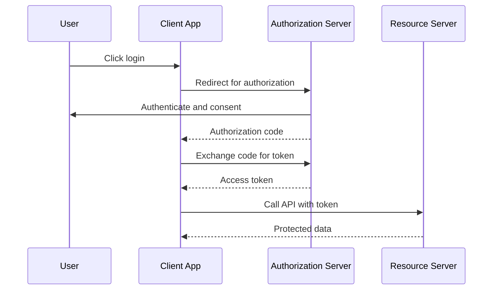
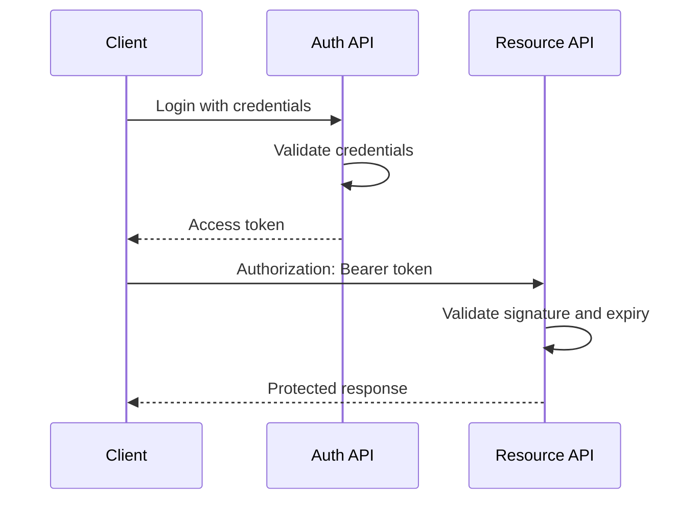

# OAuth2 and JWT

## OAuth2

OAuth2 is an authorization framework that lets applications access resources with delegated permission.

Common roles:

| Role | Meaning |
| --- | --- |
| Resource Owner | The user |
| Client | The app requesting access |
| Authorization Server | Issues tokens |
| Resource Server | API that validates tokens |

## OAuth2 Flow



## JWT

JWT means JSON Web Token. It is a compact token format commonly used for stateless API authentication.

A JWT has three parts:

```text
header.payload.signature
```

Payload example:

```json
{
  "sub": "user-123",
  "roles": ["USER"],
  "exp": 1770000000
}
```

## JWT Authentication Flow



## Resource Server Configuration

```java
@Configuration
@EnableWebSecurity
public class SecurityConfig {
    @Bean
    SecurityFilterChain securityFilterChain(HttpSecurity http) throws Exception {
        return http
                .authorizeHttpRequests(auth -> auth
                        .requestMatchers("/public/**").permitAll()
                        .anyRequest().authenticated()
                )
                .oauth2ResourceServer(oauth2 -> oauth2.jwt(Customizer.withDefaults()))
                .build();
    }
}
```

## JWT Pros and Cons

| Pros | Cons |
| --- | --- |
| Stateless API auth | Revocation is harder |
| Works well across services | Token leakage is dangerous |
| Easy for mobile/SPAs | Payload can become stale |
| Can include claims | Must validate signature and expiry |

## Access Token vs Refresh Token

| Token | Purpose |
| --- | --- |
| Access token | Short-lived token used to call APIs |
| Refresh token | Longer-lived token used to get new access tokens |

## JWT Best Practices

- Use short-lived access tokens.
- Store signing keys securely.
- Validate issuer, audience, expiry, and signature.
- Do not put secrets in JWT payload.
- Use HTTPS.
- Prefer authorization servers for production-grade OAuth2.

