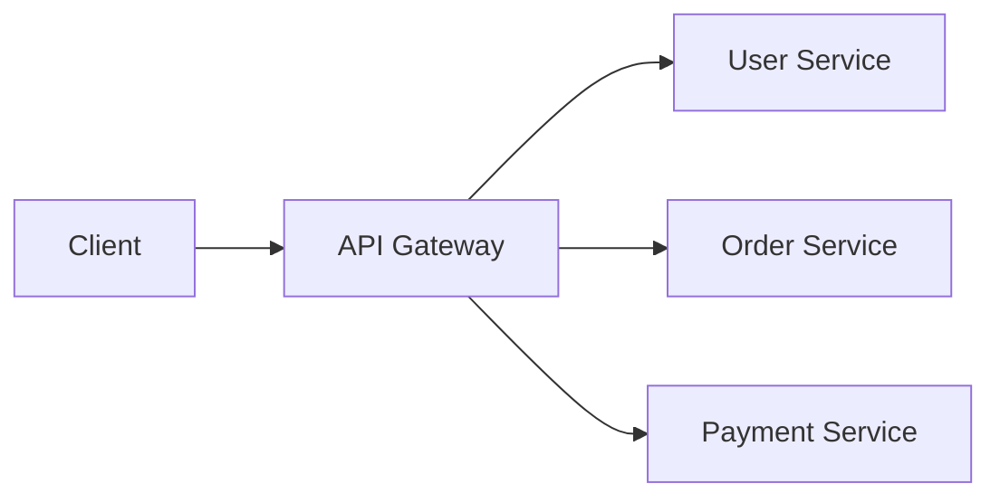
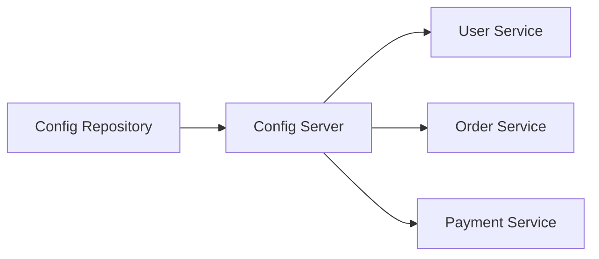
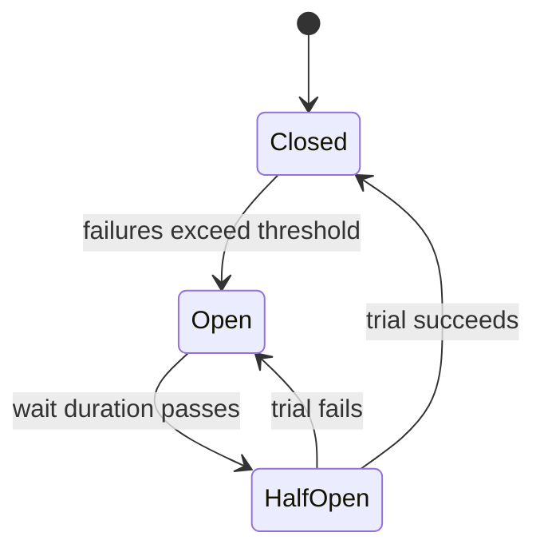
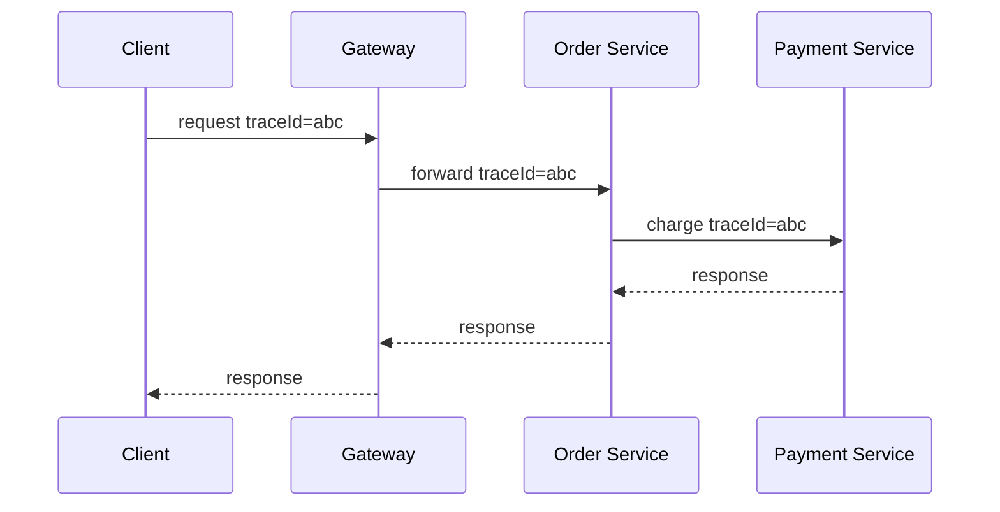

# Spring Cloud Components

## API Gateway

An API Gateway is the entry point for clients. It routes requests to backend services and can handle cross-cutting concerns.

Common responsibilities:

- routing,
- authentication,
- rate limiting,
- request/response transformation,
- TLS termination,
- observability.



## Spring Cloud Gateway Route

```yaml
spring:
  cloud:
    gateway:
      routes:
        - id: order-service
          uri: lb://order-service
          predicates:
            - Path=/api/orders/**
```

## Config Server

Config Server centralizes configuration for services.



Benefits:

- centralized configuration,
- environment-specific config,
- easier secret/config rotation,
- consistent service settings.

## Circuit Breaker

A circuit breaker prevents repeated calls to a failing dependency.



Example with Resilience4j:

```java
@CircuitBreaker(name = "paymentService", fallbackMethod = "paymentFallback")
public PaymentResponse charge(PaymentRequest request) {
    return paymentClient.charge(request);
}

public PaymentResponse paymentFallback(PaymentRequest request, Throwable ex) {
    return PaymentResponse.failed("Payment service temporarily unavailable");
}
```

## OpenFeign

OpenFeign creates HTTP clients from interfaces.

```java
@FeignClient(name = "inventory-service")
public interface InventoryClient {
    @GetMapping("/api/inventory/{productId}")
    InventoryResponse findInventory(@PathVariable Long productId);
}
```

Feign reduces manual HTTP client boilerplate, but you still need timeouts, retries, and error handling.

## Sleuth and Tracing

Distributed tracing connects logs and spans across services. In newer Spring ecosystems, tracing is commonly handled through Micrometer Tracing and OpenTelemetry-compatible exporters.



## Microservice Communication Rules

- Use synchronous HTTP for request/response workflows.
- Use messaging for async work and decoupling.
- Add timeouts to every remote call.
- Add retries only for safe operations.
- Use circuit breakers for unstable dependencies.
- Propagate trace IDs across service calls.

