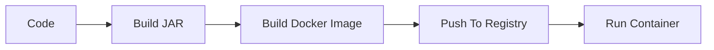
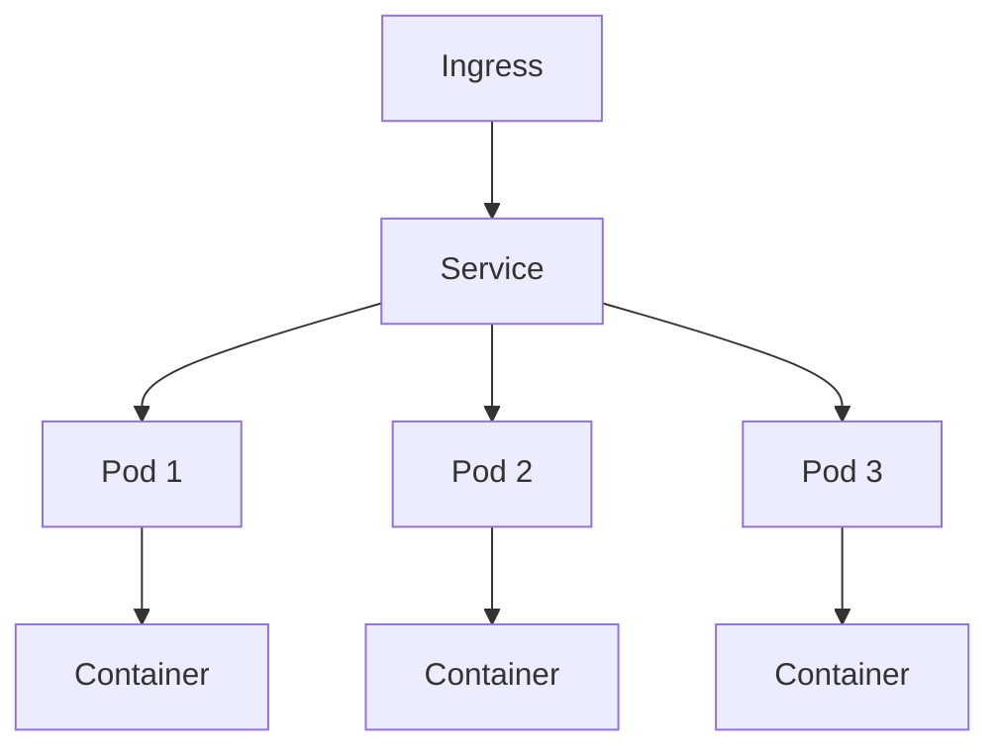

# Docker, Kubernetes, and Cloud Platforms

## Docker

Docker packages an application and its runtime dependencies into an image.

Simple Spring Boot Dockerfile:

```dockerfile
FROM eclipse-temurin:21-jre
WORKDIR /app
COPY target/app.jar app.jar
EXPOSE 8080
ENTRYPOINT ["java", "-jar", "app.jar"]
```

## Image and Container

| Term | Meaning |
| --- | --- |
| Image | Immutable package containing app and dependencies |
| Container | Running instance of an image |
| Registry | Stores images |
| Dockerfile | Instructions to build an image |

## Container Flow



## Docker Compose

Docker Compose runs multiple local containers.

```yaml
services:
  app:
    image: order-service:latest
    ports:
      - "8080:8080"
    depends_on:
      - postgres

  postgres:
    image: postgres:16
    environment:
      POSTGRES_DB: orders
      POSTGRES_USER: app
      POSTGRES_PASSWORD: secret
```

## Kubernetes

Kubernetes orchestrates containers.

Important concepts:

| Concept | Meaning |
| --- | --- |
| Pod | Smallest deployable unit |
| Deployment | Manages replica pods |
| Service | Stable network access to pods |
| ConfigMap | Non-secret configuration |
| Secret | Sensitive configuration |
| Ingress | External HTTP routing |

## Deployment Example

```yaml
apiVersion: apps/v1
kind: Deployment
metadata:
  name: order-service
spec:
  replicas: 3
  selector:
    matchLabels:
      app: order-service
  template:
    metadata:
      labels:
        app: order-service
    spec:
      containers:
        - name: order-service
          image: registry.example.com/order-service:1.0.0
          ports:
            - containerPort: 8080
```

## Kubernetes Flow



## Cloud Platforms

| Platform | Common Services |
| --- | --- |
| AWS | EC2, ECS, EKS, Lambda, RDS, S3, SQS, MSK |
| GCP | Compute Engine, GKE, Cloud Run, Cloud SQL, Pub/Sub |
| Azure | App Service, AKS, Functions, Azure SQL, Service Bus |

## Deployment Best Practices

- Build immutable images.
- Tag images with versions, not only `latest`.
- Use health checks.
- Externalize configuration.
- Keep secrets in secret managers.
- Set CPU and memory limits.
- Use rolling deployments.
- Monitor deployments after release.

