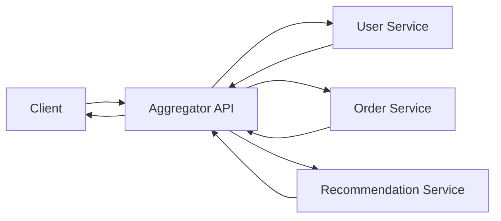
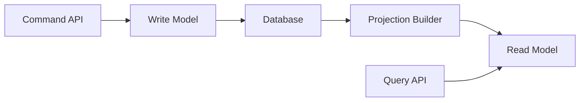
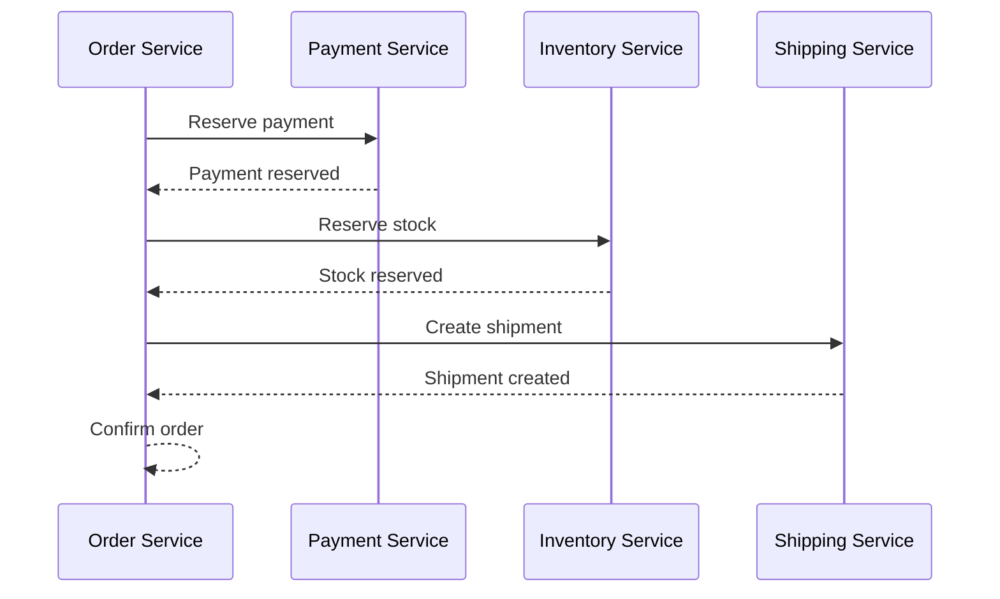
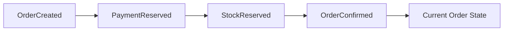

# Microservices Patterns: Aggregator, CQRS, SAGA, and Event Sourcing

## Aggregator Pattern

An aggregator combines data from multiple services into one response.



Use it when clients need a combined view and you want to avoid many client-side calls.

## CQRS

CQRS means Command Query Responsibility Segregation. It separates writes from reads.



Use CQRS when read and write models have very different needs.

Example:

- write model validates order placement,
- read model serves fast order history screens.

## SAGA Pattern

A saga manages a business transaction across multiple services without a single distributed database transaction.

Example order flow:



If a later step fails, earlier steps are compensated.

Example compensation:

- refund payment,
- release inventory,
- cancel shipment.

## Choreography vs Orchestration

| Style | Description |
| --- | --- |
| Choreography | Services react to events without central coordinator |
| Orchestration | A coordinator tells each service what to do |

## Event Sourcing

Event sourcing stores state as a sequence of events instead of only storing the latest state.



Instead of only storing:

```json
{
  "orderId": "O-1",
  "status": "CONFIRMED"
}
```

You store:

```json
[
  {"type": "OrderCreated", "orderId": "O-1"},
  {"type": "PaymentReserved", "orderId": "O-1"},
  {"type": "StockReserved", "orderId": "O-1"},
  {"type": "OrderConfirmed", "orderId": "O-1"}
]
```

## Pattern Selection

| Problem | Pattern |
| --- | --- |
| Need combined API response | Aggregator |
| Read and write models differ | CQRS |
| Multi-service transaction | SAGA |
| Need full audit history | Event Sourcing |

## Warning

These patterns add complexity. Use them when the business or scale problem justifies them, not because they sound advanced.

