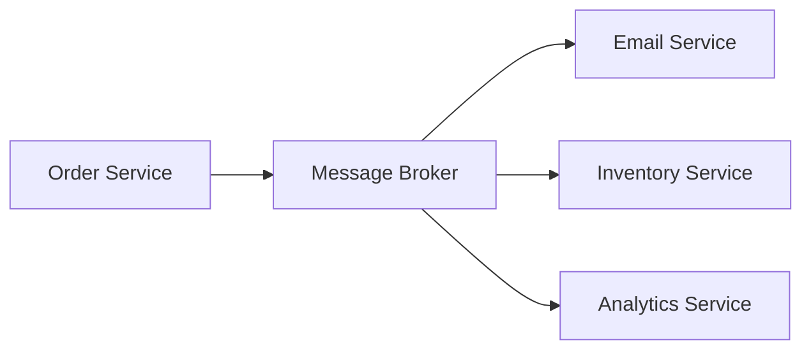
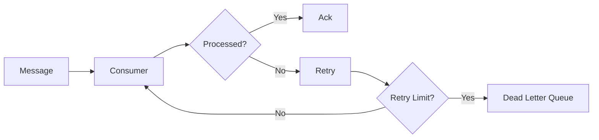

# Message Queues: SQS, Kafka, and RabbitMQ

## Why Messaging?

Messaging decouples services. The producer sends a message without waiting for the consumer to finish all processing.



## Queue vs Topic

| Model | Meaning |
| --- | --- |
| Queue | One message is processed by one consumer |
| Topic | One message can be delivered to many subscribers |

## AWS SQS

SQS is a managed queue service.

Use cases:

- background jobs,
- decoupling services,
- retrying failed work,
- buffering spikes.

Important concepts:

- visibility timeout,
- dead letter queue,
- standard queue,
- FIFO queue.

## Kafka

Kafka is a distributed event streaming platform.

Use cases:

- event streaming,
- audit logs,
- analytics pipelines,
- high-throughput integration,
- event-driven microservices.

Kafka concepts:

| Concept | Meaning |
| --- | --- |
| Topic | Named stream of records |
| Partition | Ordered shard of a topic |
| Producer | Writes records |
| Consumer | Reads records |
| Consumer group | Consumers sharing work |
| Offset | Consumer position in partition |

## RabbitMQ

RabbitMQ is a message broker commonly used for task queues and routing.

Use cases:

- work queues,
- request/reply messaging,
- routing by exchange type,
- background processing.

Exchange types:

- direct,
- fanout,
- topic,
- headers.

## Dead Letter Queue

A dead letter queue stores messages that could not be processed successfully.



## Idempotent Consumers

Message consumers should be idempotent because messages can be delivered more than once.

```java
public void handle(OrderCreatedEvent event) {
    if (processedEventRepository.existsByEventId(event.eventId())) {
        return;
    }

    sendWelcomeEmail(event.customerEmail());
    processedEventRepository.save(event.eventId());
}
```

## Choosing a Messaging Tool

| Need | Tool |
| --- | --- |
| Simple managed queue on AWS | SQS |
| High-throughput event streams | Kafka |
| Flexible broker routing | RabbitMQ |
| Event replay | Kafka |
| Background job buffer | SQS or RabbitMQ |

## Messaging Best Practices

- Use stable event schemas.
- Add event IDs.
- Make consumers idempotent.
- Use retries with backoff.
- Send poison messages to DLQ.
- Monitor queue depth and consumer lag.
- Avoid using messaging to hide unclear service boundaries.

