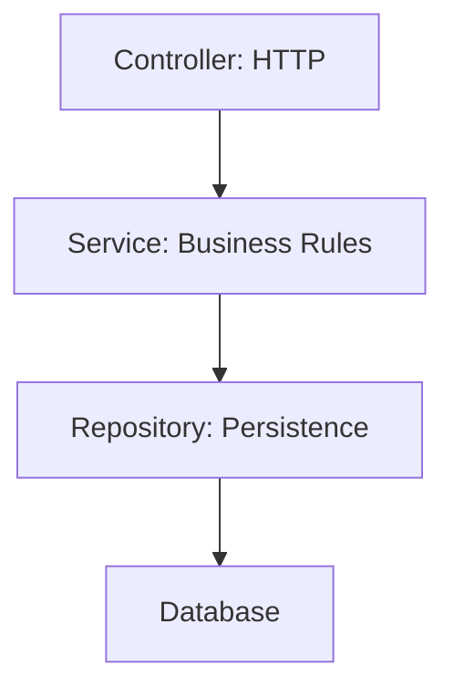

# Clean Code and SOLID Principles

## Clean Code

Clean code is code that is easy to understand, change, test, and operate.

## Naming

Bad:

```java
public void p(Order o) {
}
```

Better:

```java
public void placeOrder(Order order) {
}
```

Names should reveal intent.

## Small Functions

Functions should do one clear thing.

```java
public Order placeOrder(CreateOrderRequest request) {
    Customer customer = customerService.findActiveCustomer(request.customerId());
    Order order = orderFactory.create(customer, request.items());
    paymentService.reserve(order);
    return orderRepository.save(order);
}
```

If this grows too large, extract meaningful private methods or domain services.

## Layered Responsibilities



## SOLID

## Single Responsibility Principle

A class should have one reason to change.

Bad:

```java
public class InvoiceService {
    public void calculateInvoice() {}
    public void saveToDatabase() {}
    public void sendEmail() {}
}
```

Better:

- `InvoiceCalculator`
- `InvoiceRepository`
- `InvoiceEmailService`

## Open/Closed Principle

Code should be open for extension but closed for modification.

```java
public interface ShippingCostCalculator {
    double calculate(Order order);
}
```

New shipping strategies can be added without rewriting checkout logic.

## Liskov Substitution Principle

A subtype should be usable wherever its parent type is expected without breaking behavior.

If a subclass throws unexpected exceptions or ignores the parent contract, it violates this principle.

## Interface Segregation Principle

Prefer focused interfaces.

Bad:

```java
public interface Worker {
    void code();
    void test();
    void deploy();
}
```

Better:

```java
public interface Developer {
    void code();
}

public interface Tester {
    void test();
}
```

## Dependency Inversion Principle

High-level modules should depend on abstractions, not concrete details.

```java
public class NotificationService {
    private final MessageSender messageSender;

    public NotificationService(MessageSender messageSender) {
        this.messageSender = messageSender;
    }
}
```

## Backend Clean Code Checklist

- Keep controllers thin.
- Keep business logic in services/domain classes.
- Use DTOs for API boundaries.
- Validate input early.
- Write meaningful tests.
- Avoid global mutable state.
- Prefer composition over inheritance.
- Make failure behavior explicit.

