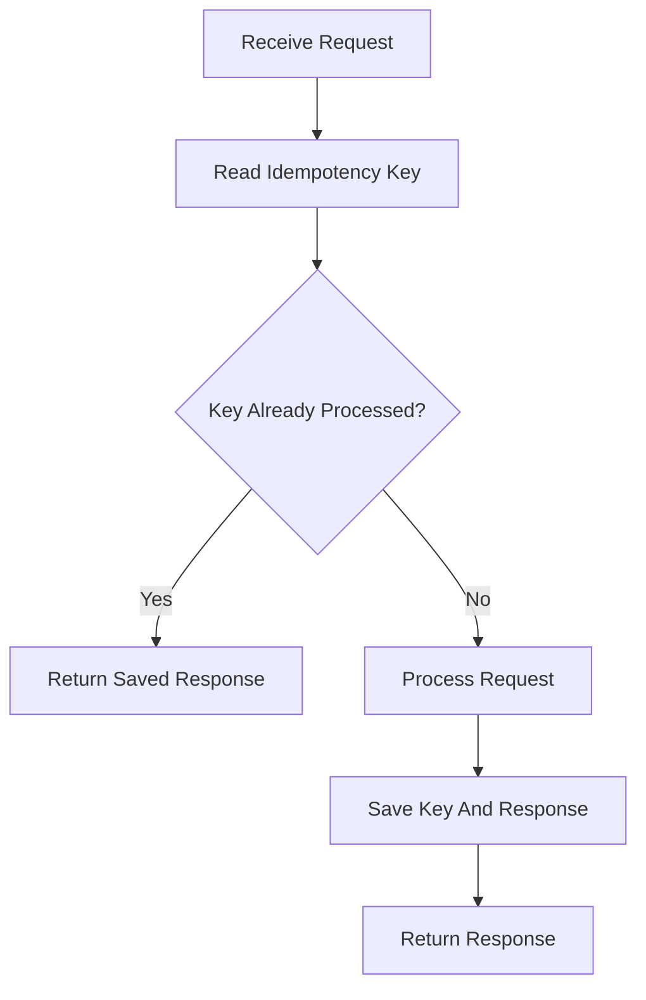
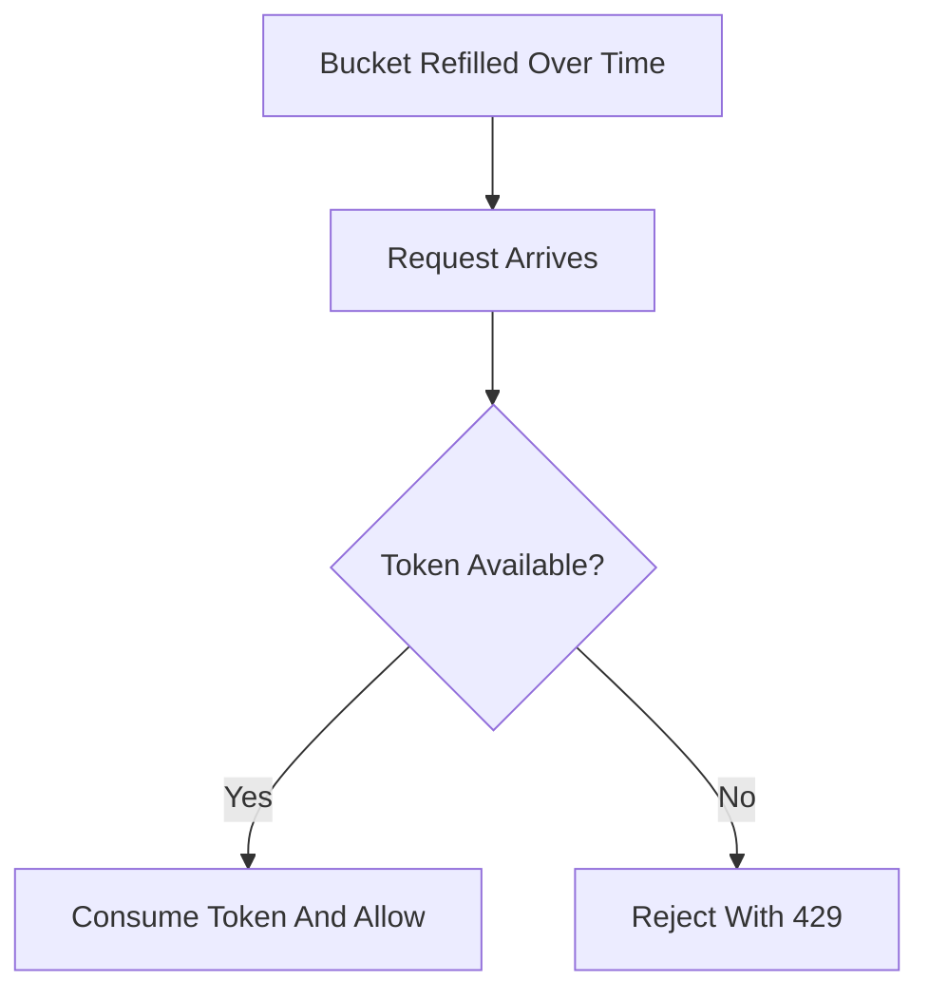

# API Management: Versioning, Idempotency, and Rate Limiting

## API Versioning

API versioning lets you evolve APIs without breaking existing clients.

Common approaches:

| Approach | Example |
| --- | --- |
| URL version | `/api/v1/users` |
| Header version | `Accept: application/vnd.app.v1+json` |
| Query version | `/api/users?version=1` |

URL versioning is simple and common.

## Backward Compatibility

Safe changes:

- adding optional response fields,
- adding new endpoints,
- adding optional request fields.

Risky changes:

- removing fields,
- changing field meanings,
- changing status codes,
- making optional fields required.

## Idempotency

Idempotency means repeated identical requests have the same effect.

This matters for retries.

Example:

```http
POST /api/payments
Idempotency-Key: 7f9f2b20-7d12-4d0f-b64f-44e6b95f9c21
```

Server-side flow:



## Idempotency Table

```sql
CREATE TABLE idempotency_keys (
    key VARCHAR(100) PRIMARY KEY,
    response_body TEXT NOT NULL,
    status_code INT NOT NULL,
    created_at TIMESTAMP NOT NULL
);
```

## Rate Limiting

Rate limiting controls how many requests a client can make.

Reasons:

- protect infrastructure,
- prevent abuse,
- enforce pricing tiers,
- improve fairness.

## Token Bucket



## Rate Limit Response

```http
HTTP/1.1 429 Too Many Requests
Retry-After: 60
```

## API Management Checklist

- Document API contracts.
- Version breaking changes.
- Use idempotency keys for payment/order creation.
- Apply rate limits at gateway or API layer.
- Return clear error codes.
- Track client usage.
- Deprecate old versions with a migration window.

