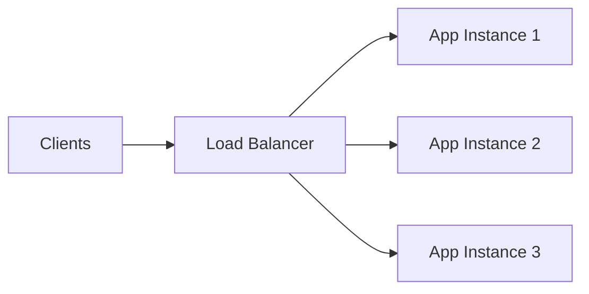
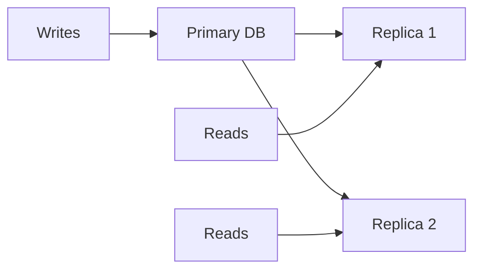
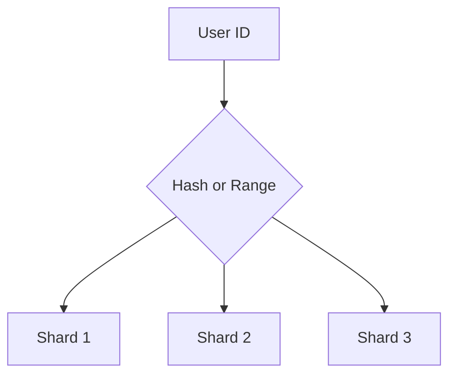

# System Design, Infrastructure, and Database Scaling

## Scalability

Scalability is the ability to handle more load.

Types:

| Type | Meaning |
| --- | --- |
| Vertical scaling | Bigger machine |
| Horizontal scaling | More machines |

## Availability

Availability means the system remains usable even when failures happen.

```text
Availability = uptime / total time
```

## Reliability

Reliability means the system behaves correctly over time.

Availability asks, "Is it up?" Reliability asks, "Is it correct?"

## Load Balancing

A load balancer distributes traffic across multiple backend instances.



## Circuit Breaker

A circuit breaker protects your system from repeatedly calling a failing dependency.

Use it with:

- payment providers,
- third-party APIs,
- remote microservices,
- unstable network dependencies.

## CDN

A Content Delivery Network caches static content near users.

Use CDN for:

- images,
- JavaScript bundles,
- CSS,
- downloadable files,
- public cached API responses when appropriate.

## Database Replication

Replication copies data from one database node to another.



Use replicas to scale reads and improve availability.

## Partitioning

Partitioning splits one database table into smaller pieces.

Example:

- partition orders by month,
- partition logs by date,
- partition tenants by tenant ID.

## Sharding

Sharding distributes data across multiple database nodes.



Sharding increases scale but adds complexity to queries, transactions, and operations.

## Scaling Order

A practical order for many systems:

1. Optimize queries and indexes.
2. Add caching.
3. Add read replicas.
4. Split heavy workloads.
5. Partition large tables.
6. Shard only when truly necessary.

## System Design Checklist

- Define functional requirements.
- Define non-functional requirements.
- Estimate traffic and data size.
- Identify APIs.
- Design storage.
- Add caching where useful.
- Plan failure handling.
- Add observability.
- Discuss tradeoffs.

