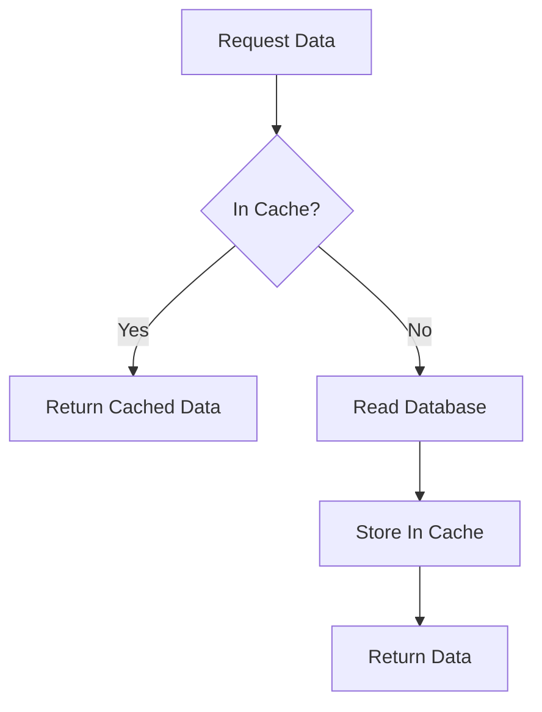
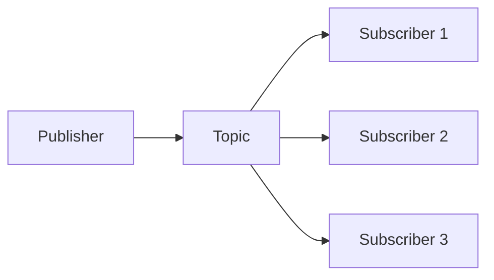
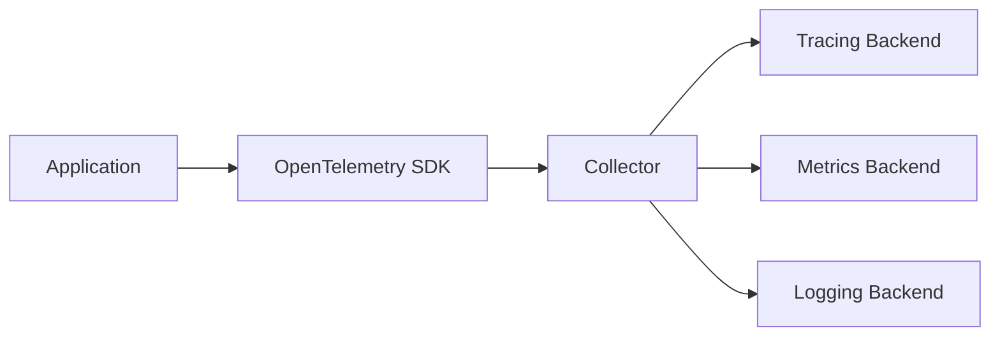

# Caching, Distributed Systems, Messaging, and Observability

## Caching

Caching stores frequently used data in a faster place.

Common cache locations:

- browser cache,
- CDN,
- application memory,
- Redis,
- database buffer cache.

## Redis

Redis is an in-memory data store often used for caching, rate limiting, distributed locks, and pub/sub.

```java
@Cacheable(value = "users", key = "#id")
public UserResponse findUser(Long id) {
    return userRepository.findById(id)
            .map(UserResponse::from)
            .orElseThrow(() -> new ResourceNotFoundException("User not found"));
}
```

## Cache-Aside Pattern



## Cache Invalidation

The hard part of caching is knowing when cached data is stale.

Common strategies:

- time-to-live,
- explicit invalidation on write,
- write-through cache,
- event-based invalidation.

## Distributed Locks

A distributed lock coordinates work across multiple application instances.

Use carefully for:

- scheduled jobs,
- one-at-a-time processing,
- preventing duplicate expensive work.

Do not use distributed locks as a substitute for correct database constraints.

## Pub/Sub

Publish/subscribe broadcasts messages to interested subscribers.



## Messaging Systems

Kafka and RabbitMQ are common messaging systems. Use dead letter queues to capture failed messages after retries.

Good message fields:

```json
{
  "eventId": "evt-123",
  "eventType": "OrderCreated",
  "occurredAt": "2026-05-12T10:00:00Z",
  "payload": {
    "orderId": "O-123"
  }
}
```

## Observability

Observability helps you understand what the system is doing.

Three pillars:

| Pillar | Purpose |
| --- | --- |
| Logs | Discrete events |
| Metrics | Numeric measurements over time |
| Traces | Request journey across services |

## Logging

Good log:

```text
level=INFO message="order created" orderId=O-123 customerId=C-7 traceId=abc123
```

Bad log:

```text
something happened
```

## Prometheus and Grafana

Prometheus collects metrics. Grafana visualizes them.

Useful metrics:

- request rate,
- error rate,
- latency percentiles,
- CPU and memory,
- database connection pool usage,
- queue depth,
- consumer lag.

## OpenTelemetry

OpenTelemetry provides standards for traces, metrics, and logs.



## Observability Checklist

- Add correlation or trace IDs.
- Log important business events.
- Track latency percentiles, not only averages.
- Alert on symptoms users feel.
- Use dashboards for golden signals.
- Trace slow cross-service requests.
- Monitor queues and dead letter queues.

